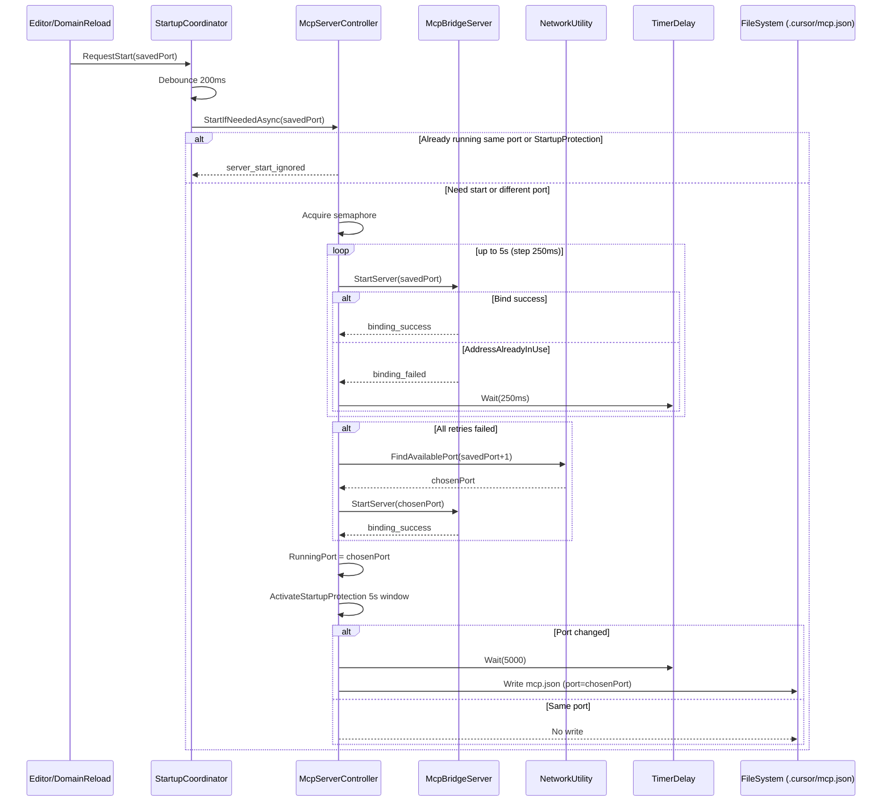

## Simplify MCP Startup Flow

### 背景と課題
- **問題**: Unityクラッシュ後の復帰で、uLoopMCPのTCPポートが+1にフォールバックし、`.cursor/mcp.json`が更新→Cursor再接続ポップアップが発生。
- **観測**: `binding_success` の直後に別経路から再度 `StartServer` が呼ばれ、`AddressAlreadyInUse` → `controller_fallback_decision` で+1へ。成功直後の「空き確認」や再入が競合の温床。

### 目的
- **同一ポートの安定再利用**: 復帰時に前回ポートを可能な限り維持。
- **`mcp.json`の不要更新抑止**: ポート不変なら更新しない。
- **起動経路の一本化**: Start要求の入口を一つにして、再入・競合を根絶。

### スコープ
- Editor専用（PlayMode無し）。uLoopMCPのEditor拡張側のみ。
- OSソケットオプションの強制（`SO_REUSEADDR`/`ExclusiveAddressUse=false`）や強制killは採用しない。

### コンポーネント構成（役割分離）
- **McpServerStartupCoordinator（新規/統合）**: 起動要求の単一入口。Editor起動/DomainReload/手動リトライをここに集約。
- **McpServerController**: 状態管理（`Stopped`/`Binding`/`Running`）と起動オーケストレーション。フォールバック判断もここで一元化。
- **McpBridgeServer**: 実ソケットのバインドのみ担当。判断・リトライ・フォールバックは行わない。

### 起動フロー（一本化）
1. すべての開始要求は `StartupCoordinator.RequestStart(savedPort)` に集約。
2. 200msデバウンスで連続要求を合流。
3. `SemaphoreSlim` による起動ロックで同時実行を防止（待ち合わせ可視化）。
4. 既に `Running` かつ `RunningPort == savedPort` なら `server_start_ignored` で即return。
5. `Binding` 中なら完了まで待機し、結果に合流（`startup_lock_waited`）。
6. `TryBindWithWait(savedPort, 5s, step=250ms)` を実行。全試行が `AddressAlreadyInUse` のときのみ初めてフォールバックへ。
7. フォールバックは `NetworkUtility.FindAvailablePort(savedPort + 1)`（一回決めたら即確定）。
8. 起動成功後は5秒の保護窓を設定し、期間中の追加Start要求は無視（`startup_protection_active`）。
9. 「成功直後のポート使用中チェック」は実施しない。バインド成功を唯一の真実とする。

### 競合・再入防止
- **デバウンス**: 200ms。短時間に多発するStart要求を一つにまとめる。
- **起動ロック**: `SemaphoreSlim(1,1)` で同時実行禁止。待機した呼び出しはログで追跡。
- **保護窓**: 起動成功後に5秒間の抑止を実施。`TimerDelay.Wait(5000)` を使用。

### バインドとフォールバック
- **ポート再利用の粘り**: `savedPort` で最大5秒（250ms間隔）だけ粘って再試行。
- **フォールバック条件**: 上記粘りですべて `AddressAlreadyInUse` の場合のみ実施。
- **再チェック排除**: `binding_success` 直後の `IsPortInUse` 等は行わない。

### `.cursor/mcp.json` 更新戦略
- **変化時のみ更新**: ポートが変化した場合に限り、保護窓経過後に1回だけ更新。
- **不変時は更新しない**: 同一ポートを維持できた場合はファイルを触らない（Cursor再接続抑止）。

### ログ計画（VibeLogger）
- 起動合流: `startup_request`, `startup_coalesced`, `startup_lock_waited`
- バインド: `binding_attempt`, `binding_success`, `binding_failed(code,hresult,native)`
- 抑止・判断: `server_start_ignored`, `fallback_decision`, `startup_protection_active`

### 擬似コード（設計）
```csharp
public async Task StartIfNeededAsync(int savedPort, CancellationToken ct)
{
    Log("startup_request", $"port={savedPort}");

    await _startupSemaphore.WaitAsync(ct);
    try
    {
        if (IsRunning && RunningPort == savedPort)
        {
            Log("server_start_ignored", $"already_running port={savedPort}");
            return;
        }

        if (IsStartupProtectionActive)
        {
            Log("server_start_ignored", "startup_protection_active");
            return;
        }

        var chosenPort = savedPort;
        var started = await TryBindWithWaitAsync(chosenPort, maxWaitMs: 5000, stepMs: 250, ct);
        if (!started)
        {
            var fallback = NetworkUtility.FindAvailablePort(savedPort + 1);
            Log("fallback_decision", $"start={savedPort} chosen={fallback}");
            chosenPort = fallback;
            started = await TryBindWithWaitAsync(chosenPort, 0, 0, ct);
        }

        if (!started)
        {
            throw new InvalidOperationException("Failed to bind any port.");
        }

        RunningPort = chosenPort;
        ActivateStartupProtection(5000);
        _ = ScheduleMcpJsonWriteIfChangedAsync(savedPort, chosenPort, ct);
    }
    finally
    {
        _startupSemaphore.Release();
    }
}

private async Task<bool> TryBindWithWaitAsync(int port, int maxWaitMs, int stepMs, CancellationToken ct)
{
    var remaining = maxWaitMs;
    while (true)
    {
        Log("binding_attempt", $"port={port}");
        if (McpBridgeServer.StartServer(port))
        {
            Log("binding_success", $"port={port}");
            return true;
        }

        var lastError = GetLastSocketError(); // 例: AddressAlreadyInUse, hresult, native
        Log("binding_failed", $"port={port} code={lastError.Code} hresult={lastError.HResult} native={lastError.Native}");

        if (remaining <= 0) return false;
        var delay = Math.Min(stepMs, remaining);
        await TimerDelay.Wait(delay, ct);
        remaining -= delay;
    }
}

private async Task ScheduleMcpJsonWriteIfChangedAsync(int savedPort, int chosenPort, CancellationToken ct)
{
    if (savedPort == chosenPort) return; // 不変なら何もしない
    await TimerDelay.Wait(5000, ct); // 保護窓経過後に一度だけ書く
    WriteMcpJsonIfPortChanged(chosenPort);
}
```

### TimerDelay の使用
- 5秒待機は `TimerDelay.Wait(5000, cancellationToken)` を使用する。
- `TimerDelay` は Editorの状態に依存しない `System.Threading.Timer` ベースで、awaitに対応。

### 受け入れ基準（検証）
- Unityクラッシュ復帰直後、`binding_success(port=X)` のあとに `controller_fallback_decision` が発生しない。
- 前回ポートが空なら同一ポートを維持し、`.cursor/mcp.json` は更新されない。
- 起動成功直後の5秒間に追加のStart要求が来ても `server_start_ignored` が記録され、再バインド試行が走らない。

### リスクと観測
- 5秒粘っても `TIME_WAIT` が解けないケース: その場合のみフォールバックするため、+1は例外時に限定される。
- 別プロセスが同ポートを本当に占有: `AddressAlreadyInUse` が持続するので妥当にフォールバック。

### 変更対象（想定）
- `McpServerController`：起動ロジックの一本化、保護窓、再入防止。
- `McpBridgeServer`：成功/失敗の明確な戻り値とエラー詳細のロギング。
- `SessionRecoveryService` / 起動関連UseCase：入口を `StartupCoordinator` に差し替え。
- `NetworkUtility`：`FindAvailablePort` はフォールバック時のみ使用。
- `VibeLogger`：ログキーの追加・統一。

### VibeLogger の使用方針
- すべてのログ出力は `VibeLogger` を使用し、`Debug.Log`/`Debug.LogWarning`/`Debug.LogError` は使用しない。
- ログキーは本設計で定義したものに統一し、勝手に新設しない（必要があれば設計を更新して追加）。
- 例外時は `SocketException.SocketErrorCode` と `HResult`、可能であればネイティブエラー番号も付与する。

```csharp
VibeLogger.LogInfo("startup_request", $"port={savedPort}");
VibeLogger.LogInfo("binding_attempt", $"port={port}");
VibeLogger.LogInfo("binding_success", $"port={port}");
VibeLogger.LogWarning("binding_failed", $"port={port} code={ex.SocketErrorCode} hresult={ex.HResult} native={ex.ErrorCode}");
VibeLogger.LogInfo("fallback_decision", $"start={savedPort} chosen={chosenPort}");
VibeLogger.LogInfo("server_start_ignored", "startup_protection_active");
VibeLogger.LogInfo("startup_protection_active", "window=5000ms");
```

### Mermaid シーケンス図


