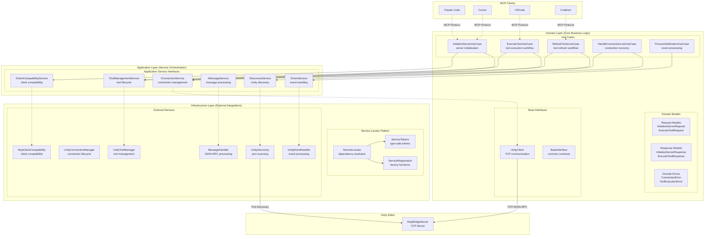
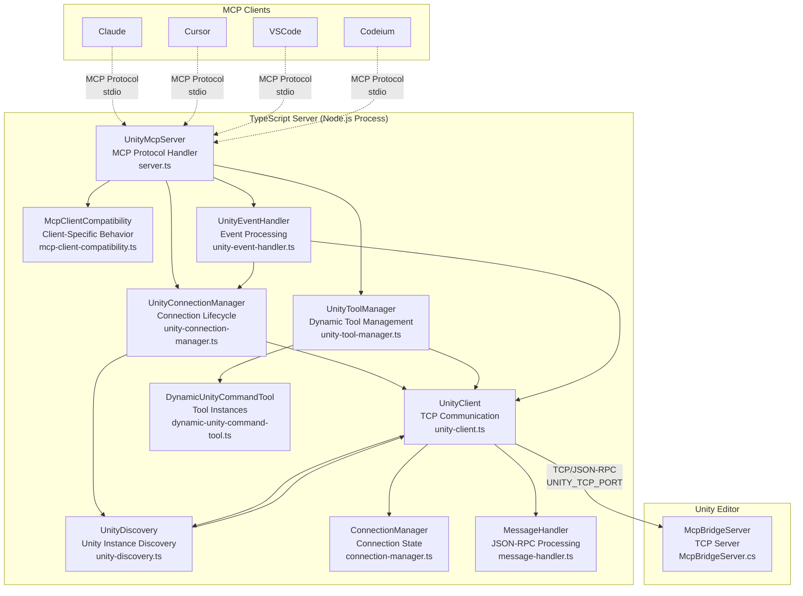
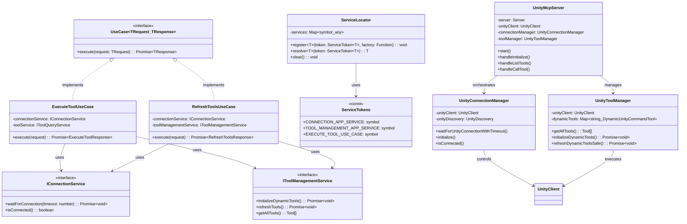
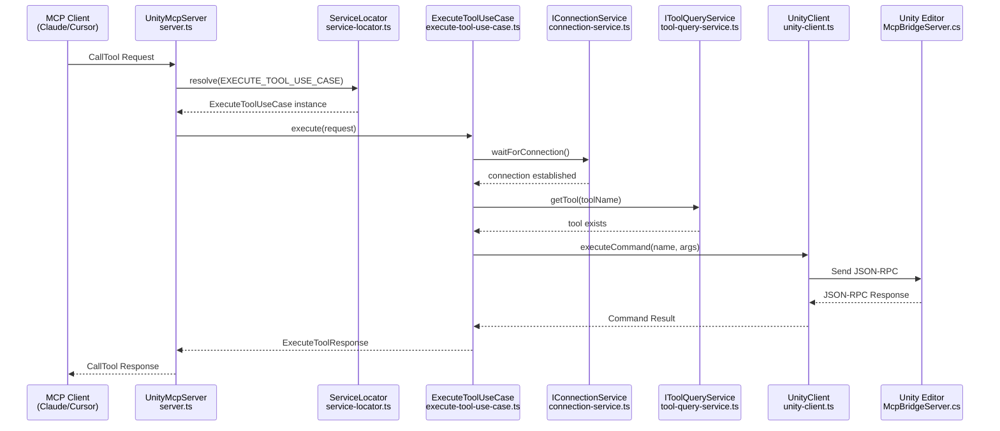

# uLoopMCP TypeScript Server DDD Architecture

## 1. TypeScript Server Overview

The TypeScript server located in `Packages/src/TypeScriptServer~` acts as the intermediary between MCP-compatible clients (like Cursor, Claude, or VSCode) and the Unity Editor. It runs as a Node.js process, communicates with clients via standard I/O (stdio) using the Model Context Protocol (MCP), and relays tool requests to the Unity Editor via TCP socket connections.

### Primary Responsibilities
1. **MCP Server Implementation**: Implements the MCP server specification using `@modelcontextprotocol/sdk` to handle requests from clients (e.g., `tools/list`, `tools/call`)
2. **Dynamic Tool Management**: Fetches available tools from Unity Editor and dynamically creates corresponding "tools" to expose to MCP clients
3. **Unity Communication**: Manages persistent TCP connections to the `McpBridgeServer` running inside Unity Editor
4. **Tool Forwarding**: Translates `tools/call` requests from MCP clients into JSON-RPC requests and sends them to Unity server for execution
5. **Notification Handling**: Listens for `notifications/tools/list_changed` events from Unity to automatically refresh toolset when tools are added or removed

## 2. Domain-Driven Design (DDD) Architecture

The TypeScript server follows Domain-Driven Design principles with Clean Architecture layering, implementing the refactoring patterns from the `.kiro/specs/typescript-server-ddd-refactoring/` specification.

### 2.1. DDD Architecture Diagram



### 2.2. Clean Architecture Layers

#### Domain Layer (Core Business Logic)
- **Use Cases**: Orchestrate business workflows without external dependencies
- **Domain Models**: Pure data structures for requests, responses, and errors
- **Base Interfaces**: Common contracts shared across the domain

#### Application Layer (Service Orchestration)
- **Application Service Interfaces**: Define contracts for external services
- **Service abstraction**: Shield domain layer from infrastructure concerns

#### Infrastructure Layer (External Integrations)
- **Service Locator Pattern**: Type-safe dependency injection
- **External Services**: Unity communication, MCP protocol handling
- **Framework Integration**: Node.js, TCP sockets, MCP SDK

### 2.3. Key DDD Patterns Implemented

#### Use Case Pattern
Each business workflow is encapsulated in a dedicated Use Case class:

```typescript
// Domain layer - pure business logic
export class ExecuteToolUseCase implements UseCase<ExecuteToolRequest, ExecuteToolResponse> {
  constructor(
    private connectionService: IConnectionService,
    private toolService: IToolQueryService
  ) {}

  async execute(request: ExecuteToolRequest): Promise<ExecuteToolResponse> {
    // Pure business logic without infrastructure concerns
  }
}
```

#### Service Locator Pattern
Type-safe dependency injection with symbol-based tokens:

```typescript
// Infrastructure layer - dependency management
export const ServiceTokens = {
  CONNECTION_APP_SERVICE: Symbol('CONNECTION_APP_SERVICE'),
  TOOL_MANAGEMENT_APP_SERVICE: Symbol('TOOL_MANAGEMENT_APP_SERVICE'),
  // ... other tokens
} as const;

export type ServiceTokenMap = {
  [ServiceTokens.CONNECTION_APP_SERVICE]: IConnectionService;
  [ServiceTokens.TOOL_MANAGEMENT_APP_SERVICE]: IToolManagementService;
  // ... other mappings
};
```

#### Interface Segregation Principle (ISP)
Small, focused interfaces for specific responsibilities:

```typescript
// Application layer - focused interfaces
export interface IToolQueryService {
  getAllTools(): Tool[];
  getTool(name: string): Tool | undefined;
  setClientName(clientName: string): void;
}

export interface IToolManagementService extends IToolQueryService {
  initializeDynamicTools(): Promise<void>;
  refreshTools(): Promise<void>;
}
```

## 3. TypeScript System Architecture Diagrams

### 3.1. TypeScript System Overview



### 3.2. TypeScript DDD Class Relationships



### 3.3. TypeScript Use Case Execution Flow



## 4. Core Architectural Principles

### 4.1. Dynamic and Extensible Tooling
The server's core strength is its ability to dynamically adapt to tools (commands) available in Unity:

- **`UnityToolManager`**: Handles all dynamic tool management through dedicated methods:
  - `initializeDynamicTools()`: Orchestrates the tool initialization process
  - `fetchCommandDetailsFromUnity()`: Retrieves command metadata from Unity
  - `createDynamicToolsFromCommands()`: Creates tool instances from metadata
  - `refreshDynamicToolsSafe()`: Safely refreshes tools with duplicate prevention
- **`McpClientCompatibility`**: Manages client-specific requirements:
  - `handleClientNameInitialization()`: Manages client name synchronization
  - `isListChangedUnsupported()`: Detects clients that don't support list_changed notifications
- **`DynamicUnityCommandTool`**: Generic "tool" factory that takes schema information received from Unity (name, description, parameters) and constructs MCP-compliant tools on the fly

### 4.2. Decoupling and Single Responsibility
The architecture follows Martin Fowler's Extract Class pattern for clean separation of responsibilities:

- **`server.ts` (`UnityMcpServer`)**: Main application entry point, focused solely on MCP protocol handling and component orchestration
- **`unity-connection-manager.ts` (`UnityConnectionManager`)**: Manages Unity connection lifecycle, discovery, and reconnection logic
- **`unity-tool-manager.ts` (`UnityToolManager`)**: Handles all aspects of dynamic tool management, from fetching Unity commands to creating and refreshing tool instances
- **`mcp-client-compatibility.ts` (`McpClientCompatibility`)**: Manages client-specific behaviors and compatibility requirements
- **`unity-event-handler.ts` (`UnityEventHandler`)**: Handles event processing, notifications, signal handling, and graceful shutdown procedures
- **`unity-client.ts` (`UnityClient`)**: Manages TCP connection to Unity Editor, delegates to:
  - **`connection-manager.ts` (`ConnectionManager`)**: Handles connection state management
  - **`message-handler.ts` (`MessageHandler`)**: Processes JSON-RPC message parsing and routing
- **`unity-discovery.ts` (`UnityDiscovery`)**: Singleton service for Unity instance discovery with 1-second polling

### 4.3. Resilience and Robustness
The server is designed to be resilient to connection drops and process lifecycle events:

- **Connection Management**: `UnityConnectionManager` orchestrates connection lifecycle through `UnityDiscovery` (singleton pattern prevents multiple timers)
- **Graceful Shutdown**: `UnityEventHandler` handles all signal processing (`SIGINT`, `SIGTERM`, `SIGHUP`) and monitors `stdin` to ensure graceful shutdown
- **Client Compatibility**: `McpClientCompatibility` manages different client behaviors, ensuring proper initialization for clients that don't support list_changed notifications (Claude Code, Gemini, Windsurf, Codeium)
- **Safe Timers**: The `safe-timer.ts` utility provides `setTimeout` and `setInterval` wrappers that automatically clear themselves when the process exits
- **Delayed Unity Connection**: Server waits for MCP client to provide its name before connecting to Unity, preventing "Unknown Client" from appearing in Unity UI

### 4.4. Safe Logging
Because the server uses `stdio` for JSON-RPC communication, `console.log` cannot be used for debugging:
- **`log-to-file.ts`**: Provides safe, file-based logging mechanism. When `MCP_DEBUG` environment variable is set, all debug, info, warning, and error messages are written to timestamped log files in `~/.claude/uloopmcp-logs/`

### 4.5. DDD Error Handling Pattern
Domain-specific errors with proper abstraction:

```typescript
// Domain layer - business-focused errors
export abstract class DomainError extends Error {
  abstract readonly code: string;
  abstract readonly category: 'connection' | 'tool' | 'validation';
}

export class ConnectionError extends DomainError {
  readonly code = 'CONNECTION_ERROR';
  readonly category = 'connection' as const;
}

export class ToolExecutionError extends DomainError {
  readonly code = 'TOOL_EXECUTION_ERROR';
  readonly category = 'tool' as const;
}
```

## 5. Key Components (File Breakdown)

### 5.1. Domain Layer

#### `src/domain/use-cases/`
Business workflow orchestration without external dependencies:

- **`execute-tool-use-case.ts`**: Orchestrates tool execution workflow
- **`refresh-tools-use-case.ts`**: Manages tool refresh lifecycle
- **`initialize-server-use-case.ts`**: Handles server initialization with client compatibility
- **`handle-connection-lost-use-case.ts`**: Manages connection recovery workflow
- **`process-notification-use-case.ts`**: Processes Unity event notifications

#### `src/domain/models/`
Pure data structures for domain concepts:

- **`requests.ts`**: Request models (InitializeServerRequest, ExecuteToolRequest, etc.)
- **`responses.ts`**: Response models (InitializeServerResponse, ExecuteToolResponse, etc.)
- **`errors.ts`**: Domain-specific error types (ConnectionError, ToolExecutionError, etc.)

#### `src/domain/base-interfaces.ts`
Core domain contracts:

```typescript
export interface UseCase<TRequest, TResponse> {
  execute(request: TRequest): Promise<TResponse>;
}
```

### 5.2. Application Layer

#### `src/application/interfaces/`
Service contracts that shield domain from infrastructure:

- **`connection-service.ts`**: Connection management interface
- **`tool-management-service.ts`**: Tool lifecycle management interface
- **`tool-query-service.ts`**: Tool query operations interface
- **`event-service.ts`**: Event handling interface
- **`message-service.ts`**: Message processing interface
- **`discovery-service.ts`**: Unity discovery interface
- **`client-compatibility-service.ts`**: Client compatibility interface

### 5.3. Infrastructure Layer

#### `src/infrastructure/`
External service implementations and dependency management:

- **`service-locator.ts`**: Type-safe dependency injection container
- **`service-tokens.ts`**: Symbol-based service tokens with type mapping
- **`service-registration.ts`**: Factory function registration for services

#### `src/server.ts`
Main entry point and MCP protocol handling:

```typescript
export class UnityMcpServer {
  constructor() {
    // Initialize all managers through service locator
    this.initializeServices();
  }

  private initializeServices(): void {
    registerServices(); // Setup dependency injection
  }

  async handleCallTool(request: CallToolRequest): Promise<CallToolResult> {
    const useCase = ServiceLocator.resolve<ExecuteToolUseCase>(
      ServiceTokens.EXECUTE_TOOL_USE_CASE
    );
    return await useCase.execute(this.mapToExecuteToolRequest(request));
  }
}
```

#### `src/unity-connection-manager.ts`
Unity connection lifecycle management:

- Orchestrates Unity connection establishment through `UnityDiscovery`
- Provides `waitForUnityConnectionWithTimeout()` for synchronous initialization
- Handles connection callbacks and manages reconnection scenarios
- Integrates with singleton `UnityDiscovery` service to prevent timer conflicts

#### `src/unity-tool-manager.ts`
Dynamic tool management implementation:

- `initializeDynamicTools()`: Fetches Unity commands and creates corresponding tools
- `refreshDynamicToolsSafe()`: Safely refreshes tools with duplicate prevention
- `fetchCommandDetailsFromUnity()`: Retrieves command metadata from Unity
- `createDynamicToolsFromCommands()`: Creates tool instances from Unity schemas
- Manages the `dynamicTools` Map and provides tool access methods

#### `src/mcp-client-compatibility.ts`
Client-specific compatibility management:

- `isListChangedUnsupported()`: Detects clients that don't support list_changed notifications
- `handleClientNameInitialization()`: Manages client name setup and environment variable fallbacks
- `initializeClient()`: Orchestrates client-specific initialization procedures
- Handles compatibility for Claude Code, Gemini, Windsurf, and Codeium clients

#### `src/unity-event-handler.ts`
Event processing and graceful shutdown:

- `setupUnityEventListener()`: Configures Unity notification listeners
- `sendToolsChangedNotification()`: Sends MCP list_changed notifications with duplicate prevention
- `setupSignalHandlers()`: Configures process signal handlers for graceful shutdown
- `gracefulShutdown()`: Handles cleanup and process termination

#### `src/unity-client.ts`
Unity Editor TCP communication:

- Manages `net.Socket` for TCP communication
- `connect()` establishes connection, `ensureConnected()` provides resilient connection management
- `executeCommand()` sends JSON-RPC requests to Unity and waits for responses
- Handles incoming data, distinguishing between responses and asynchronous notifications

#### `src/unity-discovery.ts`
Unity instance discovery service:

- Implements singleton pattern to prevent multiple discovery timers
- Provides 1-second polling for Unity Editor instances
- Checks specified port from UNITY_TCP_PORT environment variable
- Handles connection callbacks and connection loss events

#### `src/tools/dynamic-unity-command-tool.ts`
Dynamic tool factory:

- `generateInputSchema()` translates C# schema definition into JSON Schema format
- `execute()` method forwards tool calls to Unity via `UnityClient`
- Extends `BaseTool` abstract class for consistent tool interface

#### `src/utils/`
Infrastructure utilities:

- **`log-to-file.ts`**: Safe, file-based logging functions (`debugToFile`, `infoToFile`, etc.)
- **`safe-timer.ts`**: `SafeTimer` class and `safeSetTimeout`/`safeSetInterval` functions for robust timer management
- **`vibe-logger.ts`**: Structured logging for AI analysis with operation tracking

#### `src/constants.ts`
Shared constants and configuration:

- MCP protocol constants
- Environment variables
- Default messages and timeout values
- Port ranges and discovery settings

## 6. Key Workflows

### 6.1. Server Startup and Tool Initialization
1. `UnityMcpServer` instantiates and registers services with `ServiceLocator`
2. `UnityMcpServer.start()` called
3. `UnityEventHandler.setupUnityEventListener()` configures notification listeners
4. `UnityConnectionManager.initialize()` starts connection discovery process
5. MCP server connects to `StdioServerTransport`, ready to serve requests
6. Server waits for `initialize` request from MCP client
7. Upon receiving `initialize` request:
   - Client name extracted from `clientInfo.name`
   - `InitializeServerUseCase` orchestrates initialization workflow
   - Based on client compatibility, either synchronous or asynchronous initialization used
8. For synchronous initialization (list_changed unsupported clients):
   - `UnityConnectionManager.waitForUnityConnectionWithTimeout()` waits for Unity
   - Tools fetched and returned immediately in initialize response
9. For asynchronous initialization (list_changed supported clients):
   - Background tool initialization started
   - Tools discovered and client notified via `list_changed` notification

### 6.2. Handling a Tool Call (DDD Flow)
1. MCP client sends `tools/call` request via `stdin`
2. `UnityMcpServer`'s `CallToolRequestSchema` handler invoked
3. `ServiceLocator.resolve(EXECUTE_TOOL_USE_CASE)` retrieves Use Case instance
4. `ExecuteToolUseCase.execute(request)` orchestrates the workflow:
   - Validates connection availability through `IConnectionService`
   - Verifies tool existence through `IToolQueryService`
   - Executes tool through infrastructure layer
5. Use Case returns domain response model
6. `UnityMcpServer` maps domain response to MCP response format
7. Final response sent to client via `stdout`

### 6.3. Connection Recovery Workflow
1. Connection loss detected by `UnityClient` socket events
2. `HandleConnectionLostUseCase` orchestrated through Service Locator
3. Use Case coordinates recovery through application service interfaces:
   - `IConnectionService.handleConnectionLost()`
   - `IDiscoveryService.startDiscovery()`
   - `IToolManagementService.clearTools()`
4. Background reconnection process initiated
5. Upon reconnection, tools refreshed and clients notified

## 7. Development and Testing Infrastructure

### 7.1. Build System
- **esbuild**: Fast JavaScript bundler for production builds
- **TypeScript**: Type-safe JavaScript development with strict mode
- **Node.js**: Runtime environment for server execution

### 7.2. Testing Framework
- **Jest**: JavaScript testing framework with TypeScript support
- **Unit Tests**: Individual component testing with service mocking
- **Integration Tests**: Cross-component interaction testing
- **Domain Tests**: Pure business logic testing without infrastructure

### 7.3. Code Quality
- **ESLint**: TypeScript linting with strict rules
- **Prettier**: Code formatting for consistency
- **Type Checking**: Strict TypeScript compilation with no-any enforcement

### 7.4. Debugging and Monitoring
- **VibeLogger**: Structured logging for AI analysis with correlation IDs
- **File-based Logging**: Safe logging to `~/.claude/uloopmcp-logs/`
- **Debug Environment Variables**: `MCP_DEBUG` for detailed logging
- **Process Monitoring**: Signal handling and graceful shutdown
- **Connection Health**: Automatic reconnection and discovery

### 7.5. DDD Development Guidelines

#### Domain Layer Rules
- No external dependencies (no imports from infrastructure)
- Pure business logic focused on use cases
- Domain models as simple data structures
- Error types specific to business concerns

#### Application Layer Rules
- Define contracts for external services
- Shield domain from infrastructure complexity
- Interface segregation for focused responsibilities

#### Infrastructure Layer Rules
- Implement application interfaces
- Handle external system integration
- Manage dependency injection and service lifecycle
- Contain all framework-specific code

#### Testing Strategy
- Domain layer: Pure unit tests without mocks
- Application layer: Interface contract testing
- Infrastructure layer: Integration testing with external systems
- End-to-end: Full workflow testing through MCP protocol