# uLoopMCP TypeScript Server DDDアーキテクチャ

## 1. TypeScript Server概要

`Packages/src/TypeScriptServer~`にあるTypeScriptサーバーは、MCP互換クライアント（Cursor、Claude、VSCodeなど）とUnity Editorの仲介役として機能します。Node.jsプロセスとして動作し、標準I/O（stdio）を介してModel Context Protocol（MCP）を使用してクライアントと通信し、TCPソケット接続を介してUnity EditorでツールリクエストをUnity Editorにリレーします。

### 主な責務
1. **MCPサーバー実装**: `@modelcontextprotocol/sdk`を使用してMCPサーバー仕様を実装し、クライアントからのリクエスト（例：`tools/list`、`tools/call`）を処理
2. **動的ツール管理**: Unity Editorから利用可能なツールを取得し、MCPクライアントに公開する対応「ツール」を動的に作成
3. **Unity通信**: Unity Editor内で動作する`McpBridgeServer`への永続TCP接続を管理
4. **ツール転送**: MCPクライアントからの`tools/call`リクエストをJSON-RPCリクエストに変換してUnityサーバーに実行のため送信
5. **通知処理**: Unityからの`notifications/tools/list_changed`イベントをリッスンしてツールが追加・削除された際にツールセットを自動更新

## 2. Domain-Driven Design（DDD）アーキテクチャ

TypeScriptサーバーは、`.kiro/specs/typescript-server-ddd-refactoring/`仕様のリファクタリングパターンを実装し、Clean Architectureレイヤリングを備えたDomain-Driven Design原則に従います。

### 2.1. DDDアーキテクチャ図


### 2.2. Clean Architectureレイヤー

#### ドメイン層（コアビジネスロジック）
- **Use Cases**: 外部依存なしでビジネスワークフローを調整
- **ドメインモデル**: リクエスト、レスポンス、エラーのための純粋なデータ構造
- **基底インターフェース**: ドメイン全体で共有される共通契約

#### アプリケーション層（サービス調整）
- **アプリケーションサービスインターフェース**: 外部サービスの契約を定義
- **サービス抽象化**: ドメイン層をインフラストラクチャの懸念から保護

#### インフラストラクチャ層（外部統合）
- **Service Locatorパターン**: 型安全な依存性注入
- **外部サービス**: Unity通信、MCPプロトコル処理
- **フレームワーク統合**: Node.js、TCPソケット、MCP SDK

### 2.3. 実装された主要DDDパターン

#### Use Caseパターン
各ビジネスワークフローが専用Use Caseクラスにカプセル化されています：

```typescript
// ドメイン層 - 純粋なビジネスロジック
export class ExecuteToolUseCase implements UseCase<ExecuteToolRequest, ExecuteToolResponse> {
  constructor(
    private connectionService: IConnectionService,
    private toolService: IToolQueryService
  ) {}

  async execute(request: ExecuteToolRequest): Promise<ExecuteToolResponse> {
    // インフラストラクチャの懸念なしの純粋なビジネスロジック
  }
}
```

#### Service Locatorパターン
シンボルベーストークンによる型安全な依存性注入：

```typescript
// インフラストラクチャ層 - 依存性管理
export const ServiceTokens = {
  CONNECTION_APP_SERVICE: Symbol('CONNECTION_APP_SERVICE'),
  TOOL_MANAGEMENT_APP_SERVICE: Symbol('TOOL_MANAGEMENT_APP_SERVICE'),
  // ... その他のトークン
} as const;

export type ServiceTokenMap = {
  [ServiceTokens.CONNECTION_APP_SERVICE]: IConnectionService;
  [ServiceTokens.TOOL_MANAGEMENT_APP_SERVICE]: IToolManagementService;
  // ... その他のマッピング
};
```

#### インターフェース分離原則（ISP）
特定の責務のための小さく焦点の絞られたインターフェース：

```typescript
// アプリケーション層 - 焦点の絞られたインターフェース
export interface IToolQueryService {
  getAllTools(): Tool[];
  getTool(name: string): Tool | undefined;
  setClientName(clientName: string): void;
}

export interface IToolManagementService extends IToolQueryService {
  initializeDynamicTools(): Promise<void>;
  refreshTools(): Promise<void>;
}
```

## 3. TypeScriptシステムアーキテクチャ図

### 3.1. TypeScriptシステム概要

```mermaid
graph TB
    subgraph "MCPクライアント"
        Claude[Claude]
        Cursor[Cursor]
        VSCode[VSCode]
        Codeium[Codeium]
    end
    
    subgraph "TypeScriptサーバー（Node.jsプロセス）"
        MCP[UnityMcpServer<br/>MCPプロトコルハンドラー<br/>server.ts]
        UCM[UnityConnectionManager<br/>接続ライフサイクル<br/>unity-connection-manager.ts]
        UTM[UnityToolManager<br/>動的ツール管理<br/>unity-tool-manager.ts]
        MCC[McpClientCompatibility<br/>クライアント固有動作<br/>mcp-client-compatibility.ts]
        UEH[UnityEventHandler<br/>イベント処理<br/>unity-event-handler.ts]
        UC[UnityClient<br/>TCP通信<br/>unity-client.ts]
        UD[UnityDiscovery<br/>Unityインスタンス発見<br/>unity-discovery.ts]
        CM[ConnectionManager<br/>接続状態<br/>connection-manager.ts]
        MH[MessageHandler<br/>JSON-RPC処理<br/>message-handler.ts]
        Tools[DynamicUnityCommandTool<br/>ツールインスタンス<br/>dynamic-unity-command-tool.ts]
    end
    
    subgraph "Unity Editor"
        Bridge[McpBridgeServer<br/>TCPサーバー<br/>McpBridgeServer.cs]
    end
    
    Claude -.->|MCPプロトコル<br/>stdio| MCP
    Cursor -.->|MCPプロトコル<br/>stdio| MCP
    VSCode -.->|MCPプロトコル<br/>stdio| MCP
    Codeium -.->|MCPプロトコル<br/>stdio| MCP
    
    MCP --> UCM
    MCP --> UTM
    MCP --> MCC
    MCP --> UEH
    UCM --> UC
    UCM --> UD
    UTM --> UC
    UTM --> Tools
    UEH --> UC
    UEH --> UCM
    UC --> CM
    UC --> MH
    UC --> UD
    UD --> UC
    UC -->|TCP/JSON-RPC<br/>UNITY_TCP_PORT| Bridge
```



### 3.2. TypeScript DDDクラス関係


### 3.3. TypeScript Use Case実行フロー


## 4. コアアーキテクチャ原則

### 4.1. 動的で拡張可能なツーリング
サーバーのコア強度は、Unityで利用可能なツール（コマンド）に動的に適応する能力です：

- **`UnityToolManager`**: 専用メソッドですべての動的ツール管理を処理:
  - `initializeDynamicTools()`: ツール初期化プロセスを調整
  - `fetchCommandDetailsFromUnity()`: Unityからコマンドメタデータを取得
  - `createDynamicToolsFromCommands()`: メタデータからツールインスタンスを作成
  - `refreshDynamicToolsSafe()`: 重複防止で安全にツールを更新
- **`McpClientCompatibility`**: クライアント固有要件を管理:
  - `handleClientNameInitialization()`: クライアント名同期を管理
  - `isListChangedUnsupported()`: list_changed通知をサポートしないクライアントを検出
- **`DynamicUnityCommandTool`**: Unityから受信したスキーマ情報（名前、説明、パラメータ）を取得してMCP準拠ツールをオンザフライで構築する汎用「ツール」ファクトリ

### 4.2. 分離と単一責任
アーキテクチャは責務の清潔な分離のためのMartin FowlerのExtract Classパターンに従います：

- **`server.ts`（`UnityMcpServer`）**: メインアプリケーションエントリーポイント、MCPプロトコル処理とコンポーネント調整のみに焦点
- **`unity-connection-manager.ts`（`UnityConnectionManager`）**: Unity接続ライフサイクル、発見、再接続ロジックを管理
- **`unity-tool-manager.ts`（`UnityToolManager`）**: Unityコマンドの取得からツールインスタンスの作成・更新まで動的ツール管理のすべての側面を処理
- **`mcp-client-compatibility.ts`（`McpClientCompatibility`）**: クライアント固有動作と互換性要件を管理
- **`unity-event-handler.ts`（`UnityEventHandler`）**: イベント処理、通知、シグナル処理、優雅なシャットダウン手順を処理
- **`unity-client.ts`（`UnityClient`）**: Unity EditorへのTCP接続を管理、以下に委譲:
  - **`connection-manager.ts`（`ConnectionManager`）**: 接続状態管理を処理
  - **`message-handler.ts`（`MessageHandler`）**: JSON-RPCメッセージ解析とルーティングを処理
- **`unity-discovery.ts`（`UnityDiscovery`）**: 1秒ポーリングでUnityインスタンス発見のシングルトンサービス

### 4.3. 耐性と堅牢性
サーバーは接続ドロップとプロセスライフサイクルイベントに耐性を持つよう設計されています：

- **接続管理**: `UnityConnectionManager`が`UnityDiscovery`を通じて接続ライフサイクルを調整（シングルトンパターンで複数タイマーを防止）
- **優雅なシャットダウン**: `UnityEventHandler`がすべてのシグナル処理（`SIGINT`、`SIGTERM`、`SIGHUP`）を処理し、`stdin`を監視して優雅なシャットダウンを保証
- **クライアント互換性**: `McpClientCompatibility`が異なるクライアント動作を管理し、list_changed通知をサポートしないクライアント（Claude Code、Gemini、Windsurf、Codeium）の適切な初期化を保証
- **Safe Timers**: `safe-timer.ts`ユーティリティがプロセス終了時に自動クリアされる`setTimeout`と`setInterval`ラッパーを提供
- **遅延Unity接続**: サーバーはMCPクライアントが名前を提供するまでUnityへの接続を待ち、Unity UIに「Unknown Client」が表示されるのを防止

### 4.4. 安全なログ記録
サーバーがJSON-RPC通信に`stdio`を使用するため、`console.log`はデバッグに使用できません：
- **`log-to-file.ts`**: 安全なファイルベースログ記録メカニズムを提供。`MCP_DEBUG`環境変数が設定されると、すべてのデバッグ、情報、警告、エラーメッセージが`~/.claude/uloopmcp-logs/`のタイムスタンプ付きログファイルに書き込まれます

### 4.5. DDDエラーハンドリングパターン
適切な抽象化を持つドメイン固有エラー：

```typescript
// ドメイン層 - ビジネス焦点エラー
export abstract class DomainError extends Error {
  abstract readonly code: string;
  abstract readonly category: 'connection' | 'tool' | 'validation';
}

export class ConnectionError extends DomainError {
  readonly code = 'CONNECTION_ERROR';
  readonly category = 'connection' as const;
}

export class ToolExecutionError extends DomainError {
  readonly code = 'TOOL_EXECUTION_ERROR';
  readonly category = 'tool' as const;
}
```

## 5. 主要コンポーネント（ファイル別）

### 5.1. ドメイン層

#### `src/domain/use-cases/`
外部依存なしのビジネスワークフロー調整：

- **`execute-tool-use-case.ts`**: ツール実行ワークフローを調整
- **`refresh-tools-use-case.ts`**: ツール更新ライフサイクルを管理
- **`initialize-server-use-case.ts`**: クライアント互換性でサーバー初期化を処理
- **`handle-connection-lost-use-case.ts`**: 接続回復ワークフローを管理
- **`process-notification-use-case.ts`**: Unityイベント通知を処理

#### `src/domain/models/`
ドメイン概念のための純粋なデータ構造：

- **`requests.ts`**: リクエストモデル（InitializeServerRequest、ExecuteToolRequestなど）
- **`responses.ts`**: レスポンスモデル（InitializeServerResponse、ExecuteToolResponseなど）
- **`errors.ts`**: ドメイン固有エラータイプ（ConnectionError、ToolExecutionErrorなど）

#### `src/domain/base-interfaces.ts`
コアドメイン契約：

```typescript
export interface UseCase<TRequest, TResponse> {
  execute(request: TRequest): Promise<TResponse>;
}
```

### 5.2. アプリケーション層

#### `src/application/interfaces/`
ドメインをインフラストラクチャから保護するサービス契約：

- **`connection-service.ts`**: 接続管理インターフェース
- **`tool-management-service.ts`**: ツールライフサイクル管理インターフェース
- **`tool-query-service.ts`**: ツールクエリ操作インターフェース
- **`event-service.ts`**: イベント処理インターフェース
- **`message-service.ts`**: メッセージ処理インターフェース
- **`discovery-service.ts`**: Unity発見インターフェース
- **`client-compatibility-service.ts`**: クライアント互換性インターフェース

### 5.3. インフラストラクチャ層

#### `src/infrastructure/`
外部サービス実装と依存性管理：

- **`service-locator.ts`**: 型安全な依存性注入コンテナ
- **`service-tokens.ts`**: 型マッピング付きシンボルベースサービストークン
- **`service-registration.ts`**: サービスのファクトリ関数登録

#### `src/server.ts`
メインエントリーポイントとMCPプロトコル処理：

```typescript
export class UnityMcpServer {
  constructor() {
    // サービスロケーターを通じてすべてのマネージャーを初期化
    this.initializeServices();
  }

  private initializeServices(): void {
    registerServices(); // 依存性注入を設定
  }

  async handleCallTool(request: CallToolRequest): Promise<CallToolResult> {
    const useCase = ServiceLocator.resolve<ExecuteToolUseCase>(
      ServiceTokens.EXECUTE_TOOL_USE_CASE
    );
    return await useCase.execute(this.mapToExecuteToolRequest(request));
  }
}
```

#### `src/unity-connection-manager.ts`
Unity接続ライフサイクル管理：

- `UnityDiscovery`を通じてUnity接続確立を調整
- 同期初期化のための`waitForUnityConnectionWithTimeout()`を提供
- 接続コールバックを処理し再接続シナリオを管理
- タイマー競合を防ぐためシングルトン`UnityDiscovery`サービスと統合

#### `src/unity-tool-manager.ts`
動的ツール管理実装：

- `initializeDynamicTools()`: Unityコマンドを取得して対応ツールを作成
- `refreshDynamicToolsSafe()`: 重複防止で安全にツールを更新
- `fetchCommandDetailsFromUnity()`: Unityからコマンドメタデータを取得
- `createDynamicToolsFromCommands()`: Unityスキーマからツールインスタンスを作成
- `dynamicTools` Mapを管理しツールアクセスメソッドを提供

#### `src/mcp-client-compatibility.ts`
クライアント固有互換性管理：

- `isListChangedUnsupported()`: list_changed通知をサポートしないクライアントを検出
- `handleClientNameInitialization()`: クライアント名設定と環境変数フォールバックを管理
- `initializeClient()`: クライアント固有初期化手順を調整
- Claude Code、Gemini、Windsurf、Codeiumクライアントの互換性を処理

#### `src/unity-event-handler.ts`
イベント処理と優雅なシャットダウン：

- `setupUnityEventListener()`: Unity通知リスナーを設定
- `sendToolsChangedNotification()`: 重複防止でMCP list_changed通知を送信
- `setupSignalHandlers()`: 優雅なシャットダウンのプロセスシグナルハンドラーを設定
- `gracefulShutdown()`: クリーンアップとプロセス終了を処理

#### `src/unity-client.ts`
Unity Editor TCP通信：

- TCP通信のための`net.Socket`を管理
- `connect()`で接続確立、`ensureConnected()`で耐性接続管理を提供
- `executeCommand()`でJSON-RPCリクエストをUnityに送信し応答を待機
- レスポンスと非同期通知を区別して受信データを処理

#### `src/unity-discovery.ts`
Unityインスタンス発見サービス：

- 複数発見タイマーを防ぐシングルトンパターンを実装
- Unity Editorインスタンスの1秒ポーリングを提供
- UNITY_TCP_PORT環境変数の指定ポートをチェック
- 接続コールバックと接続失事イベントを処理

#### `src/tools/dynamic-unity-command-tool.ts`
動的ツールファクトリ：

- `generateInputSchema()`でC#スキーマ定義をJSONスキーマ形式に変換
- `execute()`メソッドで`UnityClient`経由でツール呼び出しをUnityに転送
- 一貫したツールインターフェースのため`BaseTool`抽象クラスを継承

#### `src/utils/`
インフラストラクチャユーティリティ：

- **`log-to-file.ts`**: 安全なファイルベースログ記録関数（`debugToFile`、`infoToFile`など）
- **`safe-timer.ts`**: 堅牢なタイマー管理のための`SafeTimer`クラスと`safeSetTimeout`/`safeSetInterval`関数
- **`vibe-logger.ts`**: 操作追跡でAI分析のための構造化ログ記録

#### `src/constants.ts`
共有定数と設定：

- MCPプロトコル定数
- 環境変数
- デフォルトメッセージとタイムアウト値
- ポート範囲と発見設定

## 6. 主要ワークフロー

### 6.1. サーバー起動とツール初期化
1. `UnityMcpServer`がサービスをインスタンス化し`ServiceLocator`に登録
2. `UnityMcpServer.start()`が呼び出される
3. `UnityEventHandler.setupUnityEventListener()`が通知リスナーを設定
4. `UnityConnectionManager.initialize()`が接続発見プロセスを開始
5. MCPサーバーが`StdioServerTransport`に接続、リクエスト提供準備完了
6. サーバーがMCPクライアントからの`initialize`リクエストを待機
7. `initialize`リクエスト受信時:
   - `clientInfo.name`からクライアント名を抽出
   - `InitializeServerUseCase`が初期化ワークフローを調整
   - クライアント互換性に基づいて同期または非同期初期化を使用
8. 同期初期化（list_changed未サポートクライアント）:
   - `UnityConnectionManager.waitForUnityConnectionWithTimeout()`がUnityを待機
   - ツールを取得して初期化レスポンスで即座に返却
9. 非同期初期化（list_changedサポートクライアント）:
   - バックグラウンドツール初期化を開始
   - ツールを発見してクライアントに`list_changed`通知

### 6.2. ツール呼び出し処理（DDDフロー）
1. MCPクライアントが`stdin`経由で`tools/call`リクエストを送信
2. `UnityMcpServer`の`CallToolRequestSchema`ハンドラーが呼び出される
3. `ServiceLocator.resolve(EXECUTE_TOOL_USE_CASE)`でUse Caseインスタンスを取得
4. `ExecuteToolUseCase.execute(request)`がワークフローを調整:
   - `IConnectionService`を通じて接続可用性を検証
   - `IToolQueryService`を通じてツール存在を確認
   - インフラストラクチャ層を通じてツールを実行
5. Use Caseがドメインレスポンスモデルを返却
6. `UnityMcpServer`がドメインレスポンスをMCPレスポンス形式にマップ
7. `stdout`経由でクライアントに最終レスポンスを送信

### 6.3. 接続回復ワークフロー
1. `UnityClient`ソケットイベントで接続失が検出される
2. Service Locatorを通じて`HandleConnectionLostUseCase`が調整される
3. Use Caseがアプリケーションサービスインターフェースを通じて回復を調整:
   - `IConnectionService.handleConnectionLost()`
   - `IDiscoveryService.startDiscovery()`
   - `IToolManagementService.clearTools()`
4. バックグラウンド再接続プロセスが開始される
5. 再接続時、ツールが更新されクライアントに通知

## 7. 開発・テストインフラストラクチャ

### 7.1. ビルドシステム
- **esbuild**: 本番ビルドのための高速JavaScriptバンドラー
- **TypeScript**: strictモードによる型安全JavaScript開発
- **Node.js**: サーバー実行のランタイム環境

### 7.2. テストフレームワーク
- **Jest**: TypeScriptサポート付きJavaScriptテストフレームワーク
- **ユニットテスト**: サービスモック付き個別コンポーネントテスト
- **統合テスト**: コンポーネント間相互作用テスト
- **ドメインテスト**: インフラストラクチャなしの純粋ビジネスロジックテスト

### 7.3. コード品質
- **ESLint**: 厳格ルール付きTypeScriptリンティング
- **Prettier**: 一貫性のためのコード整形
- **型チェック**: no-any強制による厳格TypeScriptコンパイル

### 7.4. デバッグ・監視
- **VibeLogger**: 相関IDでAI分析のための構造化ログ記録
- **ファイルベースログ記録**: `~/.claude/uloopmcp-logs/`への安全ログ記録
- **デバッグ環境変数**: 詳細ログ記録のための`MCP_DEBUG`
- **プロセス監視**: シグナル処理と優雅なシャットダウン
- **接続ヘルス**: 自動再接続と発見

### 7.5. DDD開発ガイドライン

#### ドメイン層ルール
- 外部依存なし（インフラストラクチャからのインポートなし）
- ユースケースに焦点を当てた純粋ビジネスロジック
- 単純データ構造としてのドメインモデル
- ビジネス懸念に特化したエラータイプ

#### アプリケーション層ルール
- 外部サービスの契約を定義
- インフラストラクチャ複雑性からドメインを保護
- 焦点の絞られた責務のためのインターフェース分離

#### インフラストラクチャ層ルール
- アプリケーションインターフェースを実装
- 外部システム統合を処理
- 依存性注入とサービスライフサイクルを管理
- すべてのフレームワーク固有コードを格納

#### テスト戦略
- ドメイン層: モックなしの純粋ユニットテスト
- アプリケーション層: インターフェース契約テスト
- インフラストラクチャ層: 外部システムとの統合テスト
- エンドツーエンド: MCPプロトコルを通じた完全ワークフローテスト