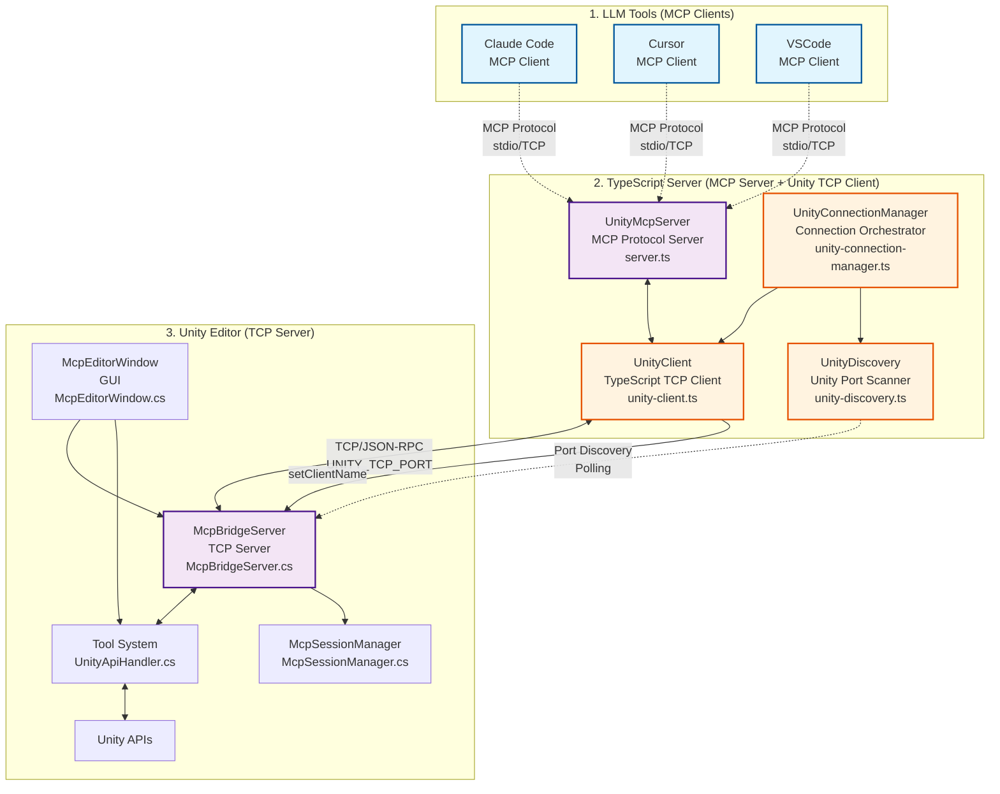
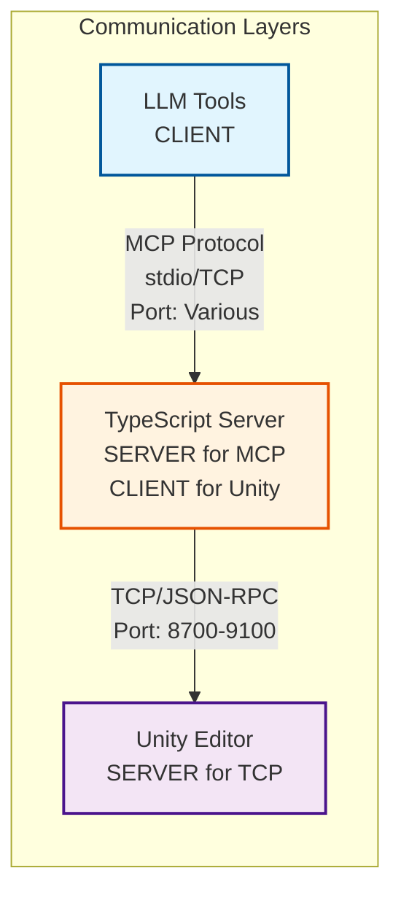
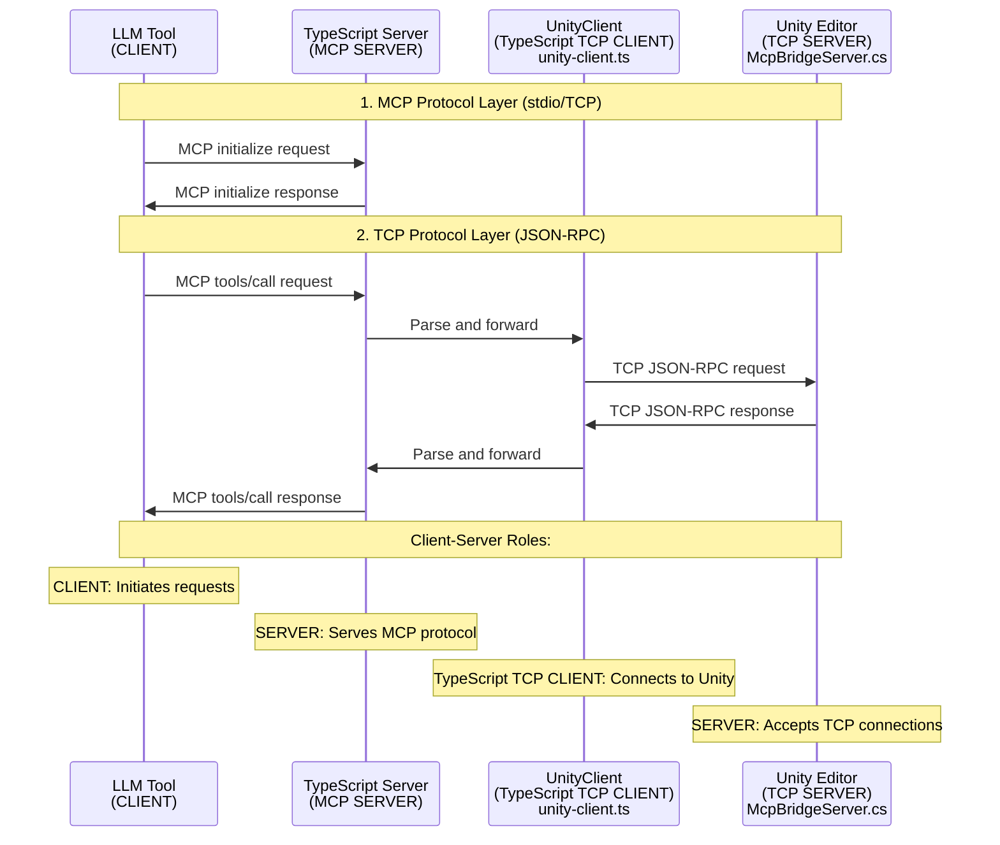
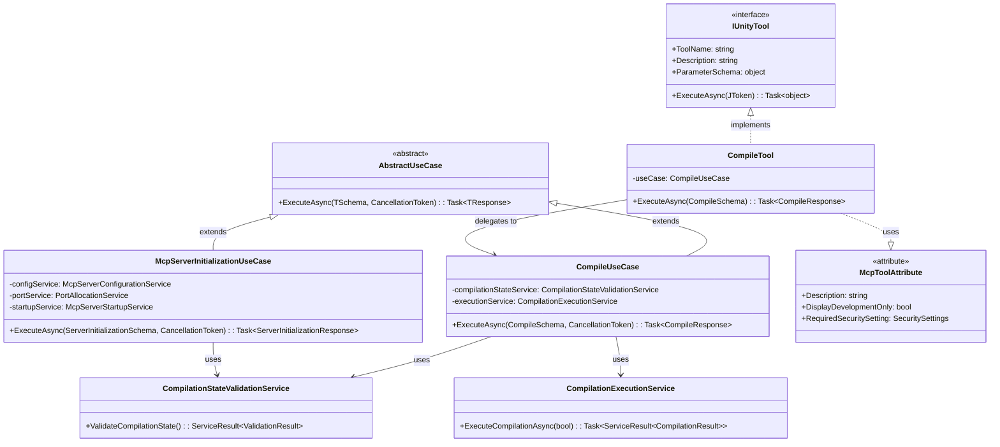
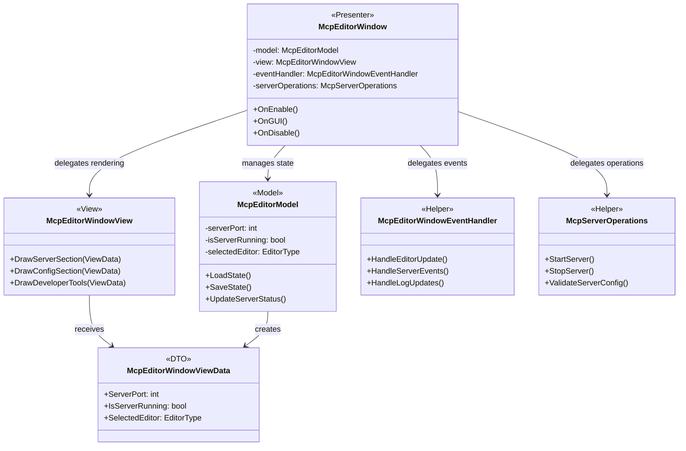
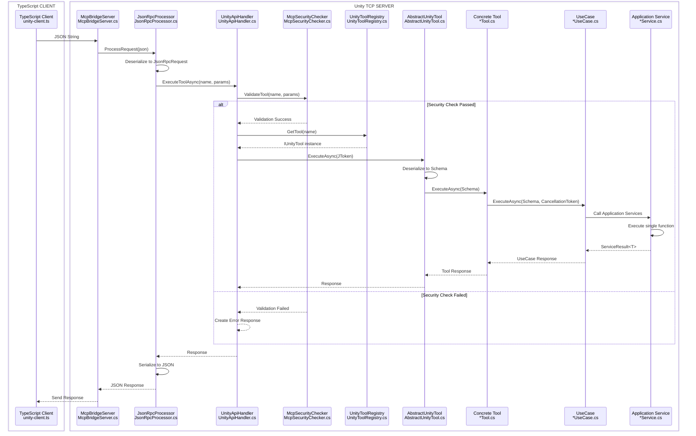
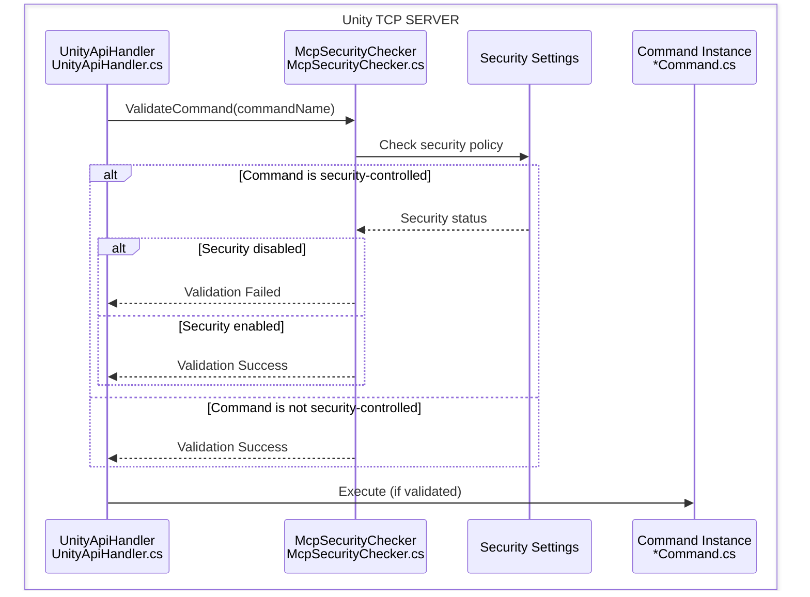

# uLoopMCP Unity Editor-Side Architecture

## 1. Overview

This document details the architecture of the C# code within the `Packages/src/Editor` directory. This code runs inside the Unity Editor and serves as the bridge between the Unity environment and the external TypeScript-based MCP (Model-Context-Protocol) server.

### System Architecture Overview



### Client-Server Relationship Breakdown



### Protocol and Communication Details



### Communication Protocol Summary

| Component | Role | Protocol | Port | Connection Type |
|-----------|------|----------|------|----------------|
| **LLM Tools** (Claude, Cursor, VSCode) | **CLIENT** | MCP Protocol | stdio/Various | Initiates MCP requests |
| **TypeScript Server** | **SERVER** (for MCP)<br/>**CLIENT** (for Unity) | MCP ↔ TCP/JSON-RPC | stdio ↔ 8700-9100 | Bridge between protocols |
| **Unity Editor** | **SERVER** | TCP/JSON-RPC | 8700-9100 | Accepts TCP connections |

### Communication Flow Details

#### Layer 1: LLM Tools ↔ TypeScript Server (MCP Protocol)
- **Protocol**: Model Context Protocol (MCP)
- **Transport**: stdio or TCP
- **Data Format**: JSON-RPC 2.0 with MCP extensions
- **Connection**: LLM tools act as MCP clients
- **Lifecycle**: Managed by LLM tool (Claude, Cursor, VSCode)

#### Layer 2: TypeScript Server ↔ Unity Editor (TCP Protocol)
- **Protocol**: Custom TCP with JSON-RPC 2.0
- **Transport**: TCP Socket
- **Ports**: UNITY_TCP_PORT environment variable specified port (auto-discovery)
- **Connection**: TypeScript server acts as TCP client
- **Lifecycle**: Managed by UnityConnectionManager with automatic reconnection

#### Key Architectural Points:
1. **TypeScript Server serves as a Protocol Bridge**: Converts MCP protocol to TCP/JSON-RPC
2. **Unity Editor is the final TCP Server**: Processes tool requests and executes Unity operations
3. **LLM Tools are pure MCP Clients**: Send tool requests through standard MCP protocol
4. **Automatic Discovery**: TypeScript server discovers Unity instances through port scanning

### TCP/JSON-RPC Communication Specification

#### Transport Layer
- **Protocol**: TCP/IP over localhost
- **Default Port**: 8700 (configurable via environment variable)
- **Message Format**: JSON-RPC 2.0 compliant
- **Message Framing**: Content-Length headers (RFC-compliant)
- **Dynamic Buffer Management**: Up to 1MB dynamic buffering capacity
- **Fragmented Message Support**: TCP fragmented message reassembly functionality

#### JSON-RPC 2.0 Message Format

**Framing Format:**
```
Content-Length: <message_size>\r\n\r\n<json_content>
```

**Request Message Example:**
```
Content-Length: 120

{
  "jsonrpc": "2.0",
  "id": 1647834567890,
  "method": "ping",
  "params": {
    "Message": "Hello Unity MCP!"
  }
}
```

**Success Response:**
```json
{
  "jsonrpc": "2.0",
  "id": 1647834567890,
  "result": {
    "Message": "Unity MCP Bridge received: Hello Unity MCP!",
    "ExecutionTimeMs": 5
  }
}
```

**Error Response:**
```json
{
  "jsonrpc": "2.0",
  "id": 1647834567890,
  "error": {
    "code": -32603,
    "message": "Tool blocked by security settings",
    "data": {
      "type": "security_blocked",
      "command": "find-gameobjects",
      "reason": "GameObject search is disabled"
    }
  }
}
```

#### Connection Lifecycle

1. **Initial Connection**
   - TypeScript UnityClient connects to Unity McpBridgeServer
   - TCP socket established on localhost:8700
   - Connection test with ping command

2. **Client Registration**
   - `set-client-name` command sent immediately after connection
   - Client identity stored in Unity session manager
   - UI updated to show connected client

3. **Command Processing**
   - JSON-RPC requests processed through UnityApiHandler
   - Security validation via McpSecurityChecker
   - Tool execution through UnityCommandRegistry

4. **Connection Monitoring**
   - Automatic reconnection on connection loss
   - Periodic health checks via ping commands
   - SafeTimer cleanup on process termination

#### Push Notifications

Unity can send real-time push notifications to all connected TypeScript clients when tools or system state changes occur:

**Notification Format:**
```json
{
  "jsonrpc": "2.0",
  "method": "notifications/tools/list_changed",
  "params": {
    "timestamp": "2025-07-16T12:34:56.789Z",
    "message": "Unity tools have been updated"
  }
}
```

**Notification Triggers:**
- Assembly reloads/recompilation
- Custom tool registration
- Manual tool change notifications via `TriggerToolChangeNotification()`

**Broadcast Mechanism:**
- Sent to all connected clients simultaneously
- Uses same TCP/JSON-RPC communication channel
- Message terminated with newline character (`\n`)

**TypeScript Client Reception:**
```typescript
// TypeScript clients receive notifications via:
socket.on('data', (buffer: Buffer) => {
  const message = buffer.toString('utf8');
  if (message.includes('"method":"notifications/tools/list_changed"')) {
    // Handle tool list update
    this.refreshToolList();
  }
});
```

#### Error Handling

- **SecurityBlocked**: Tool blocked by security settings
- **InternalError**: Unity internal processing errors
- **Timeout**: Network timeout (default: 2 minutes)
- **Connection Loss**: Automatic reconnection with exponential backoff

#### Security Features

- **localhost-only**: External connections blocked
- **Tool-level Security**: McpSecurityChecker validates each command
- **Configurable Access Control**: Unity Editor security settings
- **Session Management**: Client isolation and state tracking

Its primary responsibilities are:
1.  **Running a TCP Server (`McpBridgeServer`)**: Listens for connections from the TypeScript server to receive tool requests.
2.  **Executing Unity Operations**: Processes received tool requests to perform actions within the Unity Editor, such as compiling the project, running tests, or retrieving logs.
3.  **Security Management**: Validates and controls tool execution through `McpSecurityChecker` to prevent unauthorized operations.
4.  **Session Management**: Maintains client sessions and connection state through `McpSessionManager`.
5.  **Providing a User Interface (`McpEditorWindow`)**: Offers a GUI within the Unity Editor for developers to manage and monitor the MCP server.
6.  **Managing Configuration**: Handles the setup of `mcp.json` files required by LLM tools like Cursor, Claude, and VSCode.

## 2. Core Architectural Principles

The architecture is built upon several key design principles to ensure robustness, extensibility, and maintainability.

### 2.1. UseCase + Tool Pattern (DDD Integration)
The system is centered around **Domain-Driven Design** integrated **UseCase + Tool Pattern**. Each action is structured according to DDD principles, with UseCase layer orchestrating business workflows and Application Service layer implementing single functions.

#### UseCase Layer (Domain Workflow Orchestration)
- **`AbstractUseCase<TSchema, TResponse>`**: Base class for all UseCases, orchestrating workflows through a single `ExecuteAsync` method
- **Concrete UseCases**: Manage complex workflows (e.g., `McpServerInitializationUseCase`, `DomainReloadRecoveryUseCase`)
- **Temporal Cohesion Separation**: Following Martin Fowler's refactoring principles, temporal cohesion is separated into UseCase classes

#### Application Service Layer (Single Function Implementation)
- **Single Responsibility Enforcement**: Each Application Service implements only one function
- **Unified Service Results**: All services return results via `ServiceResult<T>`
- **Examples**: `CompilationExecutionService`, `LogRetrievalService`, `TestExecutionService`

#### Tool Layer (MCP Interface)
- **`IUnityTool`**: Common interface for all tools (MCP connection point)
- **`AbstractUnityTool<TSchema, TResponse>`**: Provides type-safe handling of parameters and responses
- **`McpToolAttribute`**: Attribute for automatic tool registration
- **Tool Implementation**: Each tool calls UseCases to execute business logic

#### Registry and Security
- **`UnityToolRegistry`**: Central registry that discovers and holds all available tools
- **`UnityApiHandler`**: Receives tool names and parameters, looks up tools in registry and executes them
- **`McpSecurityChecker`**: Validates execution permissions based on security settings

This DDD-integrated architecture provides clear separation between business logic and infrastructure, achieving high extensibility and maintainability.

### 2.2. Security Architecture
The system implements comprehensive security controls to prevent unauthorized tool execution:

- **`McpSecurityChecker`**: Central security validation component that checks tool permissions before execution.
- **Attribute-Based Security**: Tools can be decorated with security attributes to define their execution requirements.
- **Default Deny Policy**: Unknown tools are blocked by default to prevent unauthorized operations.
- **Settings-Based Control**: Security policies can be configured through Unity Editor settings interface.

### 2.3. Session Management
The system maintains robust session management to handle client connections and state:

- **`McpSessionManager`**: Singleton session manager implemented as `ScriptableSingleton` for domain reload persistence.
- **Client State Tracking**: Maintains connection state, client identification, and session metadata.
- **Domain Reload Resilience**: Session state survives Unity domain reloads through persistent storage.
- **Reconnection Support**: Handles client reconnection scenarios gracefully.

### 2.4. DDD-Integrated System Architecture



### 2.5. MVP + Helper Architecture for UI



### 2.6. Schema-Driven and Type-Safe Communication
To avoid manual and error-prone JSON parsing, the system uses a schema-driven approach for commands.

- **`*Schema.cs` files** (e.g., `CompileSchema.cs`, `GetLogsSchema.cs`): These classes define the expected parameters for a command using simple C# properties. Attributes like `[Description]` and default values are used to automatically generate a JSON Schema for the client.
- **`*Response.cs` files** (e.g., `CompileResponse.cs`): These define the structure of the data returned to the client.
- **`CommandParameterSchemaGenerator.cs`**: This utility uses reflection on the `*Schema.cs` files to generate the parameter schema dynamically, ensuring the C# code is the single source of truth.

This design eliminates inconsistencies between the server and client and provides strong type safety within the C# code.

### 2.7. SOLID Principles
- **Single Responsibility Principle (SRP)**: Each class has a well-defined responsibility.
    - `McpBridgeServer`: Handles raw TCP communication.
    - `McpServerController`: Manages the server's lifecycle and state across domain reloads.
    - `McpConfigRepository`: Handles file I/O for configuration.
    - `McpConfigService`: Implements the business logic for configuration.
    - `JsonRpcProcessor`: Deals exclusively with parsing and formatting JSON-RPC 2.0 messages.
    - **UI Layer Examples**:
        - `McpEditorModel`: Manages application state and business logic only.
        - `McpEditorWindowView`: Handles UI rendering only.
        - `McpEditorWindowEventHandler`: Manages Unity Editor events only.
        - `McpServerOperations`: Handles server operations only.
- **Open/Closed Principle (OCP)**: The system is open for extension but closed for modification. The Command Pattern is the prime example; new commands can be added without altering the core execution logic. The MVP + Helper pattern also demonstrates this principle - new functionality can be added by creating new helper classes without modifying existing components.

### 2.8. MVP + Helper Pattern for UI Architecture
The UI layer implements a sophisticated **MVP (Model-View-Presenter) + Helper Pattern** that evolved from a monolithic 1247-line class into a well-structured, maintainable architecture.

#### Pattern Components
- **Model (`McpEditorModel`)**: Contains all application state, configuration data, and business logic. Provides methods for state updates while maintaining encapsulation. Handles persistence through Unity's `SessionState` and `EditorPrefs`.
- **View (`McpEditorWindowView`)**: Pure UI rendering component with no business logic. Receives all necessary data through `McpEditorWindowViewData` transfer objects.
- **Presenter (`McpEditorWindow`)**: Coordinates between Model and View, handles Unity-specific lifecycle events, and delegates complex operations to specialized helper classes.
- **Helper Classes**: Specialized components that handle specific aspects of functionality:
  - Event management (`McpEditorWindowEventHandler`)
  - Server operations (`McpServerOperations`)
  - Configuration services (`McpConfigServiceFactory`)

#### Benefits of This Architecture
1. **Separation of Concerns**: Each component has a single, clear responsibility
2. **Testability**: Helper classes can be unit tested independently from Unity Editor context
3. **Maintainability**: Complex logic is broken down into manageable, focused components
4. **Extensibility**: New features can be added through new helper classes without modifying existing code
5. **Reduced Cognitive Load**: Developers can focus on one aspect of functionality at a time

#### Implementation Guidelines
- **State Management**: All state changes go through the Model layer
- **UI Updates**: View receives data through transfer objects, never directly accesses Model
- **Complex Operations**: Delegate to appropriate helper classes rather than implementing in Presenter
- **Event Handling**: Isolate all Unity Editor event management in dedicated EventHandler

### 2.9. Domain Reload Resilience (UseCase Integration)
A significant challenge in the Unity Editor is the "domain reload," which resets the application's state. The DDD-integrated architecture handles this gracefully at the UseCase level:

#### Domain Reload Recovery UseCase
- **`DomainReloadRecoveryUseCase`**: Orchestrates the entire domain reload workflow
- **`DomainReloadDetectionService`**: Detects and determines domain reload state
- **`SessionRecoveryService`**: Handles session state preservation and restoration
- **`ClientNotificationService`**: Manages client notification processing

#### McpServerController Integration
- **`McpServerController`**: Uses `[InitializeOnLoad]` to hook into Editor lifecycle events
- **UseCase Invocation**: Executes UseCases in `OnBeforeAssemblyReload` and `OnAfterAssemblyReload`
- **`AssemblyReloadEvents`**: Delegates pre/post reload processing to UseCases
- **`SessionState`**: Domain reload data persistence (managed by UseCases)

#### Orchestrated Workflow
1. **Before Reload**: `DomainReloadRecoveryUseCase.ExecuteBeforeDomainReload()` saves server state
2. **After Reload**: `DomainReloadRecoveryUseCase.ExecuteAfterDomainReloadAsync()` restores state
3. **Client Notification**: Automatic tool list change notifications ensure seamless experience

This UseCase integration ensures domain reload processing is managed as a single business workflow, improving maintainability and reliability.

## 3. Implemented UseCases and Tools

The system currently implements 13 production-ready features using **Domain-Driven Design** architecture with **UseCase + Tool Pattern**. Each feature provides business workflow orchestration through UseCases, single-function implementation through Application Services, and MCP interface through Tools:

### 3.1. Core System UseCases and Tools
- **`PingTool`**: Connection health check and latency testing
- **`CompileUseCase` + `CompileTool`**: Compilation state validation and execution separated by Application Services, with detailed error reporting
- **`ClearConsoleTool`**: Unity Console log clearing with confirmation
- **`SetClientNameTool`**: Client identification and session management
- **`GetCommandDetailsTool`**: Tool introspection and metadata retrieval

### 3.2. Information Retrieval UseCases and Tools
- **`GetLogsUseCase` + `GetLogsTool`**: Log retrieval and filtering separated by Application Services, with type selection
- **`GetHierarchyUseCase` + `GetHierarchyTool`**: Scene hierarchy information collection and export with component information
- **`GetMenuItemsUseCase` + `GetMenuItemsTool`**: Unity menu item discovery and metadata collection
- **`GetProviderDetailsUseCase` + `GetProviderDetailsTool`**: Unity Search provider information collection

### 3.3. GameObject and Scene UseCases and Tools
- **`FindGameObjectsUseCase` + `FindGameObjectsTool`**: Multi-criteria search logic orchestrated by UseCase, advanced GameObject search
- **`UnitySearchUseCase` + `UnitySearchTool`**: Unity Search API integrated unified search across assets, scenes, and project resources

### 3.4. Execution UseCases and Tools
- **`RunTestsUseCase` + `RunTestsTool`**: Test filter creation and execution separated by Application Services, NUnit XML export (security-controlled)
- **`ExecuteMenuItemUseCase` + `ExecuteMenuItemTool`**: Menu item search and execution orchestrated by UseCase, reflection-based execution (security-controlled)

### 3.5. Security-Controlled UseCases and Tools
Several UseCases and Tools are subject to security restrictions and can be disabled via settings:
- **Test Execution**: `RunTestsUseCase`/`RunTestsTool` requires "Enable Tests Execution" setting
- **Menu Item Execution**: `ExecuteMenuItemUseCase`/`ExecuteMenuItemTool` requires "Allow Menu Item Execution" setting
- **Unknown Tools**: Blocked by default unless explicitly configured

### 3.6. Server Lifecycle UseCases
- **`McpServerInitializationUseCase`**: Orchestrates complex server initialization workflow
- **`McpServerShutdownUseCase`**: Manages proper server shutdown processing
- **`DomainReloadRecoveryUseCase`**: Completely orchestrates state management before/after domain reloads

These UseCases are not directly exposed as MCP Tools but are called internally by `McpServerController` to manage the system lifecycle.

## 4. Key Components (Directory Breakdown)

### `/Server`
This directory contains the core networking and lifecycle management components.
- **`McpBridgeServer.cs`**: The low-level TCP server. It listens on a specified port, accepts client connections, and handles the reading/writing of JSON data using Content-Length framing over the network stream. It operates on a background thread.
- **`FrameParser.cs`**: Specialized class for Content-Length header parsing and validation. Handles frame integrity verification and JSON content extraction.
- **`DynamicBufferManager.cs`**: Dynamic buffer pool management class. Achieves memory efficiency and buffer reuse. Supports dynamic buffering up to 1MB.
- **`MessageReassembler.cs`**: TCP fragmented message reassembly class. Properly handles partially received frames and extracts complete messages.
- **`McpServerController.cs`**: The high-level, static manager for the server. It controls the lifecycle (Start, Stop, Restart) of the `McpBridgeServer` instance. It is the central point for managing state across domain reloads.
- **`McpServerConfig.cs`**: A static class holding constants for server configuration (e.g., default port, buffer sizes).

### `/Security`
Contains the security infrastructure for command execution control.
- **`McpSecurityChecker.cs`**: Central security validation component that implements permission checking for command execution. Evaluates security attributes and settings to determine if a command should be allowed to execute.

### `/Api`
This is the heart of the command processing logic.
- **`/Commands`**: Contains the implementation of all supported commands.
    - **`/Core`**: The foundational classes for the command system.
        - **`IUnityCommand.cs`**: Defines the contract for all commands, including `CommandName`, `Description`, `ParameterSchema`, and the `ExecuteAsync` method.
        - **`AbstractUnityCommand.cs`**: The generic base class that simplifies command creation by handling the boilerplate of parameter deserialization and response creation.
        - **`UnityCommandRegistry.cs`**: Discovers all classes with the `[McpTool]` attribute and registers them in a dictionary, mapping a command name to its implementation.
        - **`McpToolAttribute.cs`**: A simple attribute used to mark a class for automatic registration as a command.
    - **Command-specific folders**: Each of the 13 implemented commands has its own folder containing:
        - `*Command.cs`: The main command implementation
        - `*Schema.cs`: Type-safe parameter definition
        - `*Response.cs`: Structured response format
        - Commands include: `/Compile`, `/RunTests`, `/GetLogs`, `/Ping`, `/ClearConsole`, `/FindGameObjects`, `/GetHierarchy`, `/GetMenuItems`, `/ExecuteMenuItem`, `/SetClientName`, `/UnitySearch`, `/GetProviderDetails`, `/GetCommandDetails`
- **`JsonRpcProcessor.cs`**: Responsible for parsing incoming JSON strings into `JsonRpcRequest` objects and serializing response objects back into JSON strings, adhering to the JSON-RPC 2.0 specification.
- **`UnityApiHandler.cs`**: The entry point for API calls. It receives the method name and parameters from the `JsonRpcProcessor` and uses the `UnityCommandRegistry` to execute the appropriate command. Integrates with `McpSecurityChecker` for permission validation.

### `/Core`
Contains core infrastructure components for session and state management.
- **`McpSessionManager.cs`**: Singleton session manager implemented as `ScriptableSingleton` that maintains client connection state, session metadata, and survives domain reloads. Provides centralized client identification and connection tracking.

### `/UI`
Contains the code for the user-facing Editor Window, implemented using the **MVP (Model-View-Presenter) + Helper Pattern**.

#### Core MVP Components
- **`McpEditorWindow.cs`**: The **Presenter** layer (503 lines). Acts as the coordinator between the Model and View, handling Unity-specific lifecycle events and user interactions. Delegates complex operations to specialized helper classes.
- **`McpEditorModel.cs`**: The **Model** layer (470 lines). Manages all application state, persistence, and business logic. Contains UI state, server configuration, and provides methods for state updates with proper encapsulation.
- **`McpEditorWindowView.cs`**: The **View** layer. Handles pure UI rendering logic, completely separated from business logic. Receives data through `McpEditorWindowViewData` and renders the interface.
- **`McpEditorWindowViewData.cs`**: Data transfer object that carries all necessary information from the Model to the View, ensuring clean separation of concerns.

#### Specialized Helper Classes
- **`McpEditorWindowEventHandler.cs`**: Manages Unity Editor events (194 lines). Handles `EditorApplication.update`, `McpCommunicationLogger.OnLogUpdated`, server connection events, and state change detection. Completely isolates event management logic from the main window.
- **`McpServerOperations.cs`**: Handles complex server operations (131 lines). Contains server validation, starting, and stopping logic. Supports both user-interactive and internal operation modes with comprehensive error handling.
- **`McpCommunicationLog.cs`**: Manages the in-memory and `SessionState`-backed log of requests and responses displayed in the "Developer Tools" section of the window.

#### Architectural Benefits
This MVP + Helper pattern provides:
- **Single Responsibility**: Each class has one clear, focused responsibility
- **Testability**: Helper classes can be unit tested independently
- **Maintainability**: Complex logic is separated into specialized, manageable components
- **Extensibility**: New features can be added by creating new helper classes without modifying existing code
- **Reduced Complexity**: The main Presenter went from 1247 lines to 503 lines (59% reduction) through proper responsibility distribution

### `/Config`
Manages the creation and modification of `mcp.json` configuration files.
- **`UnityMcpPathResolver.cs`**: A utility to find the correct path for configuration files for different editors (Cursor, VSCode, etc.).
- **`McpConfigRepository.cs`**: Handles the direct reading and writing of the `mcp.json` file.
- **`McpConfigService.cs`**: Contains the logic for auto-configuring the `mcp.json` file with the correct command, arguments, and environment variables based on the user's settings in the `McpEditorWindow`.

### `/Tools`
Contains higher-level utilities that wrap core Unity Editor functionality.
- **`/ConsoleUtility` & `/ConsoleLogFetcher`**: A set of classes, primarily `ConsoleLogRetriever`, that use reflection to access Unity's internal console log entries. This allows the `getlogs` command to retrieve logs with specific types and filters.
- **`/TestRunner`**: Contains the logic for executing Unity tests.
    - **`PlayModeTestExecuter.cs`**: A key class that handles the complexity of running PlayMode tests, which involves disabling domain reloads (`DomainReloadDisableScope`) to ensure the `async` task can complete successfully.
    - **`NUnitXmlResultExporter.cs`**: Formats test results into NUnit-compatible XML files.
- **`/Util`**: General-purpose utilities.
    - **`CompileController.cs`**: Wraps the `CompilationPipeline` API to provide a simple `async` interface for compiling the project.

### `/Utils`
Contains low-level, general-purpose helper classes.
- **`MainThreadSwitcher.cs`**: A crucial utility that provides an `awaitable` object to switch execution from a background thread (like the TCP server's) back to Unity's main thread. This is essential because most Unity APIs can only be called from the main thread.
- **`EditorDelay.cs`**: A custom, `async/await`-compatible implementation of a frame-based delay, useful for waiting a few frames for the Editor to reach a stable state, especially after domain reloads.
- **`McpLogger.cs`**: A simple, unified logging wrapper to prefix all package-related logs with `[uLoopMCP]`.

## 5. Key Workflows

### 5.1. UseCase + Tool Execution Flow with Security



### 5.2. UI Interaction Flow (MVP + Helper Pattern)
1.  **User Interaction**: User interacts with the Unity Editor window (button clicks, field changes, etc.).
2.  **Presenter Processing**: `McpEditorWindow` (Presenter) receives the Unity Editor event.
3.  **State Update**: Presenter calls appropriate method on `McpEditorModel` to update application state.
4.  **Complex Operations**: For complex operations (server start/stop, validation), Presenter delegates to specialized helper classes:
    - `McpServerOperations` for server-related operations
    - `McpEditorWindowEventHandler` for event management
    - `McpConfigServiceFactory` for configuration operations
5.  **View Data Preparation**: Model state is packaged into `McpEditorWindowViewData` transfer objects.
6.  **UI Rendering**: `McpEditorWindowView` receives the transfer objects and renders the interface.
7.  **Event Propagation**: `McpEditorWindowEventHandler` manages Unity Editor events and updates the Model accordingly.
8.  **Persistence**: Model automatically handles state persistence through Unity's `SessionState` and `EditorPrefs`.

This workflow ensures clean separation of concerns while maintaining responsiveness and proper state management throughout the application lifecycle.

### 5.3. Security Validation Flow

