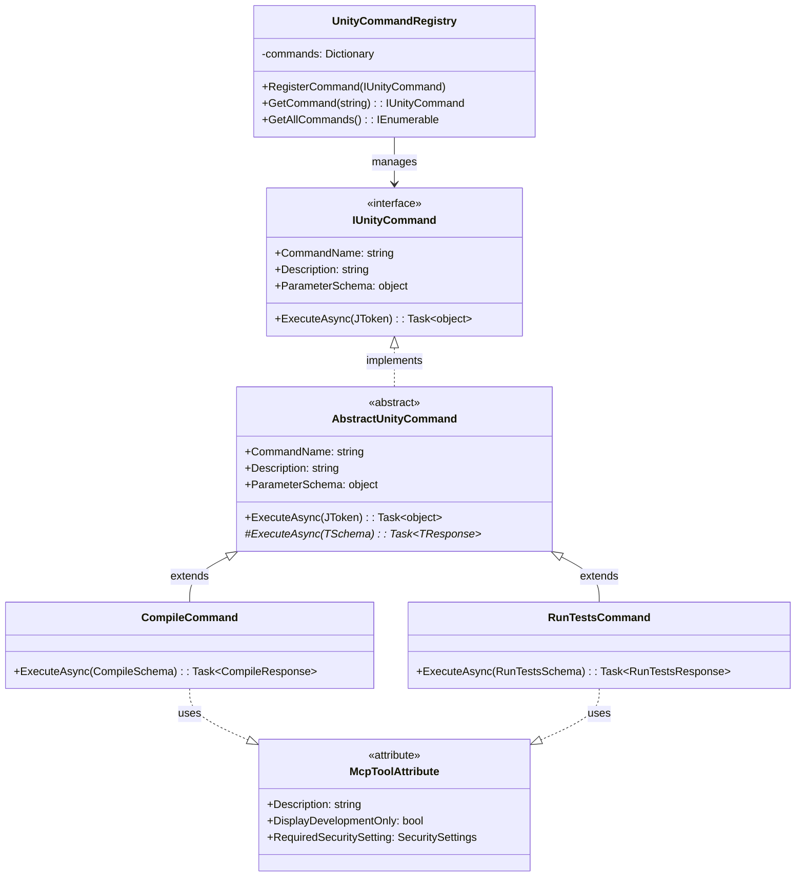
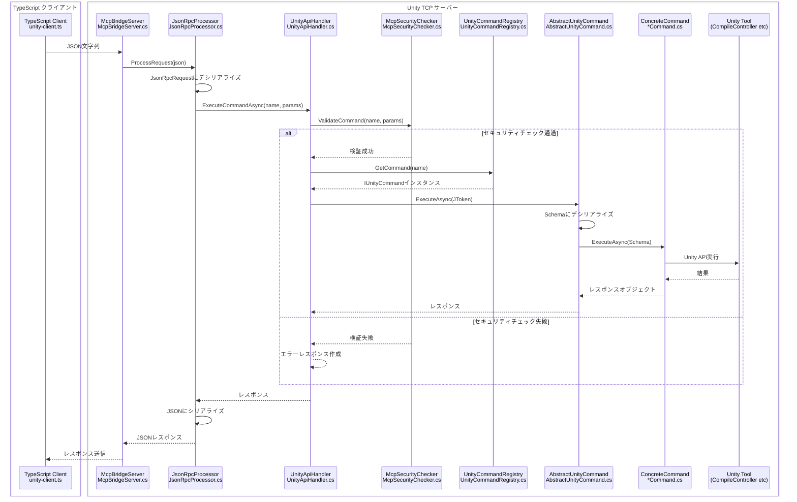

# uLoopMCP Unity Editor側アーキテクチャ

## 1. 概要

このドキュメントは、`Packages/src/Editor` ディレクトリ内のC#コードのアーキテクチャについて詳細に説明します。このコードはUnity Editor内で動作し、Unity環境と外部TypeScriptベースのMCP（Model-Context-Protocol）サーバーとの橋渡しの役割を果たします。

### システムアーキテクチャ概要

### クライアント・サーバー関係の内訳

### プロトコルと通信詳細

### 通信プロトコルの概要

| コンポーネント | 役割 | プロトコル | ポート | 接続タイプ |
|-----------|------|----------|------|----------------|
| **LLMツール**（Claude、Cursor、VSCode） | **クライアント** | MCPプロトコル | stdio/様々 | MCPリクエストを開始 |
| **TypeScriptサーバー** | **サーバー**（MCPの） **クライアント**（Unityの） | MCP ↔ TCP/JSON-RPC | stdio ↔ 8700-9100 | プロトコル間のブリッジ |
| **Unity Editor** | **サーバー** | TCP/JSON-RPC | 8700-9100 | TCP接続を受け入れ |

主な責務は以下の通りです：
1. **TCPサーバーの実行（`McpBridgeServer`）**: TypeScriptサーバーからの接続をリッスンしてツールリクエストを受信
2. **Unity操作の実行**: 受信したツールリクエストを処理してUnity Editor内でアクションを実行（プロジェクトのコンパイル、テスト実行、ログ取得など）
3. **セキュリティ管理**: `McpSecurityChecker`を通じてツール実行を検証・制御し、未承認操作を防止
4. **セッション管理**: `McpSessionManager`を通じてクライアントセッションと接続状態を維持
5. **ユーザーインターフェースの提供（`McpEditorWindow`）**: 開発者がMCPサーバーを管理・監視するためのUnity Editor内GUI
6. **設定管理**: Cursor、Claude、VSCodeなどのLLMツールに必要な`mcp.json`ファイルの設定を処理

## 2. コアアーキテクチャ原則

アーキテクチャは、堅牢性、拡張性、保守性を確保するためのいくつかの重要な設計原則に基づいて構築されています。

### 2.1. ツールパターン
システムは**ツールパターン**を中心としています。LLMツールによってトリガーできる各アクションは、独自のツールクラスにカプセル化されています。

- **`IUnityTool`**: すべてのツールの共通インターフェース
- **`AbstractUnityTool<TSchema, TResponse>`**: パラメータとレスポンスの型安全な処理を提供する汎用抽象基底クラス
- **`McpToolAttribute`**: ツールを自動登録にマークするために使用される属性（Description設定を含む）
- **`UnityToolRegistry`**: 使用可能なすべてのツールを発見・保持する中央レジストリ
- **`UnityApiHandler`**: ツール名とパラメータを受け取り、レジストリでツールを検索して実行するクラス
- **`McpSecurityChecker`**: セキュリティ設定に基づいたツール実行権限の検証

このパターンによりシステムは高い拡張性を持ちます。新機能を追加するには、開発者は`IUnityTool`を実装する新しいクラスを作成し、`[McpTool(Description = "...")]`属性で装飾するだけです。システムが自動的に発見・公開します。

### 2.2. セキュリティアーキテクチャ
システムは未承認ツール実行を防ぐための包括的なセキュリティ制御を実装しています：

- **`McpSecurityChecker`**: 実行前にツール権限をチェックする中央セキュリティ検証コンポーネント
- **属性ベースセキュリティ**: ツールを実行要件を定義するセキュリティ属性で装飾可能
- **デフォルト拒否ポリシー**: 未知のツールはデフォルトで未承認操作を防ぐためにブロック
- **設定ベース制御**: Unity Editorの設定インターフェースを通じてセキュリティポリシーを設定可能

### 2.3. セッション管理
システムはクライアント接続と状態を処理するための堅牢なセッション管理を維持します：

- **`McpSessionManager`**: ドメインリロード永続化のための`ScriptableSingleton`として実装されたシングルトンセッションマネージャー
- **クライアント状態追跡**: 接続状態、クライアント識別、セッションメタデータを維持
- **ドメインリロード耐性**: 永続ストレージを通じてUnityドメインリロードを乗り越える
- **再接続サポート**: クライアント再接続シナリオを優雅に処理

### 2.4. コマンドシステムアーキテクチャ

### 2.5. UI用MVP + Helperアーキテクチャ

### 2.6. スキーマ駆動型・型安全通信
手動でエラーの起こりやすいJSON解析を避けるため、システムはコマンドにスキーマ駆動アプローチを使用します。

- **`*Schema.cs`ファイル**（例：`CompileSchema.cs`、`GetLogsSchema.cs`）: 単純なC#プロパティを使用してコマンドの期待パラメータを定義。`[Description]`などの属性とデフォルト値を使用してクライアント用のJSONスキーマを自動生成
- **`*Response.cs`ファイル**（例：`CompileResponse.cs`）: クライアントに返されるデータの構造を定義
- **`CommandParameterSchemaGenerator.cs`**: この汎用ユーティリティは`*Schema.cs`ファイルのリフレクションを使用してパラメータスキーマを動的に生成し、C#コードが単一の真実の源であることを保証

この設計により、サーバーとクライアント間の不整合を排除し、C#コード内で強力な型安全性を提供します。

### 2.7. SOLID原則
- **単一責任原則（SRP）**: 各クラスは明確に定義された責任を持ちます。
    - `McpBridgeServer`: 生のTCP通信を処理
    - `McpServerController`: サーバーのライフサイクルとドメインリロード間の状態を管理
    - `McpConfigRepository`: 設定のファイルI/Oを処理
    - `McpConfigService`: 設定のビジネスロジックを実装
    - `JsonRpcProcessor`: JSON-RPC 2.0メッセージの解析と整形のみを扱う
    - **UIレイヤーの例**:
        - `McpEditorModel`: アプリケーション状態とビジネスロジックのみを管理
        - `McpEditorWindowView`: UIレンダリングのみを処理
        - `McpEditorWindowEventHandler`: Unity Editorイベントのみを管理
        - `McpServerOperations`: サーバー操作のみを処理
- **開放閉鎖原則（OCP）**: システムは拡張に対して開かれていますが、変更に対して閉じています。コマンドパターンが主要例です。新しいコマンドをコア実行ロジックを変更することなく追加できます。MVP + Helperパターンもこの原則を実証しています - 既存のコンポーネントを変更することなく新しいヘルパークラスを作成することで新機能を追加できます。

### 2.8. UI用MVP + Helperパターン
UIレイヤーは、1247行のモノリシッククラスから構造化された保守可能なアーキテクチャに進化した洗練された**MVP（Model-View-Presenter） + Helperパターン**を実装しています。

#### パターンコンポーネント
- **Model（`McpEditorModel`）**: すべてのアプリケーション状態、設定データ、ビジネスロジックを含む。カプセル化を維持しながら状態更新のメソッドを提供。UnityのSuryaStateとEditorPrefsを通じて永続化を処理
- **View（`McpEditorWindowView`）**: ビジネスロジックのない純粋なUIレンダリングコンポーネント。`McpEditorWindowViewData`転送オブジェクトを通じてすべての必要なデータを受信
- **Presenter（`McpEditorWindow`）**: ModelとViewを調整し、Unity固有のライフサイクルイベントを処理し、複雑な操作を専門ヘルパークラスに委譲
- **Helperクラス**: 機能の特定の側面を処理する専門コンポーネント:
  - イベント管理（`McpEditorWindowEventHandler`）
  - サーバー操作（`McpServerOperations`）
  - 設定サービス（`McpConfigServiceFactory`）

#### このアーキテクチャの利点
1. **関心の分離**: 各コンポーネントが単一の明確な責任を持つ
2. **テスト可能性**: HelperクラスはUnity Editorコンテキストから独立してユニットテスト可能
3. **保守性**: 複雑なロジックが管理可能で焦点の絞られたコンポーネントに分解
4. **拡張性**: 既存のコードを変更することなく新しいヘルパークラスで新機能を追加可能
5. **認知負荷の軽減**: 開発者は一度に機能の一側面に集中可能

#### 実装ガイドライン
- **状態管理**: すべての状態変更はModelレイヤーを通じて行う
- **UI更新**: Viewは転送オブジェクトを通じてデータを受信し、Modelに直接アクセスしない
- **複雑な操作**: Presenterで実装するのではなく適切なヘルパークラスに委譲
- **イベント処理**: すべてのUnity Editorイベント管理を専用EventHandlerに分離

### 2.9. ドメインリロードへの耐性
Unity Editorの重要な課題は、アプリケーションの状態をリセットする「ドメインリロード」です。アーキテクチャはこれを優雅に処理します：
- **`McpServerController`**: `[InitializeOnLoad]`を使用してEditorライフサイクルイベントにフック
- **`AssemblyReloadEvents`**: リロード前に、`OnBeforeAssemblyReload`を使用してサーバーの実行状態（ポート、ステータス）を`SessionState`に保存
- **`SessionState`**: ドメインリロード間で単純なデータを永続化するUnity Editor機能
- リロード後、`OnAfterAssemblyReload`が`SessionState`を読み取り、以前に実行されていた場合は自動的にサーバーを再起動し、接続されたクライアントにシームレスな体験を保証

## 3. 実装されたコマンド

システムは現在、確立されたコマンドパターンアーキテクチャに従った13の本番対応コマンドを実装しています：

### 3.1. コアシステムコマンド
- **`PingCommand`**: 接続ヘルスチェックと遅延テスト
- **`CompileCommand`**: 詳細エラーレポート付きプロジェクトコンパイル
- **`ClearConsoleCommand`**: 確認付きUnity Consoleログクリア
- **`SetClientNameCommand`**: クライアント識別とセッション管理
- **`GetCommandDetailsCommand`**: コマンド内省とメタデータ取得

### 3.2. 情報取得コマンド
- **`GetLogsCommand`**: フィルタリングと型選択付きコンソールログ取得
- **`GetHierarchyCommand`**: コンポーネント情報付きシーン階層エクスポート
- **`GetMenuItemsCommand`**: Unity メニューアイテム発見とメタデータ
- **`GetProviderDetailsCommand`**: Unity Search プロバイダー情報

### 3.3. GameObjectとシーンコマンド
- **`FindGameObjectsCommand`**: 複数条件による高度なGameObject検索
- **`UnitySearchCommand`**: アセット、シーン、プロジェクトリソース全体の統合検索

### 3.4. 実行コマンド
- **`RunTestsCommand`**: NUnit XMLエクスポート付きテスト実行（セキュリティ制御）
- **`ExecuteMenuItemCommand`**: リフレクション経由のMenuItem実行（セキュリティ制御）

### 3.5. セキュリティ制御コマンド
いくつかのコマンドはセキュリティ制限の対象であり、設定により無効化可能：
- **テスト実行**: `RunTestsCommand`は「テスト実行有効化」設定が必要
- **メニューアイテム実行**: `ExecuteMenuItemCommand`は「メニューアイテム実行許可」設定が必要
- **未知のコマンド**: 明示的に設定されない限りデフォルトでブロック

## 4. 主要コンポーネント（ディレクトリ別）

### `/Server`
このディレクトリにはコアネットワーキングとライフサイクル管理コンポーネントが含まれています。
- **`McpBridgeServer.cs`**: 低レベルTCPサーバー。指定ポートをリッスンし、クライアント接続を受け入れ、ネットワークストリーム上でContent-Lengthフレーミングを使用したJSONデータの読み書きを処理。バックグラウンドスレッドで動作
- **`FrameParser.cs`**: Content-Lengthヘッダー解析と検証の専門クラス。フレーム整合性検証とJSONコンテンツ抽出を処理
- **`DynamicBufferManager.cs`**: 動的バッファプール管理クラス。メモリ効率とバッファ再利用を実現。最大1MBまでの動的バッファリングをサポート
- **`MessageReassembler.cs`**: TCP断片化メッセージ再組み立てクラス。部分的に受信されたフレームを適切に処理し、完全なメッセージを抽出
- **`McpServerController.cs`**: サーバーの高レベル静的マネージャー。`McpBridgeServer`インスタンスのライフサイクル（開始、停止、再起動）を制御。ドメインリロード間の状態管理の中心点
- **`McpServerConfig.cs`**: サーバー設定の定数を保持する静的クラス（例：デフォルトポート、バッファサイズ）

### `/Security`
コマンド実行制御のセキュリティインフラストラクチャを含みます。
- **`McpSecurityChecker.cs`**: コマンド実行の権限チェックを実装する中央セキュリティ検証コンポーネント。セキュリティ属性と設定を評価してコマンドの実行許可を決定

### `/Api`
これがコマンド処理ロジックの中心です。
- **`/Commands`**: サポートされているすべてのコマンドの実装を含む
    - **`/Core`**: コマンドシステムの基盤クラス
        - **`IUnityCommand.cs`**: `CommandName`、`Description`、`ParameterSchema`、`ExecuteAsync`メソッドを含むすべてのコマンドの契約を定義
        - **`AbstractUnityCommand.cs`**: パラメータのデシリアライゼーションとレスポンス作成の定型文を処理してコマンド作成を簡素化する汎用基底クラス
        - **`UnityCommandRegistry.cs`**: `[McpTool]`属性を持つすべてのクラスを発見し、コマンド名をその実装にマッピングする辞書に登録
        - **`McpToolAttribute.cs`**: クラスをコマンドとして自動登録にマークするために使用される単純な属性
    - **コマンド固有フォルダー**: 実装された13のコマンドにはそれぞれ以下を含むフォルダーがあります:
        - `*Command.cs`: メインコマンド実装
        - `*Schema.cs`: 型安全パラメータ定義
        - `*Response.cs`: 構造化レスポンス形式
        - コマンドには以下が含まれます: `/Compile`、`/RunTests`、`/GetLogs`、`/Ping`、`/ClearConsole`、`/FindGameObjects`、`/GetHierarchy`、`/GetMenuItems`、`/ExecuteMenuItem`、`/SetClientName`、`/UnitySearch`、`/GetProviderDetails`、`/GetCommandDetails`
- **`JsonRpcProcessor.cs`**: 受信JSON文字列を`JsonRpcRequest`オブジェクトに解析し、レスポンスオブジェクトをJSON文字列にシリアライズしてJSON-RPC 2.0仕様に準拠
- **`UnityApiHandler.cs`**: API呼び出しのエントリーポイント。`JsonRpcProcessor`からメソッド名とパラメータを受け取り、`UnityCommandRegistry`を使用して適切なコマンドを実行。権限検証のために`McpSecurityChecker`と統合

### `/Core`
セッションと状態管理のコアインフラストラクチャコンポーネントを含みます。
- **`McpSessionManager.cs`**: クライアント接続状態、セッションメタデータを維持し、ドメインリロードを乗り越える`ScriptableSingleton`として実装されたシングルトンセッションマネージャー。集中クライアント識別と接続追跡を提供

### `/UI`
**MVP（Model-View-Presenter） + Helperパターン**を使用して実装されたユーザー向けEditorWindowのコードを含みます。

#### コアMVPコンポーネント
- **`McpEditorWindow.cs`**: **Presenter**レイヤー（503行）。ModelとViewの調整役として機能し、Unity固有のライフサイクルイベントとユーザーインタラクションを処理。複雑な操作を専門ヘルパークラスに委譲
- **`McpEditorModel.cs`**: **Model**レイヤー（470行）。すべてのアプリケーション状態、永続化、ビジネスロジックを管理。UI状態、サーバー設定を含み、適切なカプセル化で状態更新のメソッドを提供
- **`McpEditorWindowView.cs`**: **View**レイヤー。純粋なUIレンダリングロジックを処理し、ビジネスロジックから完全に分離。`McpEditorWindowViewData`を通じてデータを受信してインターフェースをレンダリング
- **`McpEditorWindowViewData.cs`**: ModelからViewにすべての必要な情報を運ぶデータ転送オブジェクト、関心の清潔な分離を保証

#### 専門ヘルパークラス
- **`McpEditorWindowEventHandler.cs`**: Unity Editorイベントを管理（194行）。`EditorApplication.update`、`McpCommunicationLogger.OnLogUpdated`、サーバー接続イベント、状態変更検出を処理。イベント管理ロジックをメインウィンドウから完全に分離
- **`McpServerOperations.cs`**: 複雑なサーバー操作を処理（131行）。サーバー検証、開始、停止ロジックを含む。包括的エラー処理でユーザーインタラクティブと内部操作モードの両方をサポート
- **`McpCommunicationLog.cs`**: ウィンドウの「開発者ツール」セクションに表示されるリクエストとレスポンスのインメモリと`SessionState`バック付きログを管理

#### アーキテクチャの利点
このMVP + Helperパターンが提供するもの：
- **単一責任**: 各クラスが一つの明確で焦点の絞られた責任を持つ
- **テスト可能性**: HelperクラスはUnity Editorコンテキストから独立してテスト可能
- **保守性**: 複雑なロジックが専門化された管理可能なコンポーネントに分離
- **拡張性**: 既存のコードを変更することなく新しいヘルパークラスで新機能を追加可能
- **複雑性の軽減**: メインPresenterが適切な責任分散により1247行から503行（59%削減）に

### `/Config`
`mcp.json`設定ファイルの作成と変更を管理します。
- **`UnityMcpPathResolver.cs`**: 異なるエディター（Cursor、VSCodeなど）の設定ファイルの正しいパスを見つけるユーティリティ
- **`McpConfigRepository.cs`**: `mcp.json`ファイルの直接読み書きを処理
- **`McpConfigService.cs`**: `McpEditorWindow`でのユーザー設定に基づいて正しいコマンド、引数、環境変数で`mcp.json`ファイルを自動設定するロジックを含む

### `/Tools`
コアUnity Editor機能をラップする高レベルユーティリティを含みます。
- **`/ConsoleUtility` & `/ConsoleLogFetcher`**: 主に`ConsoleLogRetriever`のクラスセットで、リフレクションを使用してUnityの内部コンソールログエントリにアクセス。これにより`getlogs`コマンドが特定の型とフィルターでログを取得可能
- **`/TestRunner`**: Unity テストを実行するロジックを含む
    - **`PlayModeTestExecuter.cs`**: PlayModeテストの実行の複雑さを処理する重要クラス。`async`タスクが正常に完了できるようにドメインリロードを無効化（`DomainReloadDisableScope`）を含む
    - **`NUnitXmlResultExporter.cs`**: テスト結果をNUnit互換XMLファイルに整形
- **`/Util`**: 汎用ユーティリティ
    - **`CompileController.cs`**: `CompilationPipeline` APIをラップしてプロジェクトコンパイルの単純な`async`インターフェースを提供

### `/Utils`
低レベル汎用ヘルパークラスを含みます。
- **`MainThreadSwitcher.cs`**: バックグラウンドスレッド（TCPサーバーなど）からUnityのメインスレッドに実行を切り替える`awaitable`オブジェクトを提供する重要ユーティリティ。ほとんどのUnity APIはメインスレッドからのみ呼び出し可能なため不可欠
- **`EditorDelay.cs`**: フレームベース遅延のカスタム`async/await`互換実装。特にドメインリロード後にEditorが安定状態に達するのを数フレーム待つのに有用
- **`McpLogger.cs`**: すべてのパッケージ関連ログに`[uLoopMCP]`プレフィックスを付ける単純統合ログラッパー

## 5. 主要ワークフロー

### 5.1. セキュリティ付きコマンド実行フロー

### 5.2. UIインタラクションフロー（MVP + Helperパターン）
1.  **ユーザーインタラクション**: ユーザーがUnity Editorウィンドウとインタラクション（ボタンクリック、フィールド変更など）
2.  **Presenter処理**: `McpEditorWindow`（Presenter）がUnity Editorイベントを受信
3.  **状態更新**: Presenterが`McpEditorModel`で適切なメソッドを呼び出してアプリケーション状態を更新
4.  **複雑な操作**: 複雑な操作（サーバー開始/停止、検証）については、Presenterが専門ヘルパークラスに委譲:
    - サーバー関連操作は`McpServerOperations`
    - イベント管理は`McpEditorWindowEventHandler`
    - 設定操作は`McpConfigServiceFactory`
5.  **ビューデータ準備**: Model状態が`McpEditorWindowViewData`転送オブジェクトにパッケージ化
6.  **UIレンダリング**: `McpEditorWindowView`が転送オブジェクトを受信してインターフェースをレンダリング
7.  **イベント伝播**: `McpEditorWindowEventHandler`がUnity Editorイベントを管理してModelを相応に更新
8.  **永続化**: ModelがUnityの`SessionState`と`EditorPrefs`を通じて状態永続化を自動処理

このワークフローにより、アプリケーションライフサイクル全体で応答性と適切な状態管理を維持しながら関心の清潔な分離を保証します。

### 5.3. セキュリティ検証フロー

