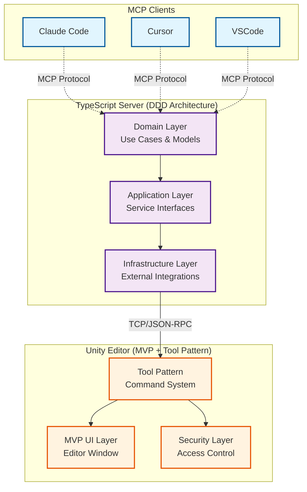

# uLoopMCP Architecture Overview

This document provides the main architecture overview for the uLoopMCP project. For detailed architecture information, please refer to the specific architecture documents:

- **[Unity Editor-Side Architecture](ARCHITECTURE_Unity.md)**: Detailed C# architecture for Unity Editor components
- **[TypeScript Server Architecture](ARCHITECTURE_TypeScript.md)**: Detailed TypeScript server DDD architecture

## System Overview

The uLoopMCP system consists of three main components that work together to provide Unity Editor integration for Model Context Protocol (MCP) clients:

1. **MCP Clients** (Claude Code, Cursor, VSCode): LLM-powered development tools that consume MCP protocol
2. **TypeScript Server** (Node.js Process): MCP protocol server with Domain-Driven Design architecture
3. **Unity Editor** (C# TCP Server): Unity Editor integration with tool system and security management

### High-Level Architecture

### Communication Flow

The system uses a three-layer communication approach:

1. **MCP Protocol Layer**: LLM clients communicate with TypeScript server using Model Context Protocol over stdio
2. **Service Layer**: TypeScript server uses Domain-Driven Design with Use Cases orchestrating business workflows
3. **TCP Layer**: TypeScript server communicates with Unity Editor via TCP/JSON-RPC on localhost

For detailed communication protocols, connection management, and architectural patterns, please refer to the specific architecture documents linked above.

## Key Features

### TypeScript Server (DDD Architecture)
- **Domain-Driven Design**: Clean Architecture with Use Cases orchestrating business workflows
- **Service Locator Pattern**: Type-safe dependency injection with symbol-based tokens
- **Interface Segregation**: Small, focused interfaces for specific responsibilities
- **Dynamic Tool Management**: Automatically discovers and exposes Unity tools to MCP clients
- **Client Compatibility**: Handles different MCP client requirements and behaviors
- **Connection Resilience**: Automatic reconnection and discovery with graceful degradation

### Unity Editor (MVP + Tool Pattern)
- **MVP + Helper Pattern**: Clean separation of concerns with specialized helper classes
- **Tool Pattern**: Extensible command system with automatic registration
- **Security Architecture**: Comprehensive access control with configurable policies
- **Session Management**: Domain reload resilient state management
- **Schema-Driven Communication**: Type-safe JSON-RPC with automatic schema generation
- **Dynamic Buffer Management**: Efficient TCP communication with fragmented message support

## Development Guidelines

### TypeScript Server DDD Rules
- **Domain Layer**: Pure business logic without external dependencies
- **Application Layer**: Service contracts shielding domain from infrastructure
- **Infrastructure Layer**: External system integrations and framework code
- **Service Locator**: Type-safe dependency injection with factory functions

### Unity Editor Patterns
- **Tool Creation**: Implement `IUnityCommand` and use `[McpTool]` attribute for automatic registration
- **UI Development**: Follow MVP + Helper pattern for maintainable Editor windows
- **Security**: All tools subject to security validation through `McpSecurityChecker`
- **Session State**: Use `ScriptableSingleton` for domain reload persistence

For comprehensive implementation details, development workflows, and architectural decisions, please consult the detailed architecture documents.