# uLoopMCP Unity Editor-Side Architecture

## 1. Overview

This document details the architecture of the C# code within the `Packages/src/Editor` directory. This code runs inside the Unity Editor and serves as the bridge between the Unity environment and the external TypeScript-based MCP (Model-Context-Protocol) server.

### System Architecture Overview

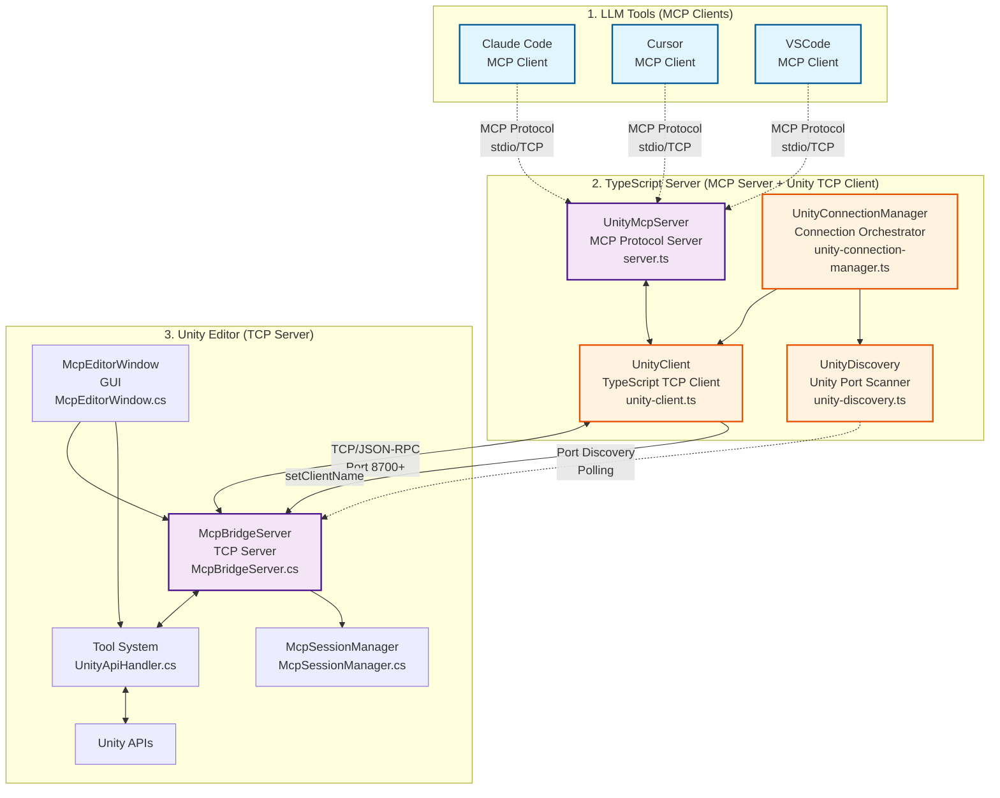

### Client-Server Relationship Breakdown

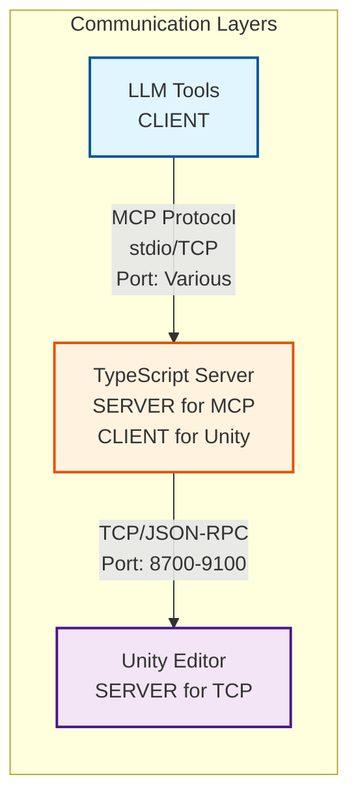

### Protocol and Communication Details

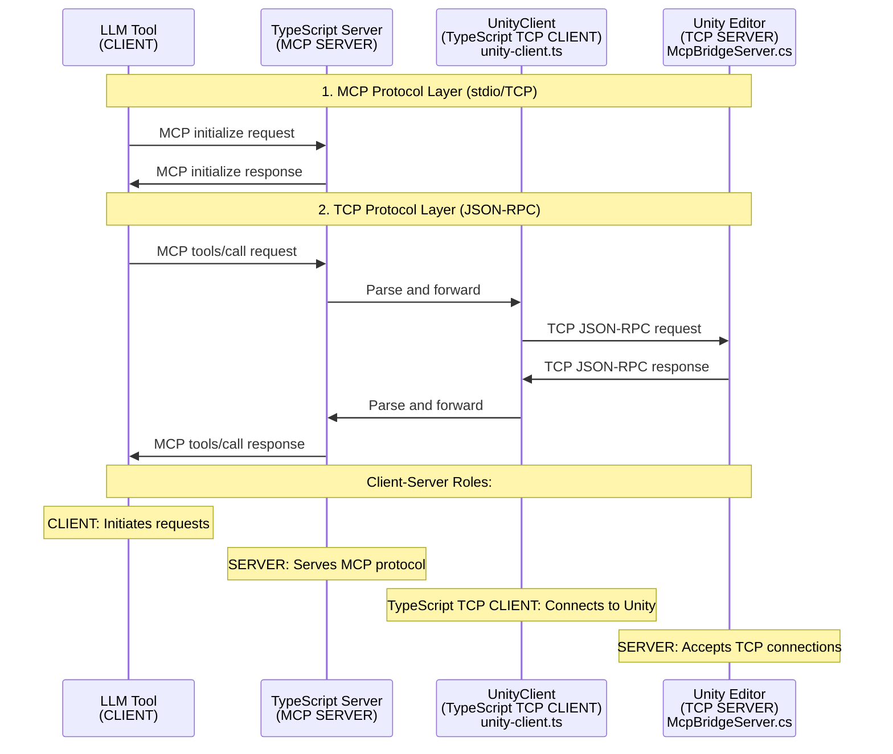

### Communication Protocol Summary

| Component | Role | Protocol | Port | Connection Type |
|-----------|------|----------|------|----------------|
| **LLM Tools** (Claude, Cursor, VSCode) | **CLIENT** | MCP Protocol | stdio/Various | Initiates MCP requests |
| **TypeScript Server** | **SERVER** (for MCP)<br/>**CLIENT** (for Unity) | MCP ↔ TCP/JSON-RPC | stdio ↔ 8700-9100 | Bridge between protocols |
| **Unity Editor** | **SERVER** | TCP/JSON-RPC | 8700-9100 | Accepts TCP connections |

### Communication Flow Details

#### Layer 1: LLM Tools ↔ TypeScript Server (MCP Protocol)
- **Protocol**: Model Context Protocol (MCP)
- **Transport**: stdio or TCP
- **Data Format**: JSON-RPC 2.0 with MCP extensions
- **Connection**: LLM tools act as MCP clients
- **Lifecycle**: Managed by LLM tool (Claude, Cursor, VSCode)

#### Layer 2: TypeScript Server ↔ Unity Editor (TCP Protocol)
- **Protocol**: Custom TCP with JSON-RPC 2.0
- **Transport**: TCP Socket
- **Ports**: 8700, 8800, 8900, 9000, 9100, 8600 (auto-discovery)
- **Connection**: TypeScript server acts as TCP client
- **Lifecycle**: Managed by UnityConnectionManager with automatic reconnection

#### Key Architectural Points:
1. **TypeScript Server serves as a Protocol Bridge**: Converts MCP protocol to TCP/JSON-RPC
2. **Unity Editor is the final TCP Server**: Processes tool requests and executes Unity operations
3. **LLM Tools are pure MCP Clients**: Send tool requests through standard MCP protocol
4. **Automatic Discovery**: TypeScript server discovers Unity instances through port scanning

### TCP/JSON-RPC Communication Specification

#### Transport Layer
- **Protocol**: TCP/IP over localhost
- **Default Port**: 8700 (configurable via environment variable)
- **Message Format**: JSON-RPC 2.0 compliant
- **Message Delimiter**: Newline character (`\n`)
- **Buffer Size**: 4096 bytes

#### JSON-RPC 2.0 Message Format

**Request Message:**
```json
{
  "jsonrpc": "2.0",
  "id": 1647834567890,
  "method": "ping",
  "params": {
    "Message": "Hello Unity MCP!"
  }
}
```

**Success Response:**
```json
{
  "jsonrpc": "2.0",
  "id": 1647834567890,
  "result": {
    "Message": "Unity MCP Bridge received: Hello Unity MCP!",
    "ExecutionTimeMs": 5
  }
}
```

**Error Response:**
```json
{
  "jsonrpc": "2.0",
  "id": 1647834567890,
  "error": {
    "code": -32603,
    "message": "Tool blocked by security settings",
    "data": {
      "type": "security_blocked",
      "command": "find-gameobjects",
      "reason": "GameObject search is disabled"
    }
  }
}
```

#### Connection Lifecycle

1. **Initial Connection**
   - TypeScript UnityClient connects to Unity McpBridgeServer
   - TCP socket established on localhost:8700
   - Connection test with ping command

2. **Client Registration**
   - `set-client-name` command sent immediately after connection
   - Client identity stored in Unity session manager
   - UI updated to show connected client

3. **Command Processing**
   - JSON-RPC requests processed through UnityApiHandler
   - Security validation via McpSecurityChecker
   - Tool execution through UnityCommandRegistry

4. **Connection Monitoring**
   - Automatic reconnection on connection loss
   - Periodic health checks via ping commands
   - SafeTimer cleanup on process termination

#### Push Notifications

Unity can send real-time push notifications to all connected TypeScript clients when tools or system state changes occur:

**Notification Format:**
```json
{
  "jsonrpc": "2.0",
  "method": "notifications/tools/list_changed",
  "params": {
    "timestamp": "2025-07-16T12:34:56.789Z",
    "message": "Unity tools have been updated"
  }
}
```

**Notification Triggers:**
- Assembly reloads/recompilation
- Custom tool registration
- Manual tool change notifications via `TriggerToolChangeNotification()`

**Broadcast Mechanism:**
- Sent to all connected clients simultaneously
- Uses same TCP/JSON-RPC communication channel
- Message terminated with newline character (`\n`)

**TypeScript Client Reception:**
```typescript
// TypeScript clients receive notifications via:
socket.on('data', (buffer: Buffer) => {
  const message = buffer.toString('utf8');
  if (message.includes('"method":"notifications/tools/list_changed"')) {
    // Handle tool list update
    this.refreshToolList();
  }
});
```

#### Error Handling

- **SecurityBlocked**: Tool blocked by security settings
- **InternalError**: Unity internal processing errors
- **Timeout**: Network timeout (default: 2 minutes)
- **Connection Loss**: Automatic reconnection with exponential backoff

#### Security Features

- **localhost-only**: External connections blocked
- **Tool-level Security**: McpSecurityChecker validates each command
- **Configurable Access Control**: Unity Editor security settings
- **Session Management**: Client isolation and state tracking

Its primary responsibilities are:
1.  **Running a TCP Server (`McpBridgeServer`)**: Listens for connections from the TypeScript server to receive tool requests.
2.  **Executing Unity Operations**: Processes received tool requests to perform actions within the Unity Editor, such as compiling the project, running tests, or retrieving logs.
3.  **Security Management**: Validates and controls tool execution through `McpSecurityChecker` to prevent unauthorized operations.
4.  **Session Management**: Maintains client sessions and connection state through `McpSessionManager`.
5.  **Providing a User Interface (`McpEditorWindow`)**: Offers a GUI within the Unity Editor for developers to manage and monitor the MCP server.
6.  **Managing Configuration**: Handles the setup of `mcp.json` files required by LLM tools like Cursor, Claude, and VSCode.

## 2. Core Architectural Principles

The architecture is built upon several key design principles to ensure robustness, extensibility, and maintainability.

### 2.1. Tool Pattern
The system is centered around the **Tool Pattern**. Each action that can be triggered by an LLM tool is encapsulated in its own tool class.

- **`IUnityTool`**: The common interface for all tools.
- **`AbstractUnityTool<TSchema, TResponse>`**: A generic abstract base class that provides type-safe handling of parameters and responses.
- **`McpToolAttribute`**: Attribute used to mark tools for automatic registration, including Description configuration.
- **`UnityToolRegistry`**: A central registry that discovers and holds all available tools.
- **`UnityApiHandler`**: These classes receive a tool name and parameters, look up the tool in the registry, and execute it.
- **`McpSecurityChecker`**: Validates tool execution permissions based on security settings.

This pattern makes the system highly extensible. To add a new feature, a developer simply needs to create a new class that implements `IUnityTool` and decorate it with the `[McpTool(Description = "...")]` attribute. The system will automatically discover and expose it.

### 2.2. Security Architecture
The system implements comprehensive security controls to prevent unauthorized tool execution:

- **`McpSecurityChecker`**: Central security validation component that checks tool permissions before execution.
- **Attribute-Based Security**: Tools can be decorated with security attributes to define their execution requirements.
- **Default Deny Policy**: Unknown tools are blocked by default to prevent unauthorized operations.
- **Settings-Based Control**: Security policies can be configured through Unity Editor settings interface.

### 2.3. Session Management
The system maintains robust session management to handle client connections and state:

- **`McpSessionManager`**: Singleton session manager implemented as `ScriptableSingleton` for domain reload persistence.
- **Client State Tracking**: Maintains connection state, client identification, and session metadata.
- **Domain Reload Resilience**: Session state survives Unity domain reloads through persistent storage.
- **Reconnection Support**: Handles client reconnection scenarios gracefully.

### 2.4. Command System Architecture

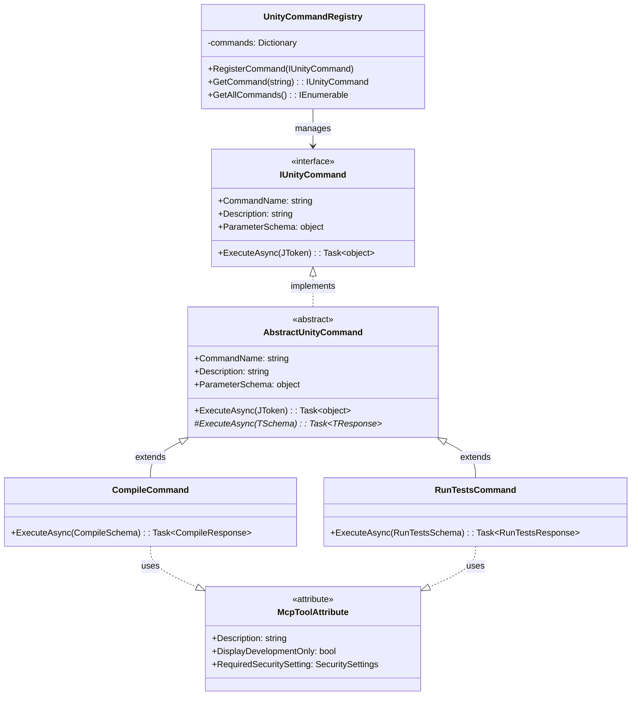

### 2.5. MVP + Helper Architecture for UI

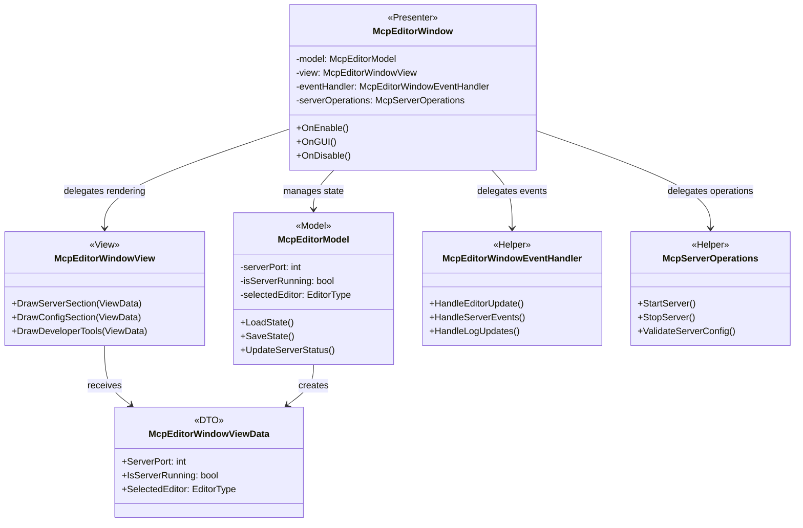

### 2.6. Schema-Driven and Type-Safe Communication
To avoid manual and error-prone JSON parsing, the system uses a schema-driven approach for commands.

- **`*Schema.cs` files** (e.g., `CompileSchema.cs`, `GetLogsSchema.cs`): These classes define the expected parameters for a command using simple C# properties. Attributes like `[Description]` and default values are used to automatically generate a JSON Schema for the client.
- **`*Response.cs` files** (e.g., `CompileResponse.cs`): These define the structure of the data returned to the client.
- **`CommandParameterSchemaGenerator.cs`**: This utility uses reflection on the `*Schema.cs` files to generate the parameter schema dynamically, ensuring the C# code is the single source of truth.

This design eliminates inconsistencies between the server and client and provides strong type safety within the C# code.

### 2.7. TypeScript Server to Unity Connection Architecture

#### 2.7.1. Connection Discovery and Management Components

The system implements a sophisticated connection discovery and management system that handles Unity Editor's frequent restarts and domain reloads:

- **`UnityClient`** (`unity-client.ts`): **TypeScript TCP client** that establishes and maintains connection to Unity Editor
- **`UnityDiscovery`** (`unity-discovery.ts`): **TypeScript singleton discovery service** that locates running Unity instances through port scanning
- **`UnityConnectionManager`** (`unity-connection-manager.ts`): **TypeScript orchestrator** that manages connection lifecycle and state management
- **`SafeTimer`** (`safe-timer.ts`): **TypeScript utility** that ensures proper timer cleanup to prevent orphaned processes

#### 2.7.2. Initial Connection Sequence

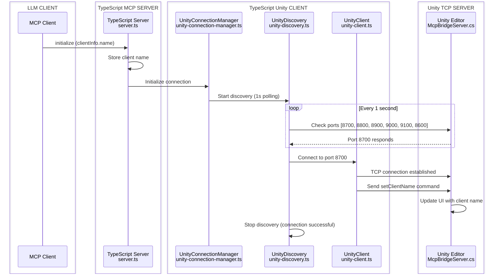

#### 2.7.3. Connection Health Monitoring and Reconnection

The system implements a robust reconnection mechanism that handles various failure scenarios:

**Connection State Detection:**
- **Socket Events**: `error`, `close`, `end` events trigger reconnection
- **Health Checks**: Periodic ping commands to verify connection integrity
- **Timeout Handling**: Connection attempts timeout after configured interval

**Reconnection Polling Process:**
1. **Detection Phase**: `UnityDiscovery` detects connection loss
2. **Restart Discovery**: Automatic restart of discovery process with 1-second intervals
3. **Port Scanning**: Systematic scanning of Unity ports (8700, 8800, 8900, 9000, 9100, 8600)
4. **Connection Establishment**: Automatic reconnection when Unity becomes available
5. **State Restoration**: Re-execution of `reconnectHandlers` to restore client state

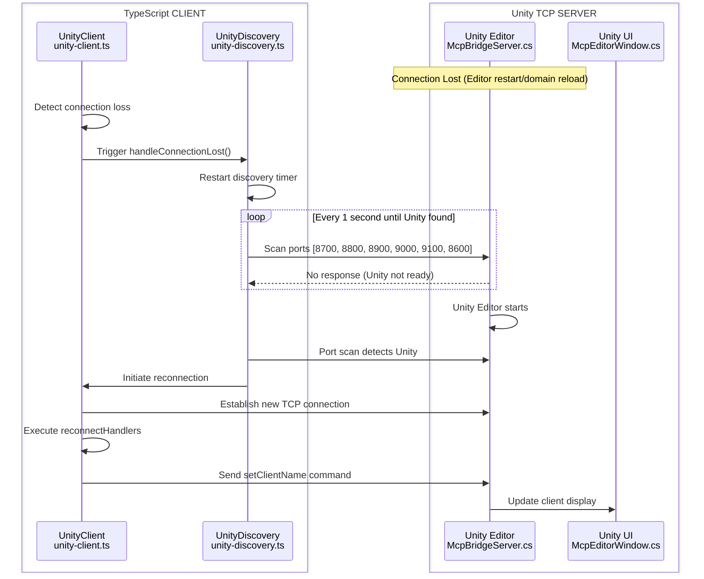

#### 2.7.4. SafeTimer Implementation for Process Cleanup

The system uses a custom `SafeTimer` class to prevent orphaned processes:

**Features:**
- **Automatic Cleanup**: Registers process exit handlers to clean up timers
- **Singleton Pattern**: Prevents multiple timer instances for the same operation
- **Development Monitoring**: Tracks active timer count for debugging
- **Graceful Shutdown**: Ensures timers are properly disposed on process termination

**Implementation Details:**
```typescript
// Automatic cleanup on process exit
process.on('exit', () => SafeTimer.cleanup());
process.on('SIGINT', () => SafeTimer.cleanup());
process.on('SIGTERM', () => SafeTimer.cleanup());
```

#### 2.7.5. Client Identification Flow

The system ensures proper client identification to prevent "Unknown Client" display issues:

1. **Initial State**: Unity Editor shows "No connected tools found" when no clients are connected.
2. **MCP Client Connection**: When an MCP client (Cursor, Claude, VSCode) connects:
   - Client sends `initialize` request with `clientInfo.name`
   - TypeScript server receives and stores the client name
   - Only then does TypeScript server connect to Unity
3. **Unity Connection**: TypeScript server immediately sends `setClientName` command
4. **UI Update**: Unity UI displays the correct client name from the first connection

This flow prevents the temporary "Unknown Client" display that would occur if the TypeScript server connected to Unity before receiving the client name.

### 2.8. SOLID Principles
- **Single Responsibility Principle (SRP)**: Each class has a well-defined responsibility.
    - `McpBridgeServer`: Handles raw TCP communication.
    - `McpServerController`: Manages the server's lifecycle and state across domain reloads.
    - `McpConfigRepository`: Handles file I/O for configuration.
    - `McpConfigService`: Implements the business logic for configuration.
    - `JsonRpcProcessor`: Deals exclusively with parsing and formatting JSON-RPC 2.0 messages.
    - **UI Layer Examples**:
        - `McpEditorModel`: Manages application state and business logic only.
        - `McpEditorWindowView`: Handles UI rendering only.
        - `McpEditorWindowEventHandler`: Manages Unity Editor events only.
        - `McpServerOperations`: Handles server operations only.
- **Open/Closed Principle (OCP)**: The system is open for extension but closed for modification. The Command Pattern is the prime example; new commands can be added without altering the core execution logic. The MVP + Helper pattern also demonstrates this principle - new functionality can be added by creating new helper classes without modifying existing components.

### 2.9. MVP + Helper Pattern for UI Architecture
The UI layer implements a sophisticated **MVP (Model-View-Presenter) + Helper Pattern** that evolved from a monolithic 1247-line class into a well-structured, maintainable architecture.

#### Pattern Components
- **Model (`McpEditorModel`)**: Contains all application state, configuration data, and business logic. Provides methods for state updates while maintaining encapsulation. Handles persistence through Unity's `SessionState` and `EditorPrefs`.
- **View (`McpEditorWindowView`)**: Pure UI rendering component with no business logic. Receives all necessary data through `McpEditorWindowViewData` transfer objects.
- **Presenter (`McpEditorWindow`)**: Coordinates between Model and View, handles Unity-specific lifecycle events, and delegates complex operations to specialized helper classes.
- **Helper Classes**: Specialized components that handle specific aspects of functionality:
  - Event management (`McpEditorWindowEventHandler`)
  - Server operations (`McpServerOperations`)
  - Configuration services (`McpConfigServiceFactory`)

#### Benefits of This Architecture
1. **Separation of Concerns**: Each component has a single, clear responsibility
2. **Testability**: Helper classes can be unit tested independently from Unity Editor context
3. **Maintainability**: Complex logic is broken down into manageable, focused components
4. **Extensibility**: New features can be added through new helper classes without modifying existing code
5. **Reduced Cognitive Load**: Developers can focus on one aspect of functionality at a time

#### Implementation Guidelines
- **State Management**: All state changes go through the Model layer
- **UI Updates**: View receives data through transfer objects, never directly accesses Model
- **Complex Operations**: Delegate to appropriate helper classes rather than implementing in Presenter
- **Event Handling**: Isolate all Unity Editor event management in dedicated EventHandler

### 2.10. Resilience to Domain Reloads
A significant challenge in the Unity Editor is the "domain reload," which resets the application's state. The architecture handles this gracefully:
- **`McpServerController`**: Uses `[InitializeOnLoad]` to hook into Editor lifecycle events.
- **`AssemblyReloadEvents`**: Before a reload, `OnBeforeAssemblyReload` is used to save the server's running state (port, status) into `SessionState`.
- **`SessionState`**: A Unity Editor feature that persists simple data across domain reloads.
- After a reload, `OnAfterAssemblyReload` reads the `SessionState` and automatically restarts the server if it was previously running, ensuring a seamless experience for the connected client.

## 3. Implemented Commands

The system currently implements 13 production-ready commands, each following the established Command Pattern architecture:

### 3.1. Core System Commands
- **`PingCommand`**: Connection health check and latency testing
- **`CompileCommand`**: Project compilation with detailed error reporting
- **`ClearConsoleCommand`**: Unity Console log clearing with confirmation
- **`SetClientNameCommand`**: Client identification and session management
- **`GetCommandDetailsCommand`**: Command introspection and metadata retrieval

### 3.2. Information Retrieval Commands
- **`GetLogsCommand`**: Console log retrieval with filtering and type selection
- **`GetHierarchyCommand`**: Scene hierarchy export with component information
- **`GetMenuItemsCommand`**: Unity menu item discovery and metadata
- **`GetProviderDetailsCommand`**: Unity Search provider information

### 3.3. GameObject and Scene Commands
- **`FindGameObjectsCommand`**: Advanced GameObject search with multiple criteria
- **`UnitySearchCommand`**: Unified search across assets, scenes, and project resources

### 3.4. Execution Commands
- **`RunTestsCommand`**: Test execution with NUnit XML export (security-controlled)
- **`ExecuteMenuItemCommand`**: MenuItem execution via reflection (security-controlled)

### 3.5. Security-Controlled Commands
Several commands are subject to security restrictions and can be disabled via settings:
- **Test Execution**: `RunTestsCommand` requires "Enable Tests Execution" setting
- **Menu Item Execution**: `ExecuteMenuItemCommand` requires "Allow Menu Item Execution" setting
- **Unknown Commands**: Blocked by default unless explicitly configured

## 4. Key Components (Directory Breakdown)

### `/Server`
This directory contains the core networking and lifecycle management components.
- **`McpBridgeServer.cs`**: The low-level TCP server. It listens on a specified port, accepts client connections, and handles the reading/writing of JSON data over the network stream. It operates on a background thread.
- **`McpServerController.cs`**: The high-level, static manager for the server. It controls the lifecycle (Start, Stop, Restart) of the `McpBridgeServer` instance. It is the central point for managing state across domain reloads.
- **`McpServerConfig.cs`**: A static class holding constants for server configuration (e.g., default port, buffer sizes).

### `/Security`
Contains the security infrastructure for command execution control.
- **`McpSecurityChecker.cs`**: Central security validation component that implements permission checking for command execution. Evaluates security attributes and settings to determine if a command should be allowed to execute.

### `/Api`
This is the heart of the command processing logic.
- **`/Commands`**: Contains the implementation of all supported commands.
    - **`/Core`**: The foundational classes for the command system.
        - **`IUnityCommand.cs`**: Defines the contract for all commands, including `CommandName`, `Description`, `ParameterSchema`, and the `ExecuteAsync` method.
        - **`AbstractUnityCommand.cs`**: The generic base class that simplifies command creation by handling the boilerplate of parameter deserialization and response creation.
        - **`UnityCommandRegistry.cs`**: Discovers all classes with the `[McpTool]` attribute and registers them in a dictionary, mapping a command name to its implementation.
        - **`McpToolAttribute.cs`**: A simple attribute used to mark a class for automatic registration as a command.
    - **Command-specific folders**: Each of the 13 implemented commands has its own folder containing:
        - `*Command.cs`: The main command implementation
        - `*Schema.cs`: Type-safe parameter definition
        - `*Response.cs`: Structured response format
        - Commands include: `/Compile`, `/RunTests`, `/GetLogs`, `/Ping`, `/ClearConsole`, `/FindGameObjects`, `/GetHierarchy`, `/GetMenuItems`, `/ExecuteMenuItem`, `/SetClientName`, `/UnitySearch`, `/GetProviderDetails`, `/GetCommandDetails`
- **`JsonRpcProcessor.cs`**: Responsible for parsing incoming JSON strings into `JsonRpcRequest` objects and serializing response objects back into JSON strings, adhering to the JSON-RPC 2.0 specification.
- **`UnityApiHandler.cs`**: The entry point for API calls. It receives the method name and parameters from the `JsonRpcProcessor` and uses the `UnityCommandRegistry` to execute the appropriate command. Integrates with `McpSecurityChecker` for permission validation.

### `/Core`
Contains core infrastructure components for session and state management.
- **`McpSessionManager.cs`**: Singleton session manager implemented as `ScriptableSingleton` that maintains client connection state, session metadata, and survives domain reloads. Provides centralized client identification and connection tracking.

### `/UI`
Contains the code for the user-facing Editor Window, implemented using the **MVP (Model-View-Presenter) + Helper Pattern**.

#### Core MVP Components
- **`McpEditorWindow.cs`**: The **Presenter** layer (503 lines). Acts as the coordinator between the Model and View, handling Unity-specific lifecycle events and user interactions. Delegates complex operations to specialized helper classes.
- **`McpEditorModel.cs`**: The **Model** layer (470 lines). Manages all application state, persistence, and business logic. Contains UI state, server configuration, and provides methods for state updates with proper encapsulation.
- **`McpEditorWindowView.cs`**: The **View** layer. Handles pure UI rendering logic, completely separated from business logic. Receives data through `McpEditorWindowViewData` and renders the interface.
- **`McpEditorWindowViewData.cs`**: Data transfer object that carries all necessary information from the Model to the View, ensuring clean separation of concerns.

#### Specialized Helper Classes
- **`McpEditorWindowEventHandler.cs`**: Manages Unity Editor events (194 lines). Handles `EditorApplication.update`, `McpCommunicationLogger.OnLogUpdated`, server connection events, and state change detection. Completely isolates event management logic from the main window.
- **`McpServerOperations.cs`**: Handles complex server operations (131 lines). Contains server validation, starting, and stopping logic. Supports both user-interactive and internal operation modes with comprehensive error handling.
- **`McpCommunicationLog.cs`**: Manages the in-memory and `SessionState`-backed log of requests and responses displayed in the "Developer Tools" section of the window.

#### Architectural Benefits
This MVP + Helper pattern provides:
- **Single Responsibility**: Each class has one clear, focused responsibility
- **Testability**: Helper classes can be unit tested independently
- **Maintainability**: Complex logic is separated into specialized, manageable components
- **Extensibility**: New features can be added by creating new helper classes without modifying existing code
- **Reduced Complexity**: The main Presenter went from 1247 lines to 503 lines (59% reduction) through proper responsibility distribution

### `/Config`
Manages the creation and modification of `mcp.json` configuration files.
- **`UnityMcpPathResolver.cs`**: A utility to find the correct path for configuration files for different editors (Cursor, VSCode, etc.).
- **`McpConfigRepository.cs`**: Handles the direct reading and writing of the `mcp.json` file.
- **`McpConfigService.cs`**: Contains the logic for auto-configuring the `mcp.json` file with the correct command, arguments, and environment variables based on the user's settings in the `McpEditorWindow`.

### `/Tools`
Contains higher-level utilities that wrap core Unity Editor functionality.
- **`/ConsoleUtility` & `/ConsoleLogFetcher`**: A set of classes, primarily `ConsoleLogRetriever`, that use reflection to access Unity's internal console log entries. This allows the `getlogs` command to retrieve logs with specific types and filters.
- **`/TestRunner`**: Contains the logic for executing Unity tests.
    - **`PlayModeTestExecuter.cs`**: A key class that handles the complexity of running PlayMode tests, which involves disabling domain reloads (`DomainReloadDisableScope`) to ensure the `async` task can complete successfully.
    - **`NUnitXmlResultExporter.cs`**: Formats test results into NUnit-compatible XML files.
- **`/Util`**: General-purpose utilities.
    - **`CompileController.cs`**: Wraps the `CompilationPipeline` API to provide a simple `async` interface for compiling the project.

### `/Utils`
Contains low-level, general-purpose helper classes.
- **`MainThreadSwitcher.cs`**: A crucial utility that provides an `awaitable` object to switch execution from a background thread (like the TCP server's) back to Unity's main thread. This is essential because most Unity APIs can only be called from the main thread.
- **`EditorDelay.cs`**: A custom, `async/await`-compatible implementation of a frame-based delay, useful for waiting a few frames for the Editor to reach a stable state, especially after domain reloads.
- **`McpLogger.cs`**: A simple, unified logging wrapper to prefix all package-related logs with `[uLoopMCP]`.

## 5. Key Workflows

### 5.1. Command Execution Flow with Security

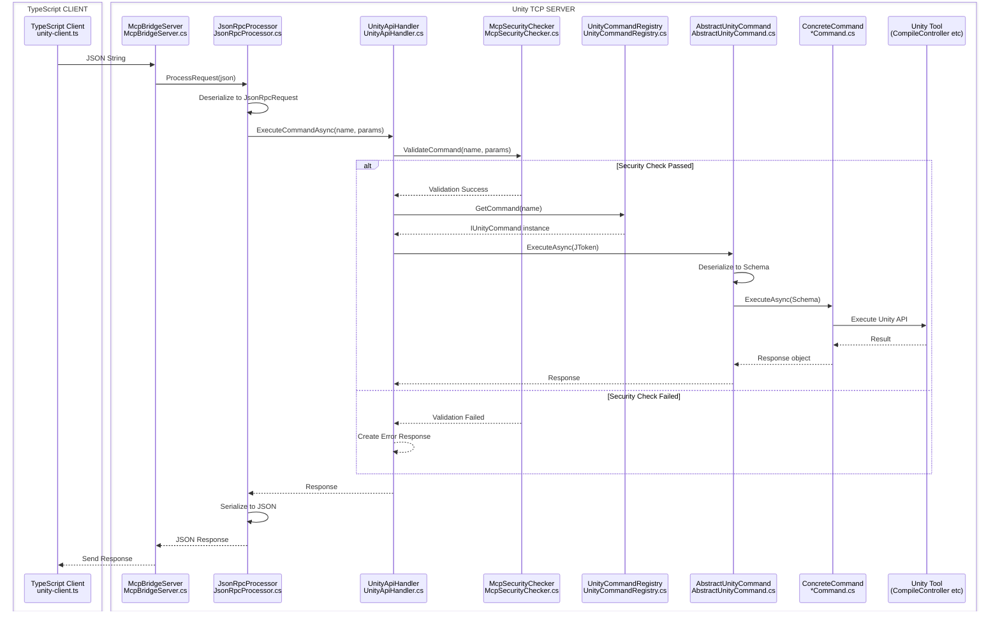

### 5.2. UI Interaction Flow (MVP + Helper Pattern)
1.  **User Interaction**: User interacts with the Unity Editor window (button clicks, field changes, etc.).
2.  **Presenter Processing**: `McpEditorWindow` (Presenter) receives the Unity Editor event.
3.  **State Update**: Presenter calls appropriate method on `McpEditorModel` to update application state.
4.  **Complex Operations**: For complex operations (server start/stop, validation), Presenter delegates to specialized helper classes:
    - `McpServerOperations` for server-related operations
    - `McpEditorWindowEventHandler` for event management
    - `McpConfigServiceFactory` for configuration operations
5.  **View Data Preparation**: Model state is packaged into `McpEditorWindowViewData` transfer objects.
6.  **UI Rendering**: `McpEditorWindowView` receives the transfer objects and renders the interface.
7.  **Event Propagation**: `McpEditorWindowEventHandler` manages Unity Editor events and updates the Model accordingly.
8.  **Persistence**: Model automatically handles state persistence through Unity's `SessionState` and `EditorPrefs`.

This workflow ensures clean separation of concerns while maintaining responsiveness and proper state management throughout the application lifecycle.

### 5.3. TypeScript-Unity Connection Lifecycle

#### 5.3.1. Complete Connection Establishment Flow

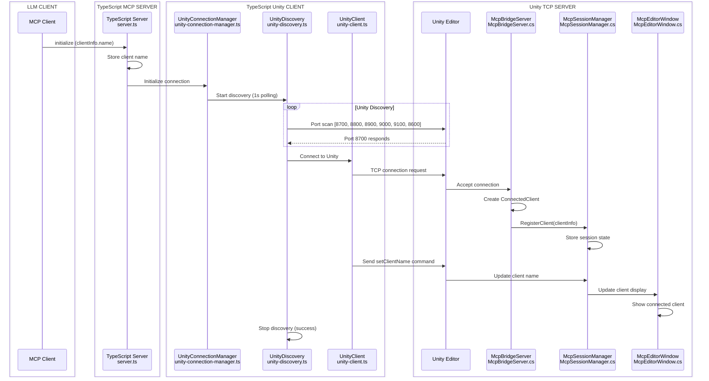

#### 5.3.2. Connection Loss Detection and Recovery

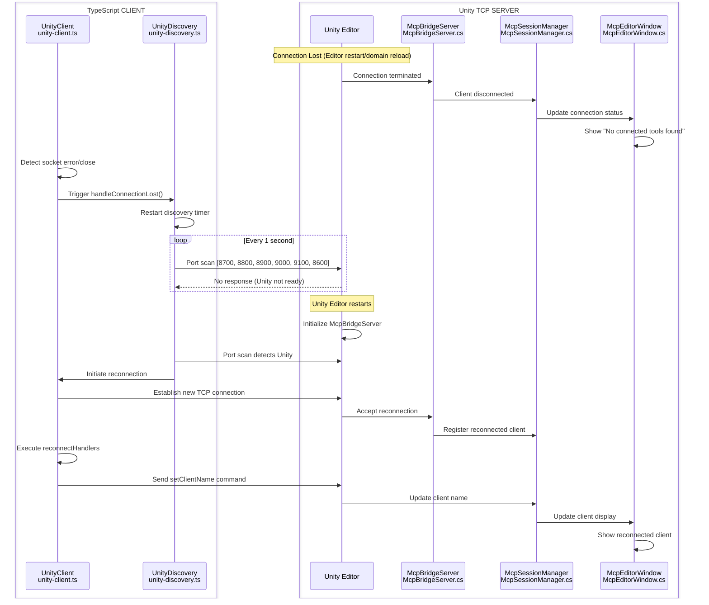

#### 5.3.3. Session Management with Domain Reload Resilience

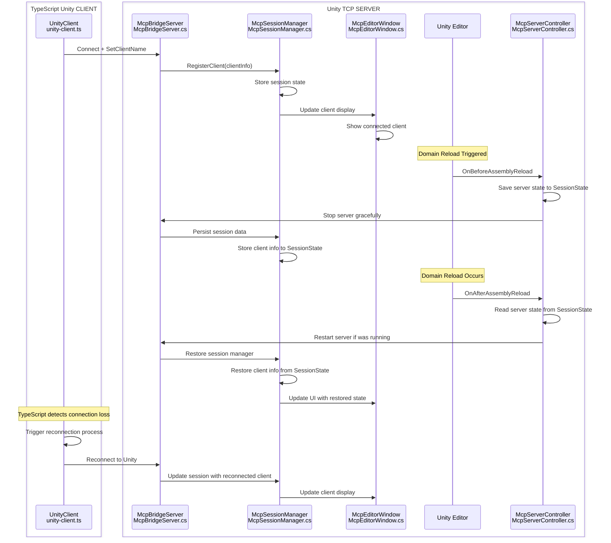

#### 5.3.4. Multi-Client Session Management

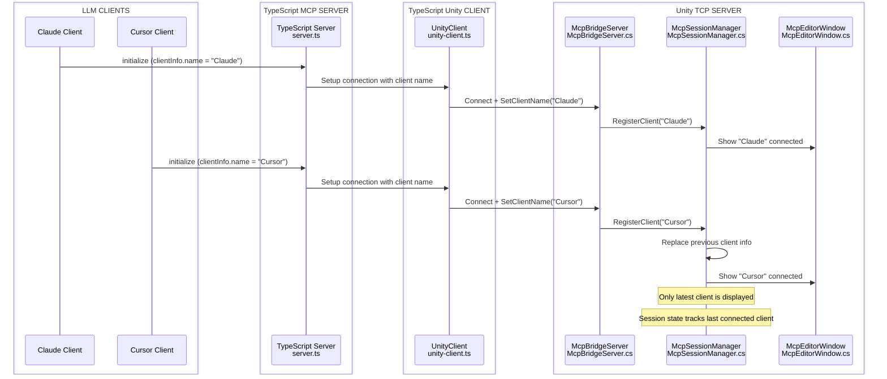

### 5.4. Connection Resilience and Recovery Patterns

#### 5.4.1. Connection State Management

The system maintains connection state through multiple layers:

**TypeScript Side State Tracking:**
- `UnityClient._connected`: Boolean flag indicating active connection
- `UnityDiscovery.isRunning`: Controls discovery process lifecycle
- `reconnectHandlers`: Array of functions executed on reconnection

**Unity Side State Tracking:**
- `McpBridgeServer.connectedClients`: Concurrent dictionary of active connections
- `McpSessionManager`: Persistent session state across domain reloads
- `McpServerController`: Static server lifecycle management

#### 5.4.2. Recovery Mechanisms

**Graceful Degradation:**
- Commands continue to queue during connection loss
- UI displays appropriate connection status
- Background processes maintain state integrity

**Automatic Recovery:**
- 1-second polling interval for Unity discovery
- Exponential backoff for connection attempts
- State restoration through `reconnectHandlers`

**Error Handling:**
- Socket-level error detection and logging
- Timeout handling for connection attempts
- Graceful handling of Unity Editor crashes

#### 5.4.3. Port Management Strategy

The system uses a systematic port discovery approach:

**Port Range:** `[8700, 8800, 8900, 9000, 9100, 8600]`
**Discovery Strategy:**
1. Start with default port (8700)
2. Increment by 100 for additional instances
3. Fall back to 8600 as final attempt

**Port Conflict Resolution:**
- Automatic port selection based on availability
- Support for multiple Unity instances
- Environment variable override capability

### 5.5. Security Validation Flow

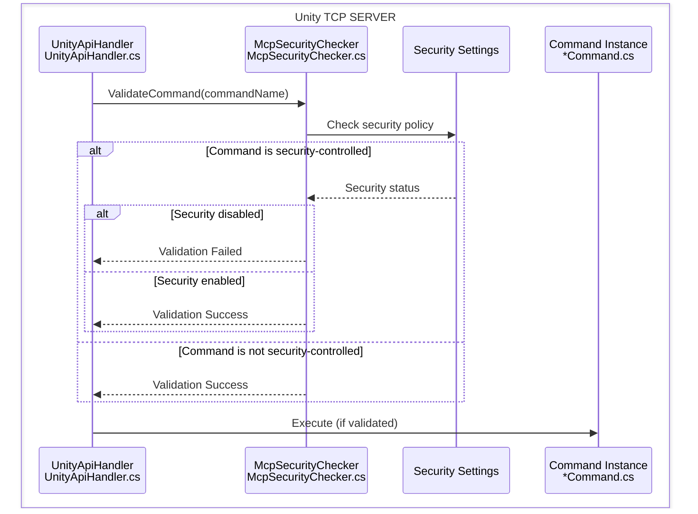

### 5.6. Implementation Notes

#### 5.6.1. TypeScript Implementation Details

**Key Classes Location:**
- `UnityClient`: `/Packages/src/TypeScriptServer~/src/unity-client.ts`
- `UnityDiscovery`: `/Packages/src/TypeScriptServer~/src/unity-discovery.ts`
- `UnityConnectionManager`: `/Packages/src/TypeScriptServer~/src/unity-connection-manager.ts`
- `SafeTimer`: `/Packages/src/TypeScriptServer~/src/safe-timer.ts`

**Critical Implementation Features:**
- **Singleton Pattern**: `UnityDiscovery` prevents multiple discovery instances
- **Event-Driven Architecture**: Socket events trigger state changes
- **Process Cleanup**: `SafeTimer` ensures no orphaned processes
- **Error Resilience**: Comprehensive error handling and recovery

#### 5.6.2. Unity C# Implementation Details

**Key Classes Location:**
- `McpBridgeServer`: `/Packages/src/Editor/Server/McpBridgeServer.cs`
- `McpServerController`: `/Packages/src/Editor/Server/McpServerController.cs`
- `McpSessionManager`: `/Packages/src/Editor/Core/McpSessionManager.cs`

**Critical Implementation Features:**
- **Thread Safety**: Concurrent collections for client management
- **Domain Reload Resilience**: `SessionState` persistence
- **Lifecycle Management**: `[InitializeOnLoad]` attribute for automatic startup
- **Client Isolation**: Individual thread handling for each client connection
