# uLoopMCP Unity Editor側アーキテクチャ

## 1. 概要

このドキュメントは、`Packages/src/Editor` ディレクトリ内のC#コードのアーキテクチャについて詳細に説明します。このコードはUnity Editor内で動作し、Unity環境と外部TypeScriptベースのMCP（Model-Context-Protocol）サーバーとの橋渡しの役割を果たします。

### システムアーキテクチャ概要

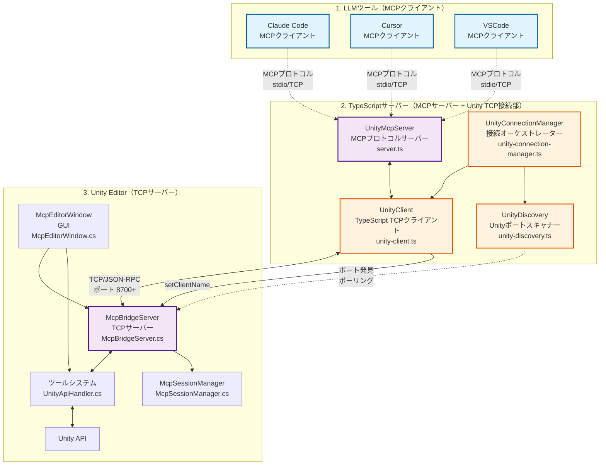
```mermaid
graph TB
    subgraph "1. LLMツール（MCPクライアント）"
        Claude[Claude Code<br/>MCPクライアント]
        Cursor[Cursor<br/>MCPクライアント]
        VSCode[VSCode<br/>MCPクライアント]
    end
    
    subgraph "2. TypeScriptサーバー（MCPサーバー + Unity TCP接続部）"
        MCP[UnityMcpServer<br/>MCPプロトコルサーバー<br/>server.ts]
        UC[UnityClient<br/>TypeScript TCPクライアント<br/>unity-client.ts]
        UCM[UnityConnectionManager<br/>接続オーケストレーター<br/>unity-connection-manager.ts]
        UD[UnityDiscovery<br/>Unityポートスキャナー<br/>unity-discovery.ts]
    end
    
    subgraph "3. Unity Editor（TCPサーバー）"
        MB[McpBridgeServer<br/>TCPサーバー<br/>McpBridgeServer.cs]
        CMD[ツールシステム<br/>UnityApiHandler.cs]
        UI[McpEditorWindow<br/>GUI<br/>McpEditorWindow.cs]
        API[Unity API]
        SM[McpSessionManager<br/>McpSessionManager.cs]
    end
    
    Claude -.->|MCPプロトコル<br/>stdio/TCP| MCP
    Cursor -.->|MCPプロトコル<br/>stdio/TCP| MCP
    VSCode -.->|MCPプロトコル<br/>stdio/TCP| MCP
    
    MCP <--> UC
    UCM --> UC
    UCM --> UD
    UD -.->|ポート発見<br/>ポーリング| MB
    UC <-->|TCP/JSON-RPC<br/>ポート 8700+| MB
    UC -->|setClientName| MB
    MB <--> CMD
    CMD <--> API
    UI --> MB
    UI --> CMD
    MB --> SM
    
    classDef client fill:#e1f5fe,stroke:#01579b,stroke-width:2px
    classDef server fill:#f3e5f5,stroke:#4a148c,stroke-width:2px
    classDef bridge fill:#fff3e0,stroke:#e65100,stroke-width:2px
    
    class Claude,Cursor,VSCode client
    class MCP,MB server
    class UC,UD,UCM bridge
```

### クライアント-サーバー関係の詳細

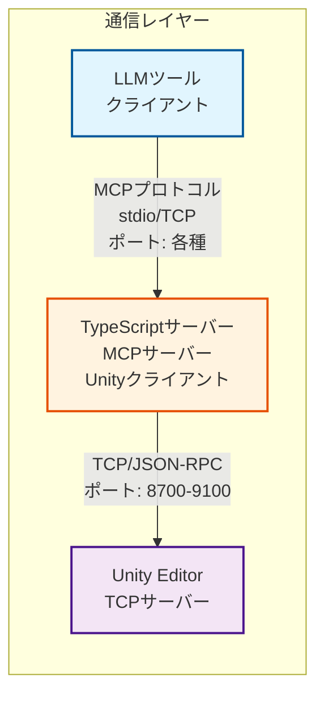
```mermaid
graph LR
    subgraph "通信レイヤー"
        LLM[LLMツール<br/>クライアント]
        TS[TypeScriptサーバー<br/>MCPサーバー<br/>Unityクライアント]
        Unity[Unity Editor<br/>TCPサーバー]
    end
    
    LLM -->|"MCPプロトコル<br/>stdio/TCP<br/>ポート: 各種"| TS
    TS -->|"TCP/JSON-RPC<br/>ポート: 8700-9100"| Unity
    
    classDef client fill:#e1f5fe,stroke:#01579b,stroke-width:2px
    classDef server fill:#f3e5f5,stroke:#4a148c,stroke-width:2px
    classDef hybrid fill:#fff3e0,stroke:#e65100,stroke-width:2px
    
    class LLM client
    class Unity server
    class TS hybrid
```

### プロトコルと通信の詳細

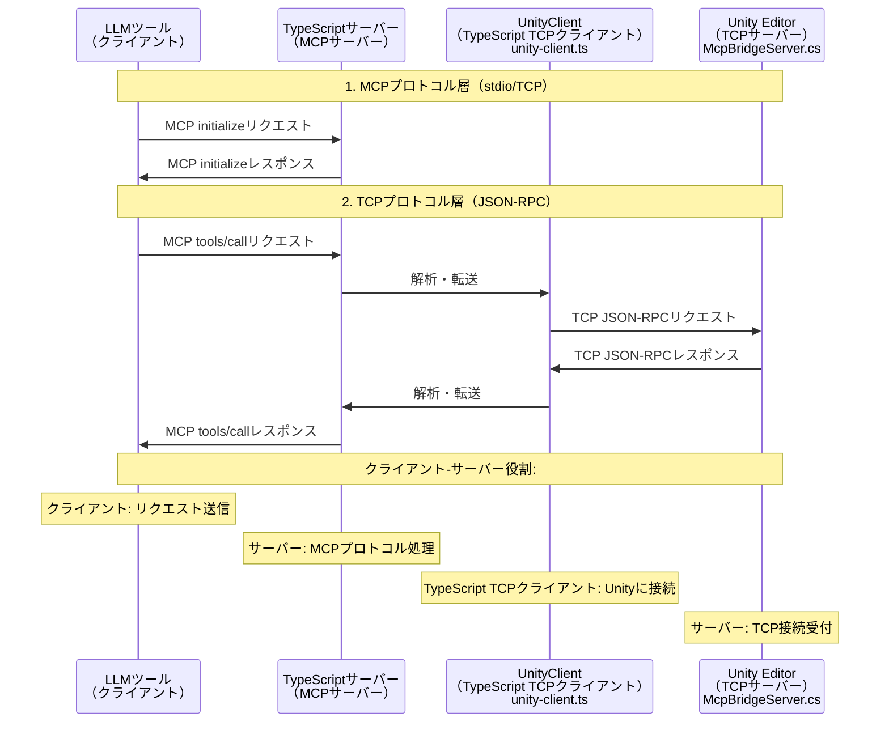
```mermaid
sequenceDiagram
    participant LLM as LLMツール<br/>（クライアント）
    participant TS as TypeScriptサーバー<br/>（MCPサーバー）
    participant UC as UnityClient<br/>（TypeScript TCPクライアント）<br/>unity-client.ts
    participant Unity as Unity Editor<br/>（TCPサーバー）<br/>McpBridgeServer.cs
    
    Note over LLM, Unity: 1. MCPプロトコル層（stdio/TCP）
    LLM->>TS: MCP initializeリクエスト
    TS->>LLM: MCP initializeレスポンス
    
    Note over LLM, Unity: 2. TCPプロトコル層（JSON-RPC）
    LLM->>TS: MCP tools/callリクエスト
    TS->>UC: 解析・転送
    UC->>Unity: TCP JSON-RPCリクエスト
    Unity->>UC: TCP JSON-RPCレスポンス
    UC->>TS: 解析・転送
    TS->>LLM: MCP tools/callレスポンス
    
    Note over LLM, Unity: クライアント-サーバー役割:
    Note over LLM: クライアント: リクエスト送信
    Note over TS: サーバー: MCPプロトコル処理
    Note over UC: TypeScript TCPクライアント: Unityに接続
    Note over Unity: サーバー: TCP接続受付
```

### 通信プロトコル概要

| コンポーネント | 役割 | プロトコル | ポート | 接続タイプ |
|-----------|------|----------|------|----------------|
| **LLMツール**（Claude、Cursor、VSCode） | **クライアント** | MCPプロトコル | stdio/各種 | MCPリクエスト送信 |
| **TypeScriptサーバー** | **サーバー**（MCP用）<br/>**クライアント**（Unity用） | MCP ↔ TCP/JSON-RPC | stdio ↔ 8700-9100 | プロトコル橋渡し |
| **Unity Editor** | **サーバー** | TCP/JSON-RPC | 8700-9100 | TCP接続受付 |

### 通信フローの詳細

#### レイヤー1: LLMツール ↔ TypeScriptサーバー（MCPプロトコル）
- **プロトコル**: Model Context Protocol（MCP）
- **トランスポート**: stdio または TCP
- **データ形式**: JSON-RPC 2.0 with MCP拡張
- **接続**: LLMツールがMCPクライアントとして動作
- **ライフサイクル**: LLMツール（Claude、Cursor、VSCode）が管理

#### レイヤー2: TypeScriptサーバー ↔ Unity Editor（TCPプロトコル）
- **プロトコル**: JSON-RPC 2.0を使用したカスタムTCP
- **トランスポート**: TCPソケット
- **ポート**: 8700、8800、8900、9000、9100、8600（自動発見）
- **接続**: TypeScriptサーバーがTCPクライアントとして動作
- **ライフサイクル**: UnityConnectionManagerによる自動再接続管理

#### 重要なアーキテクチャポイント:
1. **TypeScriptサーバーはプロトコル橋渡しとして機能**: MCPプロトコルをTCP/JSON-RPCに変換
2. **Unity EditorはTCPサーバーの最終形態**: ツールリクエストを処理してUnity操作を実行
3. **LLMツールは純粋なMCPクライアント**: 標準MCPプロトコルを通じてツールリクエストを送信
4. **自動発見**: TypeScriptサーバーがポートスキャンでUnityインスタンスを発見

### TCP/JSON-RPC通信仕様

#### トランスポート層
- **プロトコル**: localhost上のTCP/IP
- **デフォルトポート**: 8700（環境変数で設定可能）
- **メッセージ形式**: JSON-RPC 2.0準拠
- **メッセージ区切り**: 改行文字（`\n`）
- **バッファサイズ**: 4096バイト

#### JSON-RPC 2.0メッセージ形式

**リクエストメッセージ：**
```json
{
  "jsonrpc": "2.0",
  "id": 1647834567890,
  "method": "ping",
  "params": {
    "Message": "Hello Unity MCP!"
  }
}
```

**成功レスポンス：**
```json
{
  "jsonrpc": "2.0",
  "id": 1647834567890,
  "result": {
    "Message": "Unity MCP Bridge received: Hello Unity MCP!",
    "ExecutionTimeMs": 5
  }
}
```

**エラーレスポンス：**
```json
{
  "jsonrpc": "2.0",
  "id": 1647834567890,
  "error": {
    "code": -32603,
    "message": "Tool blocked by security settings",
    "data": {
      "type": "security_blocked",
      "command": "find-gameobjects",
      "reason": "GameObject search is disabled"
    }
  }
}
```

#### 接続ライフサイクル

1. **初期接続**
   - TypeScript UnityClientがUnity McpBridgeServerに接続
   - localhost:8700でTCPソケット確立
   - pingコマンドで接続テスト

2. **クライアント登録**
   - 接続直後に`set-client-name`コマンドを送信
   - Unity セッションマネージャーにクライアント識別情報を保存
   - UIを更新して接続されたクライアントを表示

3. **コマンド処理**
   - JSON-RPCリクエストをUnityApiHandlerで処理
   - McpSecurityCheckerでセキュリティ検証
   - UnityCommandRegistryでツール実行

4. **接続監視**
   - 接続断時の自動再接続
   - pingコマンドによる定期ヘルスチェック
   - プロセス終了時のSafeTimerクリーンアップ

#### プッシュ通知

Unityは、ツールやシステム状態の変更が発生した際に、接続されている全てのTypeScriptクライアントにリアルタイムプッシュ通知を送信できます：

**通知フォーマット:**
```json
{
  "jsonrpc": "2.0",
  "method": "notifications/tools/list_changed",
  "params": {
    "timestamp": "2025-07-16T12:34:56.789Z",
    "message": "Unity tools have been updated"
  }
}
```

**通知トリガー:**
- アセンブリリロード/再コンパイル
- カスタムツール登録
- `TriggerToolChangeNotification()`による手動ツール変更通知

**ブロードキャスト機能:**
- 接続中の全クライアントに同時送信
- TCP/JSON-RPC通信チャネルを使用
- 改行文字（`\n`）でメッセージ終端

**TypeScriptクライアント受信:**
```typescript
// TypeScriptクライアントは以下により通知を受信:
socket.on('data', (buffer: Buffer) => {
  const message = buffer.toString('utf8');
  if (message.includes('"method":"notifications/tools/list_changed"')) {
    // ツールリスト更新処理
    this.refreshToolList();
  }
});
```

#### エラーハンドリング

- **SecurityBlocked**: セキュリティ設定によりツールがブロック
- **InternalError**: Unity内部処理エラー
- **Timeout**: ネットワークタイムアウト（デフォルト：2分）
- **Connection Loss**: 指数バックオフによる自動再接続

#### セキュリティ機能

- **localhost制限**: 外部接続をブロック
- **ツールレベルセキュリティ**: McpSecurityCheckerが各コマンドを検証
- **設定可能なアクセス制御**: Unity Editorセキュリティ設定
- **セッション管理**: クライアント分離と状態追跡


主な責務：
1. **TCPサーバー（`McpBridgeServer`）の実行**: TypeScriptサーバーからの接続を待ち受け、ツールリクエストを受信
2. **Unity操作の実行**: 受信したツールリクエストを処理し、プロジェクトのコンパイル、テスト実行、ログ取得などのUnity Editor内での操作を実行
3. **セキュリティ管理**: `McpSecurityChecker`を通じてツール実行の検証・制御を行い、不正操作を防止
4. **セッション管理**: `McpSessionManager`を通じてクライアントセッションと接続状態を維持
5. **ユーザーインターフェース（`McpEditorWindow`）の提供**: Unity Editor内でMCPサーバーの管理・監視を行うGUIを提供
6. **設定管理**: Cursor、Claude、VSCodeなどのLLMツールで必要な`mcp.json`ファイルの設定を処理

## 2. 核となるアーキテクチャ原則

アーキテクチャは堅牢性、拡張性、保守性を確保するため、いくつかの重要な設計原則に基づいて構築されています。

### 2.1. ツールパターン

システムは**ツールパターン**を中心に構築されています。LLMツールがトリガーできる各アクションは、独自のツールクラスにカプセル化されています。

- **`IUnityTool`**: 全てのツールに共通のインターフェース
- **`AbstractUnityTool<TSchema, TResponse>`**: パラメータとレスポンスの型安全な処理を提供する汎用抽象基底クラス
- **`McpToolAttribute`**: Description設定を含む、ツールの自動登録用属性
- **`UnityToolRegistry`**: 利用可能な全てのツールを発見・保持する中央レジストリ
- **`UnityApiHandler`**: ツール名とパラメータを受け取り、レジストリでツールを検索・実行するクラス
- **`McpSecurityChecker`**: セキュリティ設定に基づいてツール実行許可を検証

このパターンにより、システムは非常に拡張しやすくなっています。新機能を追加するには、`IUnityTool`を実装し、`[McpTool(Description = "...")]`属性を付けた新しいクラスを作成するだけです。システムが自動的に発見・公開します。

### 2.2. セキュリティアーキテクチャ

システムは不正なツール実行を防ぐため、包括的なセキュリティ制御を実装しています：

- **`McpSecurityChecker`**: 実行前にツール権限をチェックする中央セキュリティ検証コンポーネント
- **属性ベースセキュリティ**: ツールにセキュリティ属性を付けて実行要件を定義可能
- **デフォルト拒否ポリシー**: 不正操作を防ぐため、未知のツールはデフォルトでブロック
- **設定ベース制御**: Unity Editorの設定インターフェースでセキュリティポリシーを設定可能

### 2.3. セッション管理

システムはクライアント接続と状態を処理するため、堅牢なセッション管理を維持しています：

- **`McpSessionManager`**: ドメインリロード永続化のため`ScriptableSingleton`として実装されたシングルトンセッションマネージャー
- **クライアント状態追跡**: 接続状態、クライアント識別、セッションメタデータを維持
- **ドメインリロード耐性**: 永続的ストレージを通じてUnityドメインリロードを乗り切るセッション状態
- **再接続サポート**: クライアント再接続シナリオを適切に処理

### 2.4. コマンドシステムアーキテクチャ

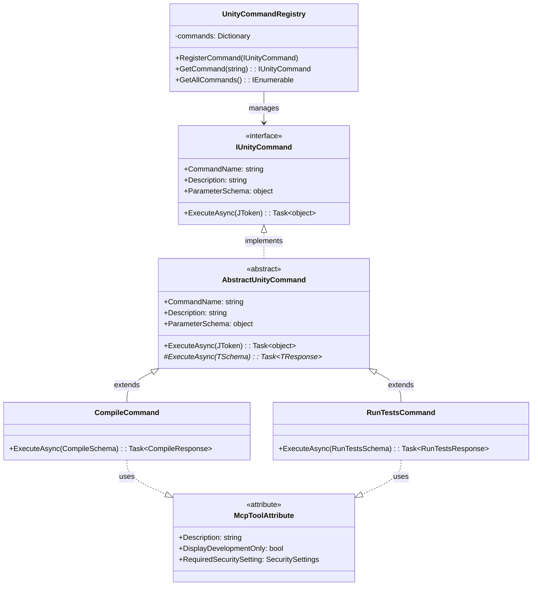
```mermaid
classDiagram
    class IUnityCommand {
        <<interface>>
        +CommandName: string
        +Description: string
        +ParameterSchema: object
        +ExecuteAsync(JToken): Task~object~
    }

    class AbstractUnityCommand {
        <<abstract>>
        +CommandName: string
        +Description: string
        +ParameterSchema: object
        +ExecuteAsync(JToken): Task~object~
        #ExecuteAsync(TSchema)*: Task~TResponse~
    }

    class UnityCommandRegistry {
        -commands: Dictionary
        +RegisterCommand(IUnityCommand)
        +GetCommand(string): IUnityCommand
        +GetAllCommands(): IEnumerable
    }

    class McpToolAttribute {
        <<attribute>>
        +Description: string
        +DisplayDevelopmentOnly: bool
        +RequiredSecuritySetting: SecuritySettings
    }

    class CompileCommand {
        +ExecuteAsync(CompileSchema): Task~CompileResponse~
    }

    class RunTestsCommand {
        +ExecuteAsync(RunTestsSchema): Task~RunTestsResponse~
    }

    IUnityCommand <|.. AbstractUnityCommand : implements
    AbstractUnityCommand <|-- CompileCommand : extends
    AbstractUnityCommand <|-- RunTestsCommand : extends
    UnityCommandRegistry --> IUnityCommand : manages
    CompileCommand ..|> McpToolAttribute : uses
    RunTestsCommand ..|> McpToolAttribute : uses
```

### 2.5. UI用MVP + ヘルパーアーキテクチャ

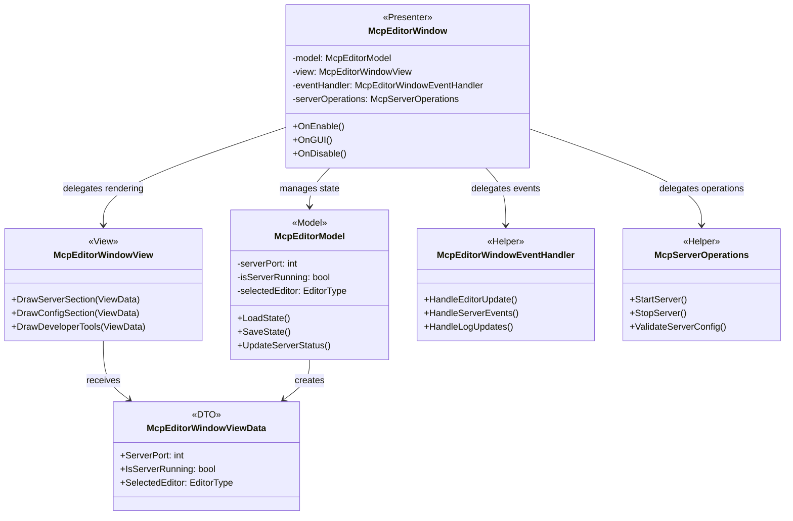
```mermaid
classDiagram
    class McpEditorWindow {
        <<Presenter>>
        -model: McpEditorModel
        -view: McpEditorWindowView
        -eventHandler: McpEditorWindowEventHandler
        -serverOperations: McpServerOperations
        +OnEnable()
        +OnGUI()
        +OnDisable()
    }

    class McpEditorModel {
        <<Model>>
        -serverPort: int
        -isServerRunning: bool
        -selectedEditor: EditorType
        +LoadState()
        +SaveState()
        +UpdateServerStatus()
    }

    class McpEditorWindowView {
        <<View>>
        +DrawServerSection(ViewData)
        +DrawConfigSection(ViewData)
        +DrawDeveloperTools(ViewData)
    }

    class McpEditorWindowViewData {
        <<DTO>>
        +ServerPort: int
        +IsServerRunning: bool
        +SelectedEditor: EditorType
    }

    class McpEditorWindowEventHandler {
        <<Helper>>
        +HandleEditorUpdate()
        +HandleServerEvents()
        +HandleLogUpdates()
    }

    class McpServerOperations {
        <<Helper>>
        +StartServer()
        +StopServer()
        +ValidateServerConfig()
    }

    McpEditorWindow --> McpEditorModel : manages state
    McpEditorWindow --> McpEditorWindowView : delegates rendering
    McpEditorWindow --> McpEditorWindowEventHandler : delegates events
    McpEditorWindow --> McpServerOperations : delegates operations
    McpEditorWindowView --> McpEditorWindowViewData : receives
    McpEditorModel --> McpEditorWindowViewData : creates
```

### 2.6. スキーマ駆動型・型安全通信

手動で行うエラーが発生しやすいJSON解析を避けるため、システムではコマンドにスキーマ駆動型アプローチを使用しています。

- **`*Schema.cs`ファイル**（例：`CompileSchema.cs`、`GetLogsSchema.cs`）: これらのクラスはシンプルなC#プロパティを使用してコマンドの期待パラメータを定義します。`[Description]`属性とデフォルト値を使用してクライアント向けJSON Schemaを自動生成します。
- **`*Response.cs`ファイル**（例：`CompileResponse.cs`）: クライアントに返すデータの構造を定義します。
- **`CommandParameterSchemaGenerator.cs`**: このユーティリティは`*Schema.cs`ファイルにリフレクションを使用してパラメータスキーマを動的に生成し、C#コードを唯一の信頼できるソースとして確実に保ちます。

この設計により、サーバーとクライアント間の不一致を排除し、C#コード内で強力な型安全性を提供します。

### 2.7. TypeScriptサーバーからUnity接続アーキテクチャ

#### 2.7.1. 接続発見・管理コンポーネント

システムは、Unity Editorの頻繁な再起動とドメインリロードを処理する洗練された接続発見・管理システムを実装しています：

- **`UnityClient`**（`unity-client.ts`）: **TypeScript TCPクライアント** - Unity Editorへの接続を確立・維持
- **`UnityDiscovery`**（`unity-discovery.ts`）: **TypeScriptシングルトン発見サービス** - ポートスキャンで実行中のUnityインスタンスを発見
- **`UnityConnectionManager`**（`unity-connection-manager.ts`）: **TypeScript オーケストレーター** - 接続ライフサイクルと状態管理を調整
- **`SafeTimer`**（`safe-timer.ts`）: **TypeScript ユーティリティ** - 孤立プロセスを防ぐため適切なタイマークリーンアップを確保

#### 2.7.2. 初期接続シーケンス

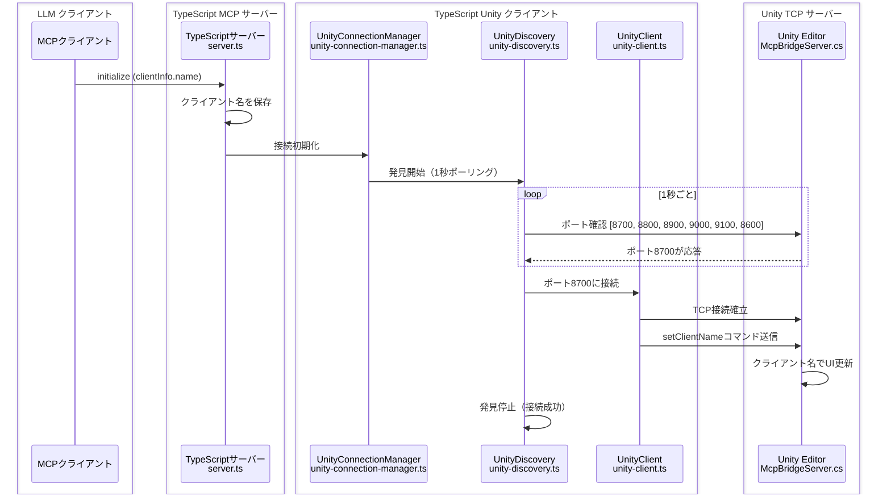
```mermaid
sequenceDiagram
    box LLM クライアント
    participant MCP as MCPクライアント
    end
    
    box TypeScript MCP サーバー
    participant TS as TypeScriptサーバー<br/>server.ts
    end
    
    box TypeScript Unity クライアント
    participant UCM as UnityConnectionManager<br/>unity-connection-manager.ts
    participant UD as UnityDiscovery<br/>unity-discovery.ts
    participant UC as UnityClient<br/>unity-client.ts
    end
    
    box Unity TCP サーバー
    participant Unity as Unity Editor<br/>McpBridgeServer.cs
    end
    
    MCP->>TS: initialize (clientInfo.name)
    TS->>TS: クライアント名を保存
    TS->>UCM: 接続初期化
    UCM->>UD: 発見開始（1秒ポーリング）
    
    loop 1秒ごと
        UD->>Unity: ポート確認 [8700, 8800, 8900, 9000, 9100, 8600]
        Unity-->>UD: ポート8700が応答
    end
    
    UD->>UC: ポート8700に接続
    UC->>Unity: TCP接続確立
    UC->>Unity: setClientNameコマンド送信
    Unity->>Unity: クライアント名でUI更新
    UD->>UD: 発見停止（接続成功）
```

#### 2.7.3. 接続ヘルス監視と再接続

システムはさまざまな失敗シナリオを処理する堅牢な再接続メカニズムを実装しています：

**接続状態検出:**
- **ソケットイベント**: `error`、`close`、`end`イベントが再接続をトリガー
- **ヘルスチェック**: 接続整合性を検証する定期的なpingコマンド
- **タイムアウト処理**: 設定された間隔後に接続試行がタイムアウト

**再接続ポーリングプロセス:**
1. **検出フェーズ**: `UnityDiscovery`が接続損失を検出
2. **発見再開**: 1秒間隔での発見プロセス自動再開
3. **ポートスキャン**: Unityポート（8700、8800、8900、9000、9100、8600）の系統的スキャン
4. **接続確立**: Unityが利用可能になった時の自動再接続
5. **状態復元**: クライアント状態復元のため`reconnectHandlers`を再実行

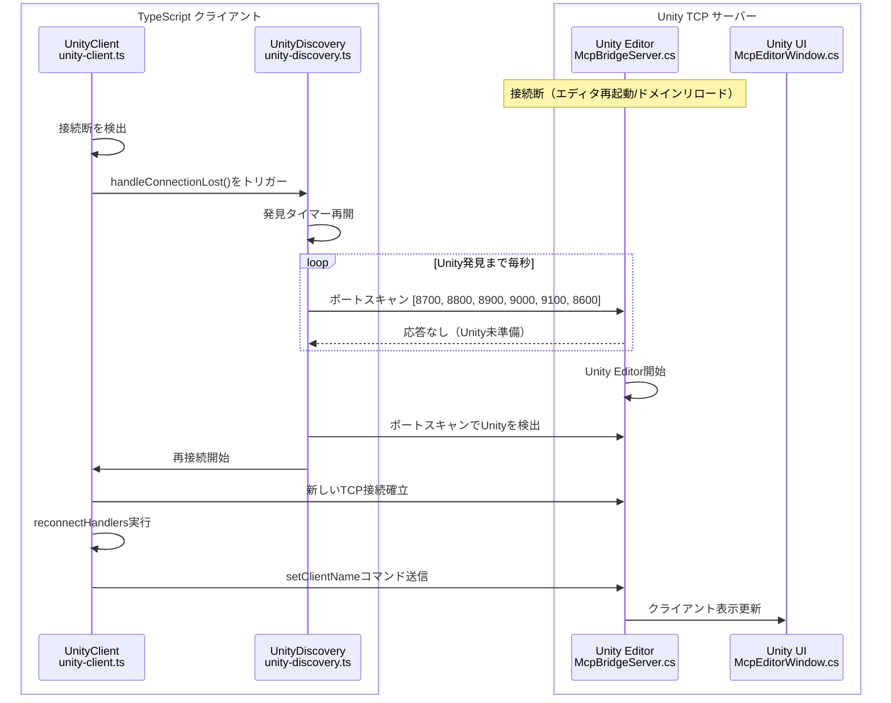
```mermaid
sequenceDiagram
    box TypeScript クライアント
    participant UC as UnityClient<br/>unity-client.ts
    participant UD as UnityDiscovery<br/>unity-discovery.ts
    end
    
    box Unity TCP サーバー
    participant Unity as Unity Editor<br/>McpBridgeServer.cs
    participant UI as Unity UI<br/>McpEditorWindow.cs
    end
    
    Note over Unity: 接続断（エディタ再起動/ドメインリロード）
    UC->>UC: 接続断を検出
    UC->>UD: handleConnectionLost()をトリガー
    UD->>UD: 発見タイマー再開
    
    loop Unity発見まで毎秒
        UD->>Unity: ポートスキャン [8700, 8800, 8900, 9000, 9100, 8600]
        Unity-->>UD: 応答なし（Unity未準備）
    end
    
    Unity->>Unity: Unity Editor開始
    UD->>Unity: ポートスキャンでUnityを検出
    UD->>UC: 再接続開始
    UC->>Unity: 新しいTCP接続確立
    UC->>UC: reconnectHandlers実行
    UC->>Unity: setClientNameコマンド送信
    Unity->>UI: クライアント表示更新
```

#### 2.7.4. プロセスクリーンアップ用SafeTimer実装

システムは孤立プロセスを防ぐため、カスタム`SafeTimer`クラスを使用しています：

**機能:**
- **自動クリーンアップ**: タイマーをクリーンアップするプロセス終了ハンドラーを登録
- **シングルトンパターン**: 同じ操作での複数タイマーインスタンスを防止
- **開発監視**: デバッグ用のアクティブタイマー数を追跡
- **適切な終了**: プロセス終了時にタイマーが適切に廃棄されることを保証

**実装詳細:**
```typescript
// プロセス終了時の自動クリーンアップ
process.on('exit', () => SafeTimer.cleanup());
process.on('SIGINT', () => SafeTimer.cleanup());
process.on('SIGTERM', () => SafeTimer.cleanup());
```

#### 2.7.5. クライアント識別フロー

システムは「Unknown Client」表示問題を防ぐため、適切なクライアント識別を保証しています：

1. **初期状態**: クライアントが接続されていない場合、Unity Editorは「接続されたツールが見つかりません」と表示
2. **MCPクライアント接続**: MCPクライアント（Cursor、Claude、VSCode）が接続した時：
   - クライアントは`clientInfo.name`を含む`initialize`リクエストを送信
   - TypeScriptサーバーがクライアント名を受信・保存
   - その後でTypeScriptサーバーがUnityに接続
3. **Unity接続**: TypeScriptサーバーが即座に`setClientName`コマンドを送信
4. **UI更新**: Unity UIが最初の接続から正しいクライアント名を表示

このフローにより、TypeScriptサーバーがクライアント名を受信する前にUnityに接続した場合に発生する、一時的な「Unknown Client」表示を防ぎます。

### 2.8. SOLID原則

- **単一責任原則（SRP）**: 各クラスには明確に定義された責任があります。
    - `McpBridgeServer`: 生のTCP通信を処理
    - `McpServerController`: ドメインリロードを越えてサーバーのライフサイクルと状態を管理
    - `McpConfigRepository`: 設定のファイルI/Oを処理
    - `McpConfigService`: 設定のビジネスロジックを実装
    - `JsonRpcProcessor`: JSON-RPC 2.0メッセージの解析・フォーマット専用
    - **UIレイヤー例**:
        - `McpEditorModel`: アプリケーション状態とビジネスロジックのみ管理
        - `McpEditorWindowView`: UI描画のみ処理
        - `McpEditorWindowEventHandler`: Unity Editorイベントのみ管理
        - `McpServerOperations`: サーバー操作のみ処理
- **開放閉鎖原則（OCP）**: システムは拡張に対して開放、変更に対して閉鎖です。コマンドパターンが最適例で、コア実行ロジックを変更することなく新しいコマンドを追加できます。MVP + ヘルパーパターンもこの原則を示しており、既存コンポーネントを変更せずに新しいヘルパークラスを作成することで新機能を追加できます。

### 2.9. UIアーキテクチャ用MVP + ヘルパーパターン

UIレイヤーは、モノリシックな1247行のクラスから構造化された保守可能なアーキテクチャに進化した洗練された**MVP（Model-View-Presenter）+ ヘルパーパターン**を実装しています。

#### パターンコンポーネント

- **Model（`McpEditorModel`）**: すべてのアプリケーション状態、設定データ、ビジネスロジックを含有。カプセル化を維持しながら状態更新のメソッドを提供。Unityの`SessionState`と`EditorPrefs`を通じて永続化を処理。
- **View（`McpEditorWindowView`）**: ビジネスロジックを持たない純粋なUI描画コンポーネント。`McpEditorWindowViewData`転送オブジェクトを通じて必要なデータをすべて受信。
- **Presenter（`McpEditorWindow`）**: ModelとViewを調整し、Unity固有のライフサイクルイベントを処理し、複雑な操作を専門のヘルパークラスに委譲。
- **ヘルパークラス**: 機能の特定の側面を処理する専門コンポーネント：
  - イベント管理（`McpEditorWindowEventHandler`）
  - サーバー操作（`McpServerOperations`）
  - 設定サービス（`McpConfigServiceFactory`）

#### このアーキテクチャの利点

1. **関心の分離**: 各コンポーネントが単一の明確な責任を持つ
2. **テスト可能性**: ヘルパークラスをUnity Editorコンテキストから独立してユニットテスト可能
3. **保守性**: 複雑なロジックが管理しやすい集中コンポーネントに分解
4. **拡張性**: 既存コードを変更せずに新しいヘルパークラスを通じて新機能を追加可能
5. **認知負荷軽減**: 開発者が一度に機能の一側面に集中可能

#### 実装ガイドライン

- **状態管理**: すべての状態変更はModelレイヤーを通過
- **UI更新**: Viewは転送オブジェクトを通じてデータを受信し、Modelに直接アクセスしない
- **複雑な操作**: Presenterで実装せずに適切なヘルパークラスに委譲
- **イベント処理**: すべてのUnity Editorイベント管理を専用EventHandlerに分離

### 2.10. ドメインリロード耐性

Unity Editorの重要な課題は、アプリケーションの状態をリセットする「ドメインリロード」です。アーキテクチャはこれを適切に処理します：

- **`McpServerController`**: `[InitializeOnLoad]`を使用してEditorライフサイクルイベントにフック
- **`AssemblyReloadEvents`**: リロード前に、`OnBeforeAssemblyReload`を使用してサーバーの実行状態（ポート、ステータス）を`SessionState`に保存
- **`SessionState`**: ドメインリロードを越えてシンプルなデータを永続化するUnity Editor機能
- リロード後、`OnAfterAssemblyReload`が`SessionState`を読み取り、以前に実行されていた場合は自動的にサーバーを再起動し、接続されたクライアントに対してシームレスな体験を確保

## 3. 実装済みコマンド

システムは現在、確立されたコマンドパターンアーキテクチャに従って13の本番対応コマンドを実装しています：

### 3.1. コアシステムコマンド

- **`PingCommand`**: 接続ヘルスチェックとレイテンシテスト
- **`CompileCommand`**: 詳細エラーレポート付きプロジェクトコンパイル
- **`ClearConsoleCommand`**: 確認付きUnity Consoleログクリア
- **`SetClientNameCommand`**: クライアント識別とセッション管理
- **`GetCommandDetailsCommand`**: コマンドのイントロスペクションとメタデータ取得

### 3.2. 情報取得コマンド

- **`GetLogsCommand`**: フィルタリングとタイプ選択付きコンソールログ取得
- **`GetHierarchyCommand`**: コンポーネント情報付きシーン階層エクスポート
- **`GetMenuItemsCommand`**: Unity メニューアイテム発見とメタデータ
- **`GetProviderDetailsCommand`**: Unity Search プロバイダー情報

### 3.3. GameObjectとシーンコマンド

- **`FindGameObjectsCommand`**: 複数条件による高度なGameObject検索
- **`UnitySearchCommand`**: アセット、シーン、プロジェクトリソース間の統合検索

### 3.4. 実行コマンド

- **`RunTestsCommand`**: NUnit XMLエクスポート付きテスト実行（セキュリティ制御）
- **`ExecuteMenuItemCommand`**: リフレクションによるMenuItem実行（セキュリティ制御）

### 3.5. セキュリティ制御コマンド

いくつかのコマンドはセキュリティ制限の対象で、設定で無効化可能です：

- **テスト実行**: `RunTestsCommand`には「テスト実行を有効化」設定が必要
- **メニューアイテム実行**: `ExecuteMenuItemCommand`には「メニューアイテム実行を許可」設定が必要
- **未知のコマンド**: 明示的に設定されない限りデフォルトでブロック

## 4. 主要コンポーネント（ディレクトリ構成）

### `/Server`

このディレクトリはコアネットワーキングとライフサイクル管理コンポーネントを含みます。

- **`McpBridgeServer.cs`**: 低レベルTCPサーバー。指定されたポートでリッスンし、クライアント接続を受け入れ、ネットワークストリーム上でのJSONデータの読み取り/書き込みを処理。バックグラウンドスレッドで動作。
- **`McpServerController.cs`**: サーバーの高レベル静的マネージャー。`McpBridgeServer`インスタンスのライフサイクル（Start、Stop、Restart）を制御。ドメインリロードを越えた状態管理の中央ポイント。
- **`McpServerConfig.cs`**: サーバー設定（例：デフォルトポート、バッファサイズ）の定数を保持する静的クラス。

### `/Security`

コマンド実行制御用のセキュリティインフラストラクチャを含みます。

- **`McpSecurityChecker.cs`**: コマンド実行の権限チェックを実装する中央セキュリティ検証コンポーネント。セキュリティ属性と設定を評価してコマンドの実行許可を決定。

### `/Api`

コマンド処理ロジックの中核です。

- **`/Commands`**: すべてのサポートされているコマンドの実装を含有。
    - **`/Core`**: コマンドシステムの基礎クラス。
        - **`IUnityCommand.cs`**: `CommandName`、`Description`、`ParameterSchema`、`ExecuteAsync`メソッドを含む、すべてのコマンドの契約を定義。
        - **`AbstractUnityCommand.cs`**: パラメータのデシリアライゼーションとレスポンス作成のボイラープレートを処理することでコマンド作成を簡素化する汎用基底クラス。
        - **`UnityCommandRegistry.cs`**: `[McpTool]`属性を持つすべてのクラスを発見し、コマンド名から実装へのマッピングを行う辞書に登録。
        - **`McpToolAttribute.cs`**: コマンドとしての自動登録のためクラスにマークする単純な属性。
    - **コマンド固有フォルダー**: 実装された13のコマンドそれぞれに専用フォルダーがあり、以下を含有：
        - `*Command.cs`: メインコマンド実装
        - `*Schema.cs`: 型安全パラメータ定義
        - `*Response.cs`: 構造化レスポンス形式
        - 含まれるコマンド：`/Compile`、`/RunTests`、`/GetLogs`、`/Ping`、`/ClearConsole`、`/FindGameObjects`、`/GetHierarchy`、`/GetMenuItems`、`/ExecuteMenuItem`、`/SetClientName`、`/UnitySearch`、`/GetProviderDetails`、`/GetCommandDetails`
- **`JsonRpcProcessor.cs`**: 受信JSON文字列を`JsonRpcRequest`オブジェクトに解析し、レスポンスオブジェクトをJSON文字列にシリアライズし、JSON-RPC 2.0仕様に準拠する責任を持つ。
- **`UnityApiHandler.cs`**: API呼び出しのエントリーポイント。`JsonRpcProcessor`からメソッド名とパラメータを受信し、`UnityCommandRegistry`を使用して適切なコマンドを実行。権限検証のため`McpSecurityChecker`と統合。

### `/Core`

セッションと状態管理用のコアインフラストラクチャコンポーネントを含有。

- **`McpSessionManager.cs`**: クライアント接続状態、セッションメタデータを維持し、ドメインリロードを乗り切る`ScriptableSingleton`として実装されたシングルトンセッションマネージャー。中央化されたクライアント識別と接続追跡を提供。

### `/UI`

**MVP（Model-View-Presenter）+ ヘルパーパターン**を使用して実装されたユーザー向けEditor Windowのコードを含有。

#### コアMVPコンポーネント

- **`McpEditorWindow.cs`**: **Presenter**レイヤー（503行）。ModelとViewのコーディネーターとして機能し、Unity固有のライフサイクルイベントとユーザーインタラクションを処理。複雑な操作を専門のヘルパークラスに委譲。
- **`McpEditorModel.cs`**: **Model**レイヤー（470行）。すべてのアプリケーション状態、永続化、ビジネスロジックを管理。UI状態、サーバー設定を含有し、適切なカプセル化で状態更新のメソッドを提供。
- **`McpEditorWindowView.cs`**: **View**レイヤー。ビジネスロジックから完全に分離された純粋なUI描画ロジックを処理。`McpEditorWindowViewData`を通じてデータを受信してインターフェースを描画。
- **`McpEditorWindowViewData.cs`**: ModelからViewに必要なすべての情報を運ぶデータ転送オブジェクト。関心の明確な分離を保証。

#### 専門ヘルパークラス

- **`McpEditorWindowEventHandler.cs`**: Unity Editorイベントを管理（194行）。`EditorApplication.update`、`McpCommunicationLogger.OnLogUpdated`、サーバー接続イベント、状態変更検出を処理。イベント管理ロジックをメインウィンドウから完全に分離。
- **`McpServerOperations.cs`**: 複雑なサーバー操作を処理（131行）。サーバー検証、開始・停止ロジックを含有。包括的なエラー処理でユーザー対話型と内部操作モードの両方をサポート。
- **`McpCommunicationLog.cs`**: ウィンドウの「開発者ツール」セクションに表示される、メモリ内と`SessionState`バックアップのリクエスト・レスポンスログを管理。

#### アーキテクチャの利点

このMVP + ヘルパーパターンは以下を提供します：

- **単一責任**: 各クラスが一つの明確で集中した責任を持つ
- **テスト可能性**: ヘルパークラスを独立してユニットテスト可能
- **保守性**: 複雑なロジックが専門化された管理可能なコンポーネントに分離
- **拡張性**: 既存コードを変更せずに新しいヘルパークラスを作成して新機能を追加可能
- **複雑度軽減**: 適切な責任分散により、メインPresenterが1247行から503行（59%削減）

### `/Config`

`mcp.json`設定ファイルの作成と変更を管理。

- **`UnityMcpPathResolver.cs`**: 異なるエディター（Cursor、VSCodeなど）の設定ファイル向けに正しいパスを見つけるユーティリティ。
- **`McpConfigRepository.cs`**: `mcp.json`ファイルの直接読み取り・書き込みを処理。
- **`McpConfigService.cs`**: `McpEditorWindow`でのユーザー設定に基づいて、正しいコマンド、引数、環境変数で`mcp.json`ファイルを自動設定するロジックを含有。

### `/Tools`

コアUnity Editor機能をラップする高レベルユーティリティを含有。

- **`/ConsoleUtility`と`/ConsoleLogFetcher`**: 主に`ConsoleLogRetriever`で構成される一連のクラス。リフレクションを使用してUnityの内部コンソールログエントリーにアクセス。これにより`getlogs`コマンドで特定のタイプとフィルターでログを取得可能。
- **`/TestRunner`**: Unity テスト実行のロジックを含有。
    - **`PlayModeTestExecuter.cs`**: PlayModeテスト実行の複雑さを処理するキークラス。`async`タスクの正常完了を保証するため、ドメインリロードを無効化（`DomainReloadDisableScope`）する処理を含む。
    - **`NUnitXmlResultExporter.cs`**: テスト結果をNUnit互換XMLファイルにフォーマット。
- **`/Util`**: 汎用ユーティリティ。
    - **`CompileController.cs`**: `CompilationPipeline` APIをラップしてプロジェクトコンパイル用のシンプルな`async`インターフェースを提供。

### `/Utils`

低レベルで汎用的なヘルパークラスを含有。

- **`MainThreadSwitcher.cs`**: バックグラウンドスレッド（TCPサーバーなど）からUnityのメインスレッドに実行を切り替える`awaitable`オブジェクトを提供する重要ユーティリティ。ほとんどのUnity APIがメインスレッドからのみ呼び出し可能なため必須。
- **`EditorDelay.cs`**: 特にドメインリロード後にEditorが安定状態に達するまで数フレーム待機するのに有用な、フレームベースディレイの`async/await`互換実装。
- **`McpLogger.cs`**: すべてのパッケージ関連ログに`[uLoopMCP]`プレフィックスを付ける、シンプルで統一されたログラッピング。

## 5. 主要ワークフロー

### 5.1. セキュリティ付きコマンド実行フロー

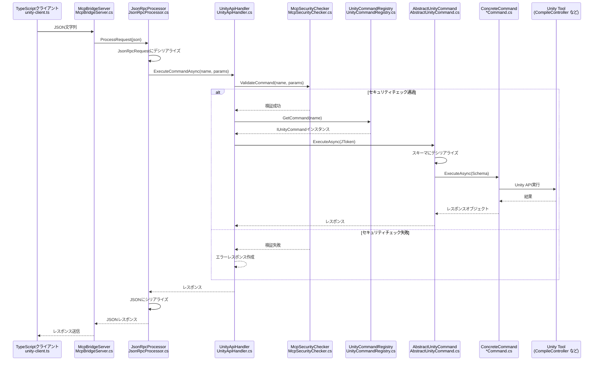
```mermaid
sequenceDiagram
    participant TS as TypeScriptクライアント<br/>unity-client.ts
    participant MB as McpBridgeServer<br/>McpBridgeServer.cs
    participant JP as JsonRpcProcessor<br/>JsonRpcProcessor.cs
    participant UA as UnityApiHandler<br/>UnityApiHandler.cs
    participant SC as McpSecurityChecker<br/>McpSecurityChecker.cs
    participant UR as UnityCommandRegistry<br/>UnityCommandRegistry.cs
    participant AC as AbstractUnityCommand<br/>AbstractUnityCommand.cs
    participant CC as ConcreteCommand<br/>*Command.cs
    participant UT as Unity Tool<br/>(CompileController など)

    TS->>MB: JSON文字列
    MB->>JP: ProcessRequest(json)
    JP->>JP: JsonRpcRequestにデシリアライズ
    JP->>UA: ExecuteCommandAsync(name, params)
    UA->>SC: ValidateCommand(name, params)
    alt セキュリティチェック通過
        SC-->>UA: 検証成功
        UA->>UR: GetCommand(name)
        UR-->>UA: IUnityCommandインスタンス
        UA->>AC: ExecuteAsync(JToken)
        AC->>AC: スキーマにデシリアライズ
        AC->>CC: ExecuteAsync(Schema)
        CC->>UT: Unity API実行
        UT-->>CC: 結果
        CC-->>AC: レスポンスオブジェクト
        AC-->>UA: レスポンス
    else セキュリティチェック失敗
        SC-->>UA: 検証失敗
        UA-->>UA: エラーレスポンス作成
    end
    UA-->>JP: レスポンス
    JP->>JP: JSONにシリアライズ
    JP-->>MB: JSONレスポンス
    MB-->>TS: レスポンス送信
```

### 5.2. UI相互作用フロー（MVP + ヘルパーパターン）

1. **ユーザー相互作用**: ユーザーがUnity Editorウィンドウと相互作用（ボタンクリック、フィールド変更など）
2. **Presenter処理**: `McpEditorWindow`（Presenter）がUnity Editorイベントを受信
3. **状態更新**: Presenterが`McpEditorModel`の適切なメソッドを呼び出してアプリケーション状態を更新
4. **複雑な操作**: 複雑な操作（サーバー開始・停止、検証）の場合、Presenterが専門ヘルパークラスに委譲：
    - サーバー関連操作用の`McpServerOperations`
    - イベント管理用の`McpEditorWindowEventHandler`
    - 設定操作用の`McpConfigServiceFactory`
5. **Viewデータ準備**: Model状態が`McpEditorWindowViewData`転送オブジェクトにパッケージ化
6. **UI描画**: `McpEditorWindowView`が転送オブジェクトを受信してインターフェースを描画
7. **イベント伝播**: `McpEditorWindowEventHandler`がUnity Editorイベントを管理し、それに応じてModelを更新
8. **永続化**: ModelがUnityの`SessionState`と`EditorPrefs`を通じて状態永続化を自動処理

このワークフローにより、アプリケーションライフサイクル全体を通じて応答性と適切な状態管理を維持しながら、関心の明確な分離を保証します。

### 5.3. TypeScript-Unity接続ライフサイクル

#### 5.3.1. 完全接続確立フロー

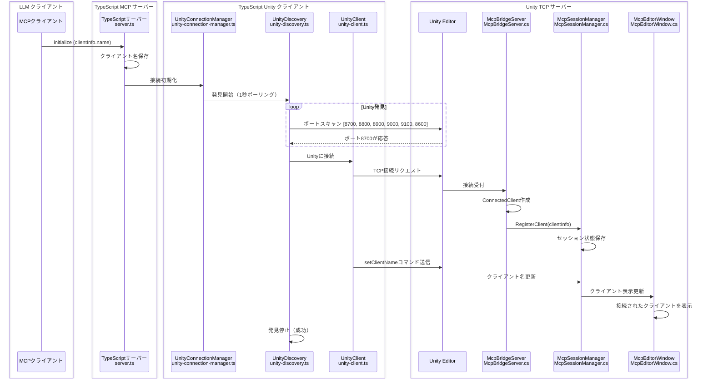
```mermaid
sequenceDiagram
    box LLM クライアント
    participant MCP as MCPクライアント
    end
    
    box TypeScript MCP サーバー
    participant TS as TypeScriptサーバー<br/>server.ts
    end
    
    box TypeScript Unity クライアント
    participant UCM as UnityConnectionManager<br/>unity-connection-manager.ts
    participant UD as UnityDiscovery<br/>unity-discovery.ts
    participant UC as UnityClient<br/>unity-client.ts
    end
    
    box Unity TCP サーバー
    participant Unity as Unity Editor
    participant MB as McpBridgeServer<br/>McpBridgeServer.cs
    participant SM as McpSessionManager<br/>McpSessionManager.cs
    participant UI as McpEditorWindow<br/>McpEditorWindow.cs
    end
    
    MCP->>TS: initialize (clientInfo.name)
    TS->>TS: クライアント名保存
    TS->>UCM: 接続初期化
    UCM->>UD: 発見開始（1秒ポーリング）
    
    loop Unity発見
        UD->>Unity: ポートスキャン [8700, 8800, 8900, 9000, 9100, 8600]
        Unity-->>UD: ポート8700が応答
    end
    
    UD->>UC: Unityに接続
    UC->>Unity: TCP接続リクエスト
    Unity->>MB: 接続受付
    MB->>MB: ConnectedClient作成
    MB->>SM: RegisterClient(clientInfo)
    SM->>SM: セッション状態保存
    
    UC->>Unity: setClientNameコマンド送信
    Unity->>SM: クライアント名更新
    SM->>UI: クライアント表示更新
    UI->>UI: 接続されたクライアントを表示
    
    UD->>UD: 発見停止（成功）
```

#### 5.3.2. 接続断検出と復旧

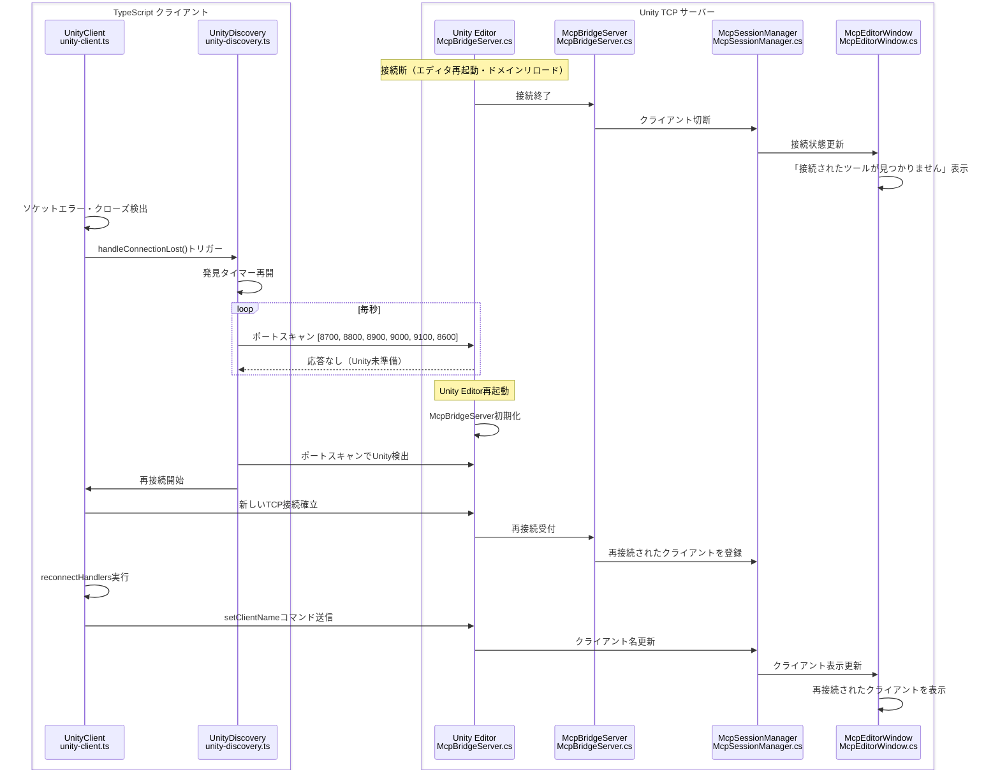
```mermaid
sequenceDiagram
    box TypeScript クライアント
    participant UC as UnityClient<br/>unity-client.ts
    participant UD as UnityDiscovery<br/>unity-discovery.ts
    end
    
    box Unity TCP サーバー
    participant Unity as Unity Editor<br/>McpBridgeServer.cs
    participant MB as McpBridgeServer<br/>McpBridgeServer.cs
    participant SM as McpSessionManager<br/>McpSessionManager.cs
    participant UI as McpEditorWindow<br/>McpEditorWindow.cs
    end
    
    Note over Unity: 接続断（エディタ再起動・ドメインリロード）
    
    Unity->>MB: 接続終了
    MB->>SM: クライアント切断
    SM->>UI: 接続状態更新
    UI->>UI: 「接続されたツールが見つかりません」表示
    
    UC->>UC: ソケットエラー・クローズ検出
    UC->>UD: handleConnectionLost()トリガー
    UD->>UD: 発見タイマー再開
    
    loop 毎秒
        UD->>Unity: ポートスキャン [8700, 8800, 8900, 9000, 9100, 8600]
        Unity-->>UD: 応答なし（Unity未準備）
    end
    
    Note over Unity: Unity Editor再起動
    Unity->>Unity: McpBridgeServer初期化
    
    UD->>Unity: ポートスキャンでUnity検出
    UD->>UC: 再接続開始
    UC->>Unity: 新しいTCP接続確立
    Unity->>MB: 再接続受付
    MB->>SM: 再接続されたクライアントを登録
    
    UC->>UC: reconnectHandlers実行
    UC->>Unity: setClientNameコマンド送信
    Unity->>SM: クライアント名更新
    SM->>UI: クライアント表示更新
    UI->>UI: 再接続されたクライアントを表示
```

#### 5.3.3. ドメインリロード耐性を持つセッション管理

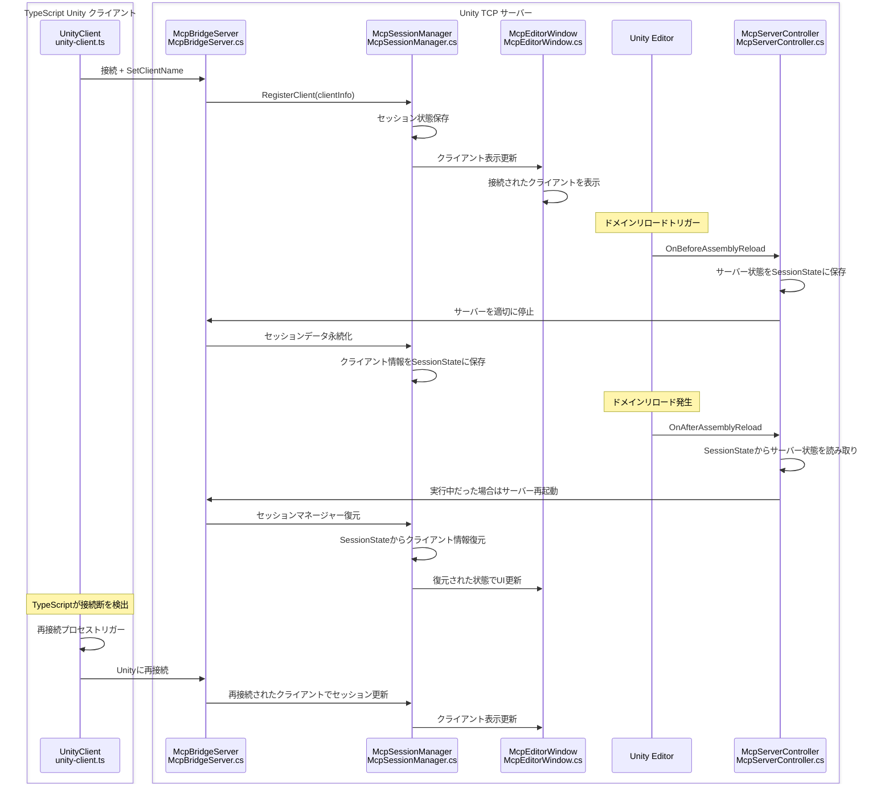
```mermaid
sequenceDiagram
    box TypeScript Unity クライアント
    participant UC as UnityClient<br/>unity-client.ts
    end
    
    box Unity TCP サーバー
    participant MB as McpBridgeServer<br/>McpBridgeServer.cs
    participant SM as McpSessionManager<br/>McpSessionManager.cs
    participant UI as McpEditorWindow<br/>McpEditorWindow.cs
    participant Unity as Unity Editor
    participant SC as McpServerController<br/>McpServerController.cs
    end
    
    UC->>MB: 接続 + SetClientName
    MB->>SM: RegisterClient(clientInfo)
    SM->>SM: セッション状態保存
    SM->>UI: クライアント表示更新
    UI->>UI: 接続されたクライアントを表示
    
    Note over Unity: ドメインリロードトリガー
    Unity->>SC: OnBeforeAssemblyReload
    SC->>SC: サーバー状態をSessionStateに保存
    SC->>MB: サーバーを適切に停止
    MB->>SM: セッションデータ永続化
    SM->>SM: クライアント情報をSessionStateに保存
    
    Note over Unity: ドメインリロード発生
    Unity->>SC: OnAfterAssemblyReload
    SC->>SC: SessionStateからサーバー状態を読み取り
    SC->>MB: 実行中だった場合はサーバー再起動
    MB->>SM: セッションマネージャー復元
    SM->>SM: SessionStateからクライアント情報復元
    SM->>UI: 復元された状態でUI更新
    
    Note over UC: TypeScriptが接続断を検出
    UC->>UC: 再接続プロセストリガー
    UC->>MB: Unityに再接続
    MB->>SM: 再接続されたクライアントでセッション更新
    SM->>UI: クライアント表示更新
```

#### 5.3.4. マルチクライアントセッション管理

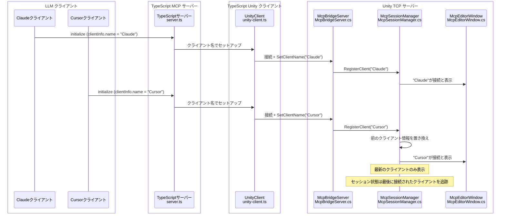
```mermaid
sequenceDiagram
    box LLM クライアント
    participant C1 as Claudeクライアント
    participant C2 as Cursorクライアント
    end
    
    box TypeScript MCP サーバー
    participant TS as TypeScriptサーバー<br/>server.ts
    end
    
    box TypeScript Unity クライアント
    participant UC as UnityClient<br/>unity-client.ts
    end
    
    box Unity TCP サーバー
    participant MB as McpBridgeServer<br/>McpBridgeServer.cs
    participant SM as McpSessionManager<br/>McpSessionManager.cs
    participant UI as McpEditorWindow<br/>McpEditorWindow.cs
    end
    
    C1->>TS: initialize (clientInfo.name = "Claude")
    TS->>UC: クライアント名でセットアップ
    UC->>MB: 接続 + SetClientName("Claude")
    MB->>SM: RegisterClient("Claude")
    SM->>UI: "Claude"が接続と表示
    
    C2->>TS: initialize (clientInfo.name = "Cursor")
    TS->>UC: クライアント名でセットアップ
    UC->>MB: 接続 + SetClientName("Cursor")
    MB->>SM: RegisterClient("Cursor")
    SM->>SM: 前のクライアント情報を置き換え
    SM->>UI: "Cursor"が接続と表示
    
    Note over SM: 最新のクライアントのみ表示
    Note over SM: セッション状態は最後に接続されたクライアントを追跡
```

### 5.4. 接続耐性と復旧パターン

#### 5.4.1. 接続状態管理

システムは複数レイヤーを通じて接続状態を維持します：

**TypeScript側状態追跡:**
- `UnityClient._connected`: アクティブ接続を示すブール値フラグ
- `UnityDiscovery.isRunning`: 発見プロセスライフサイクルを制御
- `reconnectHandlers`: 再接続時に実行される関数の配列

**Unity側状態追跡:**
- `McpBridgeServer.connectedClients`: アクティブ接続の並行辞書
- `McpSessionManager`: ドメインリロードを越えた永続セッション状態
- `McpServerController`: 静的サーバーライフサイクル管理

#### 5.4.2. 復旧メカニズム

**優雅な劣化:**
- 接続断中もコマンドはキューに続行
- UIが適切な接続状態を表示
- バックグラウンドプロセスが状態整合性を維持

**自動復旧:**
- Unity発見用の1秒ポーリング間隔
- 接続試行用の指数バックオフ
- `reconnectHandlers`を通じた状態復元

**エラー処理:**
- ソケットレベルのエラー検出とログ記録
- 接続試行のタイムアウト処理
- Unity Editor クラッシュの適切な処理

#### 5.4.3. ポート管理戦略

システムは系統的なポート発見アプローチを使用します：

**ポート範囲:** `[8700, 8800, 8900, 9000, 9100, 8600]`

**発見戦略:**
1. デフォルトポート（8700）で開始
2. 追加インスタンス用に100ずつ増加
3. 最終試行として8600にフォールバック

**ポート競合解決:**
- 利用可能性に基づく自動ポート選択
- 複数Unityインスタンスのサポート
- 環境変数オーバーライド機能

### 5.5. セキュリティ検証フロー

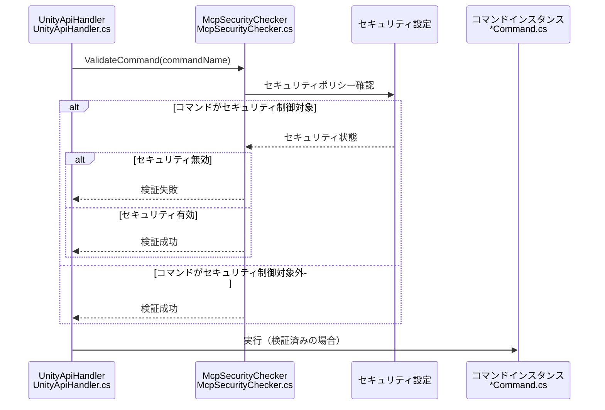
```mermaid
sequenceDiagram
    participant UA as UnityApiHandler<br/>UnityApiHandler.cs
    participant SC as McpSecurityChecker<br/>McpSecurityChecker.cs
    participant Settings as セキュリティ設定
    participant Command as コマンドインスタンス<br/>*Command.cs
    
    UA->>SC: ValidateCommand(commandName)
    SC->>Settings: セキュリティポリシー確認
    alt コマンドがセキュリティ制御対象
        Settings-->>SC: セキュリティ状態
        alt セキュリティ無効
            SC-->>UA: 検証失敗
        else セキュリティ有効
            SC-->>UA: 検証成功
        end
    else コマンドがセキュリティ制御対象外
        SC-->>UA: 検証成功
    end
    UA->>Command: 実行（検証済みの場合）
```

### 5.6. 実装ノート

#### 5.6.1. TypeScript実装詳細

**主要クラスの場所:**
- `UnityClient`: `/Packages/src/TypeScriptServer~/src/unity-client.ts`
- `UnityDiscovery`: `/Packages/src/TypeScriptServer~/src/unity-discovery.ts`
- `UnityConnectionManager`: `/Packages/src/TypeScriptServer~/src/unity-connection-manager.ts`
- `SafeTimer`: `/Packages/src/TypeScriptServer~/src/safe-timer.ts`

**重要な実装機能:**
- **シングルトンパターン**: `UnityDiscovery`が複数の発見インスタンスを防止
- **イベント駆動アーキテクチャ**: ソケットイベントが状態変更をトリガー
- **プロセスクリーンアップ**: `SafeTimer`が孤立プロセスを防止
- **エラー耐性**: 包括的なエラー処理と復旧

#### 5.6.2. Unity C#実装詳細

**主要クラスの場所:**
- `McpBridgeServer`: `/Packages/src/Editor/Server/McpBridgeServer.cs`
- `McpServerController`: `/Packages/src/Editor/Server/McpServerController.cs`
- `McpSessionManager`: `/Packages/src/Editor/Core/McpSessionManager.cs`

**重要な実装機能:**
- **スレッドセーフティ**: クライアント管理用の並行コレクション
- **ドメインリロード耐性**: `SessionState`永続化
- **ライフサイクル管理**: 自動起動用の`[InitializeOnLoad]`属性
- **クライアント分離**: 各クライアント接続の個別スレッド処理

---

# TypeScriptサーバーアーキテクチャ

## 6. TypeScriptサーバー概要

`Packages/src/TypeScriptServer~` に配置されるTypeScriptサーバーは、MCP対応クライアント（Cursor、Claude、VSCodeなど）とUnity Editorの仲介役として動作します。Node.jsプロセスとして実行され、Model Context Protocol (MCP)を使用してstdio経由でクライアントと通信し、TCPソケット接続を通じてUnity Editorにツールリクエストをリレーします。

### 主要責務
1. **MCPサーバー実装**: `@modelcontextprotocol/sdk`を使用してMCPサーバー仕様を実装し、クライアントからのリクエスト（`tools/list`、`tools/call`など）を処理
2. **動的ツール管理**: Unity Editorから利用可能なツールを取得し、MCPクライアントに公開する対応する「ツール」を動的に作成
3. **Unity通信**: Unity Editor内で動作する`McpBridgeServer`への永続的TCP接続を管理
4. **ツール転送**: MCPクライアントからの`tools/call`リクエストをJSON-RPCリクエストに変換し、実行のためUnityサーバーに送信
5. **通知処理**: Unityからの`notifications/tools/list_changed`イベントをリッスンし、Unityプロジェクトでツールが追加・削除された際に自動的にツールセットを更新

## 7. TypeScriptサーバーアーキテクチャ図

### 7.1. TypeScriptシステム概要

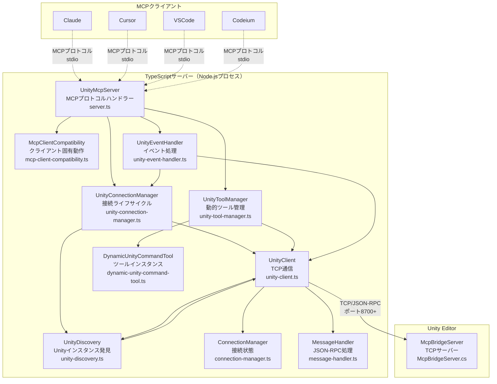
```mermaid
graph TB
    subgraph "MCPクライアント"
        Claude[Claude]
        Cursor[Cursor]
        VSCode[VSCode]
        Codeium[Codeium]
    end
    
    subgraph "TypeScriptサーバー（Node.jsプロセス）"
        MCP[UnityMcpServer<br/>MCPプロトコルハンドラー<br/>server.ts]
        UCM[UnityConnectionManager<br/>接続ライフサイクル<br/>unity-connection-manager.ts]
        UTM[UnityToolManager<br/>動的ツール管理<br/>unity-tool-manager.ts]
        MCC[McpClientCompatibility<br/>クライアント固有動作<br/>mcp-client-compatibility.ts]
        UEH[UnityEventHandler<br/>イベント処理<br/>unity-event-handler.ts]
        UC[UnityClient<br/>TCP通信<br/>unity-client.ts]
        UD[UnityDiscovery<br/>Unityインスタンス発見<br/>unity-discovery.ts]
        CM[ConnectionManager<br/>接続状態<br/>connection-manager.ts]
        MH[MessageHandler<br/>JSON-RPC処理<br/>message-handler.ts]
        Tools[DynamicUnityCommandTool<br/>ツールインスタンス<br/>dynamic-unity-command-tool.ts]
    end
    
    subgraph "Unity Editor"
        Bridge[McpBridgeServer<br/>TCPサーバー<br/>McpBridgeServer.cs]
    end
    
    Claude -.->|MCPプロトコル<br/>stdio| MCP
    Cursor -.->|MCPプロトコル<br/>stdio| MCP
    VSCode -.->|MCPプロトコル<br/>stdio| MCP
    Codeium -.->|MCPプロトコル<br/>stdio| MCP
    
    MCP --> UCM
    MCP --> UTM
    MCP --> MCC
    MCP --> UEH
    UCM --> UC
    UCM --> UD
    UTM --> UC
    UTM --> Tools
    UEH --> UC
    UEH --> UCM
    UC --> CM
    UC --> MH
    UC --> UD
    UD --> UC
    UC -->|TCP/JSON-RPC<br/>ポート8700+| Bridge
```

### 7.2. TypeScriptクラス関係図

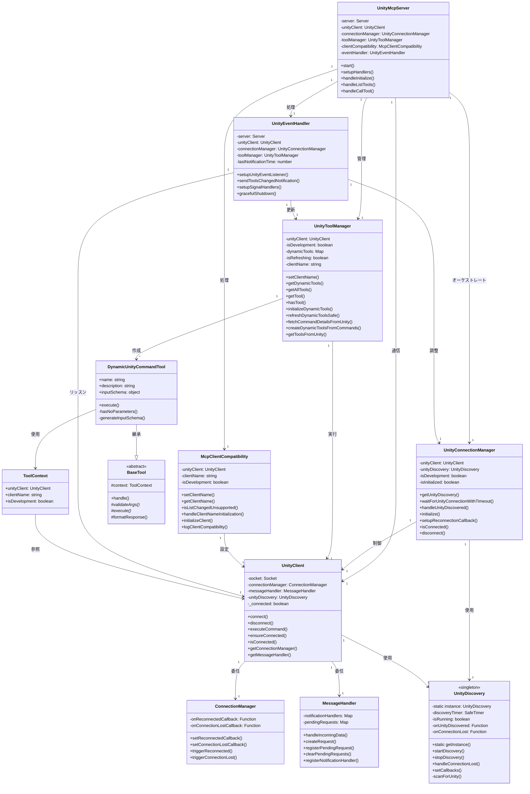
```mermaid
classDiagram
    class UnityMcpServer {
        -server: Server
        -unityClient: UnityClient
        -connectionManager: UnityConnectionManager
        -toolManager: UnityToolManager
        -clientCompatibility: McpClientCompatibility
        -eventHandler: UnityEventHandler
        +start()
        +setupHandlers()
        +handleInitialize()
        +handleListTools()
        +handleCallTool()
    }

    class UnityConnectionManager {
        -unityClient: UnityClient
        -unityDiscovery: UnityDiscovery
        -isDevelopment: boolean
        -isInitialized: boolean
        +getUnityDiscovery()
        +waitForUnityConnectionWithTimeout()
        +handleUnityDiscovered()
        +initialize()
        +setupReconnectionCallback()
        +isConnected()
        +disconnect()
    }

    class UnityToolManager {
        -unityClient: UnityClient
        -isDevelopment: boolean
        -dynamicTools: Map<string, DynamicUnityCommandTool>
        -isRefreshing: boolean
        -clientName: string
        +setClientName()
        +getDynamicTools()
        +getAllTools()
        +getTool()
        +hasTool()
        +initializeDynamicTools()
        +refreshDynamicToolsSafe()
        +fetchCommandDetailsFromUnity()
        +createDynamicToolsFromCommands()
        +getToolsFromUnity()
    }

    class McpClientCompatibility {
        -unityClient: UnityClient
        -clientName: string
        -isDevelopment: boolean
        +setClientName()
        +getClientName()
        +isListChangedUnsupported()
        +handleClientNameInitialization()
        +initializeClient()
        +logClientCompatibility()
    }

    class UnityEventHandler {
        -server: Server
        -unityClient: UnityClient
        -connectionManager: UnityConnectionManager
        -toolManager: UnityToolManager
        -lastNotificationTime: number
        +setupUnityEventListener()
        +sendToolsChangedNotification()
        +setupSignalHandlers()
        +gracefulShutdown()
    }

    class UnityClient {
        -socket: Socket
        -connectionManager: ConnectionManager
        -messageHandler: MessageHandler
        -unityDiscovery: UnityDiscovery
        -_connected: boolean
        +connect()
        +disconnect()
        +executeCommand()
        +ensureConnected()
        +isConnected()
        +getConnectionManager()
        +getMessageHandler()
    }

    class UnityDiscovery {
        <<singleton>>
        -static instance: UnityDiscovery
        -discoveryTimer: SafeTimer
        -isRunning: boolean
        -onUnityDiscovered: Function
        -onConnectionLost: Function
        +static getInstance()
        +startDiscovery()
        +stopDiscovery()
        +handleConnectionLost()
        +setCallbacks()
        -scanForUnity()
    }

    class ConnectionManager {
        -onReconnectedCallback: Function
        -onConnectionLostCallback: Function
        +setReconnectedCallback()
        +setConnectionLostCallback()
        +triggerReconnected()
        +triggerConnectionLost()
    }

    class MessageHandler {
        -notificationHandlers: Map<string, Function>
        -pendingRequests: Map<number, PendingRequest>
        +handleIncomingData()
        +createRequest()
        +registerPendingRequest()
        +clearPendingRequests()
        +registerNotificationHandler()
    }

    class BaseTool {
        <<abstract>>
        #context: ToolContext
        +handle()
        #validateArgs()*
        #execute()*
        #formatResponse()
    }

    class DynamicUnityCommandTool {
        +name: string
        +description: string
        +inputSchema: object
        +execute()
        -hasNoParameters()
        -generateInputSchema()
    }

    class ToolContext {
        +unityClient: UnityClient
        +clientName: string
        +isDevelopment: boolean
    }

    UnityMcpServer "1" --> "1" UnityConnectionManager : オーケストレート
    UnityMcpServer "1" --> "1" UnityToolManager : 管理
    UnityMcpServer "1" --> "1" McpClientCompatibility : 処理
    UnityMcpServer "1" --> "1" UnityEventHandler : 処理
    UnityMcpServer "1" --> "1" UnityClient : 通信
    UnityConnectionManager "1" --> "1" UnityClient : 制御
    UnityConnectionManager "1" --> "1" UnityDiscovery : 使用
    UnityToolManager "1" --> "1" UnityClient : 実行
    UnityToolManager "1" --> "*" DynamicUnityCommandTool : 作成
    McpClientCompatibility "1" --> "1" UnityClient : 設定
    UnityEventHandler "1" --> "1" UnityClient : リッスン
    UnityEventHandler "1" --> "1" UnityConnectionManager : 調整
    UnityEventHandler "1" --> "1" UnityToolManager : 更新
    UnityClient "1" --> "1" ConnectionManager : 委任
    UnityClient "1" --> "1" MessageHandler : 委任
    UnityClient "1" --> "1" UnityDiscovery : 使用
    DynamicUnityCommandTool --|> BaseTool : 継承
    DynamicUnityCommandTool --> ToolContext : 使用
    ToolContext --> UnityClient : 参照
```

### 7.3. TypeScriptツール実行シーケンス

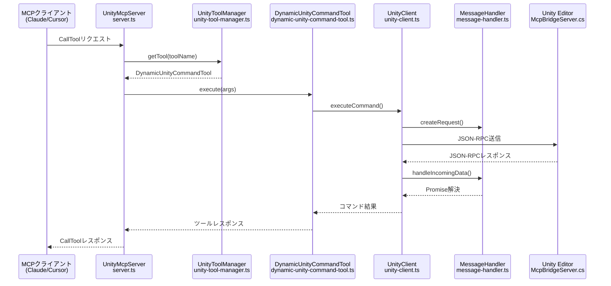
```mermaid
sequenceDiagram
    participant MC as MCPクライアント<br/>(Claude/Cursor)
    participant US as UnityMcpServer<br/>server.ts
    participant UTM as UnityToolManager<br/>unity-tool-manager.ts
    participant DT as DynamicUnityCommandTool<br/>dynamic-unity-command-tool.ts
    participant UC as UnityClient<br/>unity-client.ts
    participant MH as MessageHandler<br/>message-handler.ts
    participant UE as Unity Editor<br/>McpBridgeServer.cs

    MC->>US: CallToolリクエスト
    US->>UTM: getTool(toolName)
    UTM-->>US: DynamicUnityCommandTool
    US->>DT: execute(args)
    DT->>UC: executeCommand()
    UC->>MH: createRequest()
    UC->>UE: JSON-RPC送信
    UE-->>UC: JSON-RPCレスポンス
    UC->>MH: handleIncomingData()
    MH-->>UC: Promise解決
    UC-->>DT: コマンド結果
    DT-->>US: ツールレスポンス
    US-->>MC: CallToolレスポンス
```

## 8. TypeScript核心アーキテクチャ原則

### 8.1. 動的で拡張可能なツーリング
サーバーの核心的な強みは、Unityで利用可能なツール（コマンド）に動的に適応する能力です：

- **`UnityToolManager`**: 専用メソッドを通じて全ての動的ツール管理を処理：
  - `initializeDynamicTools()`: ツール初期化プロセスをオーケストレート
  - `fetchCommandDetailsFromUnity()`: Unityからコマンドメタデータを取得
  - `createDynamicToolsFromCommands()`: メタデータからツールインスタンスを作成
  - `refreshDynamicToolsSafe()`: 重複防止機能付きでツールを安全に更新
- **`McpClientCompatibility`**: クライアント固有の要件を管理：
  - `handleClientNameInitialization()`: クライアント名同期を管理
  - `isListChangedUnsupported()`: list_changed通知をサポートしないクライアントを検出
- **`DynamicUnityCommandTool`**: Unityから受信したスキーマ情報（名前、説明、パラメータ）を取得し、MCP準拠のツールをその場で構築する汎用「ツール」ファクトリ

### 8.2. 疎結合と単一責任
アーキテクチャは責務の明確な分離のためMartin FowlerのExtract Classパターンに従います：

- **`server.ts` (`UnityMcpServer`)**: メインアプリケーションエントリーポイント、MCPプロトコル処理とコンポーネントオーケストレーションに専念
- **`unity-connection-manager.ts` (`UnityConnectionManager`)**: Unity接続ライフサイクル、発見、再接続ロジックを管理
- **`unity-tool-manager.ts` (`UnityToolManager`)**: Unityコマンドの取得からツールインスタンスの作成・更新まで、動的ツール管理の全側面を処理
- **`mcp-client-compatibility.ts` (`McpClientCompatibility`)**: クライアント固有の動作と互換性要件を管理
- **`unity-event-handler.ts` (`UnityEventHandler`)**: イベント処理、通知、シグナルハンドリング、グレースフルシャットダウン手順を処理
- **`unity-client.ts` (`UnityClient`)**: Unity EditorへのTCP接続を管理、以下に委任：
  - **`connection-manager.ts` (`ConnectionManager`)**: 接続状態管理を処理
  - **`message-handler.ts` (`MessageHandler`)**: JSON-RPCメッセージ解析とルーティングを処理
- **`unity-discovery.ts` (`UnityDiscovery`)**: 1秒間隔ポーリングでUnityインスタンス発見を行うシングルトンサービス

### 8.3. 回復力とロバストネス
サーバーは接続断とプロセスライフサイクルイベントに対して回復力を持つよう設計されています：

- **接続管理**: `UnityConnectionManager`が`UnityDiscovery`を通じて接続ライフサイクルをオーケストレート（シングルトンパターンで複数タイマーを防止）
- **グレースフルシャットダウン**: `UnityEventHandler`が全シグナル処理（`SIGINT`、`SIGTERM`、`SIGHUP`）を処理し、`stdin`を監視してグレースフルシャットダウンを保証
- **クライアント互換性**: `McpClientCompatibility`が異なるクライアント動作を管理し、list_changed通知をサポートしないクライアント（Claude Code、Gemini、Windsurf、Codeium）の適切な初期化を保証
- **セーフタイマー**: `safe-timer.ts`ユーティリティがプロセス終了時に自動的にクリアされる`setTimeout`と`setInterval`ラッパーを提供
- **遅延Unity接続**: サーバーはMCPクライアントが名前を提供するまでUnityへの接続を待機し、Unity UIに「Unknown Client」が表示されることを防止

### 8.4. セーフログ
サーバーはJSON-RPC通信に`stdio`を使用するため、`console.log`をデバッグに使用することはできません：
- **`log-to-file.ts`**: セーフなファイルベースログ機能を提供。`MCP_DEBUG`環境変数が設定されると、全てのデバッグ、情報、警告、エラーメッセージが`~/.claude/uloopmcp-logs/`のタイムスタンプ付きログファイルに書き込まれます

## 9. TypeScript主要コンポーネント（ファイル詳細）

### `src/server.ts`
Martin FowlerのExtract Classリファクタリングで簡素化されたアプリケーションのメインエントリーポイント：
- **`UnityMcpServer`クラス**:
    - `@modelcontextprotocol/sdk` `Server`を初期化
    - 専門的なマネージャークラスをインスタンス化・オーケストレート
    - `InitializeRequestSchema`、`ListToolsRequestSchema`、`CallToolRequestSchema`を処理
    - クライアント互換性に基づいて適切なマネージャーに初期化を委任

### `src/unity-connection-manager.ts`
発見と再接続に焦点を当てたUnity接続ライフサイクルを管理：
- **`UnityConnectionManager`クラス**:
    - `UnityDiscovery`を通じてUnity接続確立をオーケストレート
    - 同期初期化のための`waitForUnityConnectionWithTimeout()`を提供
    - 接続コールバックを処理し、再接続シナリオを管理
    - タイマー競合を防ぐシングルトン`UnityDiscovery`サービスと統合

### `src/unity-tool-manager.ts`
動的ツール管理とライフサイクルの全側面を処理：
- **`UnityToolManager`クラス**:
    - `initializeDynamicTools()`: Unityコマンドを取得し対応するツールを作成
    - `refreshDynamicToolsSafe()`: 重複防止機能付きでツールを安全に更新
    - `fetchCommandDetailsFromUnity()`: Unityからコマンドメタデータを取得
    - `createDynamicToolsFromCommands()`: Unityスキーマからツールインスタンスを作成
    - `dynamicTools` Mapを管理し、ツールアクセスメソッドを提供

### `src/mcp-client-compatibility.ts`
クライアント固有の互換性と動作の違いを管理：
- **`McpClientCompatibility`クラス**:
    - `isListChangedUnsupported()`: list_changed通知をサポートしないクライアントを検出
    - `handleClientNameInitialization()`: クライアント名設定と環境変数フォールバックを管理
    - `initializeClient()`: クライアント固有の初期化手順をオーケストレート
    - Claude Code、Gemini、Windsurf、Codeiumクライアントの互換性を処理

### `src/unity-event-handler.ts`
イベント処理、通知、グレースフルシャットダウンを管理：
- **`UnityEventHandler`クラス**:
    - `setupUnityEventListener()`: Unity通知リスナーを設定
    - `sendToolsChangedNotification()`: 重複防止機能付きでMCP list_changed通知を送信
    - `setupSignalHandlers()`: グレースフルシャットダウンのためのプロセスシグナルハンドラーを設定
    - `gracefulShutdown()`: クリーンアップとプロセス終了を処理

### `src/unity-client.ts`
Unity Editorとの全通信をカプセル化：
- **`UnityClient`クラス**:
    - TCP通信のための`net.Socket`を管理
    - `connect()`で接続確立、`ensureConnected()`で回復力のある接続管理を提供
    - `executeCommand()`でUnityにJSON-RPCリクエストを送信し、レスポンスを待機
    - 受信データを処理し、レスポンスと非同期通知を区別

### `src/unity-discovery.ts`
Unityインスタンス発見のためのシングルトンサービス：
- **`UnityDiscovery`クラス**:
    - 複数の発見タイマーを防ぐシングルトンパターンを実装
    - Unity Editorインスタンスの1秒間隔ポーリングを提供
    - ポート [8700, 8800, 8900, 9000, 9100, 8600] をスキャン
    - 接続コールバックと接続断イベントを処理

### `src/tools/dynamic-unity-command-tool.ts`
Unityコマンドに基づくツールのファクトリ：
- **`DynamicUnityCommandTool`クラス**:
    - `generateInputSchema()`でC#スキーマ定義をJSONスキーマ形式に変換
    - `execute()`メソッドで`UnityClient`経由でツール呼び出しをUnityに転送
    - 一貫したツールインターフェースのため`BaseTool`抽象クラスを継承

### `src/utils/`
ヘルパーユーティリティを含む：
- **`log-to-file.ts`**: セーフなファイルベースログ関数（`debugToFile`、`infoToFile`など）
- **`safe-timer.ts`**: 堅牢なタイマー管理のための`SafeTimer`クラスと`safeSetTimeout`/`safeSetInterval`関数

### `src/constants.ts`
全ての共有定数の中央ファイル：
- MCPプロトコル定数
- 環境変数
- デフォルトメッセージとタイムアウト値
- ポート範囲と発見設定

## 10. TypeScript主要ワークフロー

### 10.1. サーバー起動とツール初期化
1. `UnityMcpServer`が専門的なマネージャークラスをインスタンス化
2. `UnityMcpServer.start()`が呼び出される
3. `UnityEventHandler.setupUnityEventListener()`が通知リスナーを設定
4. `UnityConnectionManager.initialize()`が接続発見プロセスを開始
5. MCPサーバーが`StdioServerTransport`に接続し、リクエストを処理する準備完了
6. サーバーがMCPクライアントからの`initialize`リクエストを待機
7. `initialize`リクエスト受信時：
   - `clientInfo.name`からクライアント名を抽出
   - `McpClientCompatibility.setClientName()`がクライアント情報を保存
   - クライアント互換性に基づいて同期または非同期初期化を使用
8. 同期初期化の場合（list_changed未サポートクライアント）：
   - `UnityConnectionManager.waitForUnityConnectionWithTimeout()`がUnityを待機
   - `UnityToolManager.getToolsFromUnity()`がツールを取得し即座に返却
9. 非同期初期化の場合（list_changedサポートクライアント）：
   - `UnityToolManager.initializeDynamicTools()`がバックグラウンド初期化を開始
   - ツールが発見され`UnityEventHandler.sendToolsChangedNotification()`がクライアントに通知

### 10.2. ツール呼び出しの処理
1. MCPクライアントが`stdin`経由で`tools/call`リクエストを送信
2. `UnityMcpServer`の`CallToolRequestSchema`ハンドラーが呼び出される
3. `UnityToolManager.hasTool()`を呼び出してリクエストされたツールの存在を確認
4. `UnityToolManager.getTool()`を呼び出して対応する`DynamicUnityCommandTool`インスタンスを取得
5. ツールインスタンスの`execute()`メソッドを呼び出す
6. ツールの`execute()`メソッドが`this.context.unityClient.executeCommand()`をツール名と引数で呼び出す
7. `UnityClient`がTCP経由でUnityにJSON-RPCリクエストを送信
8. Unityがコマンドを実行しレスポンスを返送
9. `UnityClient`がレスポンスを受信しpromiseを解決、ツールに結果を返却
10. ツールが結果をMCP準拠レスポンスに整形して返却
11. `UnityMcpServer`が`stdout`経由でクライアントに最終レスポンスを送信

## 11. TypeScript開発・テストインフラストラクチャ

### 11.1. ビルドシステム
- **esbuild**: プロダクションビルド用高速JavaScriptバンドラー
- **TypeScript**: 型安全JavaScript開発
- **Node.js**: サーバー実行のランタイム環境

### 11.2. テストフレームワーク
- **Jest**: JavaScriptテストフレームワーク
- **ユニットテスト**: 個別コンポーネントテスト
- **統合テスト**: コンポーネント間相互作用テスト

### 11.3. コード品質
- **ESLint**: JavaScript/TypeScriptリント
- **Prettier**: コード整形
- **型チェック**: 厳密なTypeScriptコンパイル

### 11.4. デバッグ・監視
- **ファイルベースログ**: `~/.claude/uloopmcp-logs/`への安全なログ
- **デバッグ環境変数**: 詳細ログのための`MCP_DEBUG`
- **プロセス監視**: シグナルハンドリングとグレースフルシャットダウン
- **接続ヘルス**: 自動再接続と発見