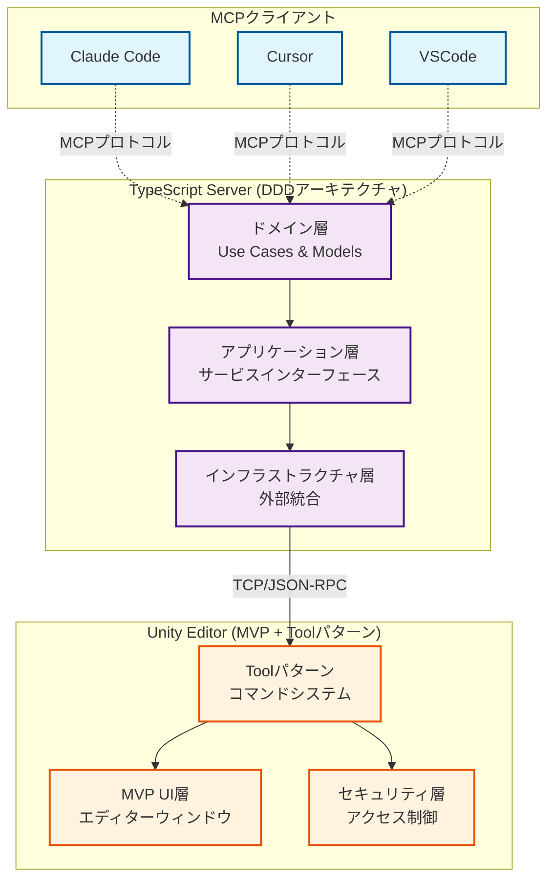

# uLoopMCP アーキテクチャ概要

このドキュメントはuLoopMCPプロジェクトのメインアーキテクチャ概要を提供します。詳細なアーキテクチャ情報については、以下の専用アーキテクチャドキュメントを参照してください：

- **[Unity Editor側アーキテクチャ](ARCHITECTURE_Unity_ja.md)**: Unity Editorコンポーネントの詳細なC#アーキテクチャ
- **[TypeScript Serverアーキテクチャ](ARCHITECTURE_TypeScript_ja.md)**: TypeScript ServerのDDDアーキテクチャ詳細

## システム概要

uLoopMCPシステムは、Model Context Protocol (MCP) クライアント向けのUnity Editor統合を提供するために連携する3つの主要コンポーネントで構成されています：

1. **MCPクライアント** (Claude Code, Cursor, VSCode): MCPプロトコルを消費するLLM駆動開発ツール
2. **TypeScript Server** (Node.jsプロセス): Domain-Driven Designアーキテクチャを持つMCPプロトコルサーバー
3. **Unity Editor** (C# TCPサーバー): ツールシステムとセキュリティ管理を備えたUnity Editor統合

### 高レベルアーキテクチャ

### 通信フロー

システムは3層通信アプローチを使用します：

1. **MCPプロトコル層**: LLMクライアントがstdio上でModel Context Protocolを使用してTypeScript serverと通信
2. **サービス層**: TypeScript serverがDomain-Driven Designを使用し、Use Casesがビジネスワークフローを統制
3. **TCP層**: TypeScript serverがlocalhost上でTCP/JSON-RPCを使用してUnity Editorと通信

詳細な通信プロトコル、接続管理、アーキテクチャパターンについては、上記リンクの専用アーキテクチャドキュメントを参照してください。

## 主要機能

### TypeScript Server (DDDアーキテクチャ)
- **Domain-Driven Design**: ビジネスワークフローを統制するUse Casesを持つClean Architecture
- **Service Locatorパターン**: シンボルベースのトークンを使用した型安全な依存性注入
- **インターフェース分離**: 特定の責務に焦点を当てた小さなインターフェース
- **動的ツール管理**: Unityツールを自動的に発見しMCPクライアントに公開
- **クライアント互換性**: 異なるMCPクライアントの要件と動作を処理
- **接続レジリエンス**: 自動再接続と発見、優雅なデグラデーション

### Unity Editor (DDD + MVP + Toolパターン)
- **Domain-Driven Design**: UseCase層でビジネスワークフローを統制、Application Service層で単一機能を実装
- **UseCase + Toolパターン**: Martin Fowlerのリファクタリング原則に従った時間的結合分離を持つDDD統合アーキテクチャ
- **MVP + Helperパターン**: 専門ヘルパークラスによる関心の清潔な分離
- **Application Serviceパターン**: ConnectedToolsMonitoringServiceによる自動起動ツール監視、エディターウィンドウ非依存動作
- **セキュリティアーキテクチャ**: 設定可能なポリシーを持つ包括的なアクセス制御
- **セッション管理**: 専用UseCaseを通じたドメインリロード耐性のある状態管理
- **スキーマ駆動通信**: 自動スキーマ生成による型安全なJSON-RPC
- **動的バッファ管理**: 断片化メッセージサポート付きの効率的なTCP通信

## 開発ガイドライン

### TypeScript Server DDDルール
- **ドメイン層**: 外部依存関係のない純粋なビジネスロジック
- **アプリケーション層**: ドメインをインフラストラクチャから保護するサービス契約
- **インフラストラクチャ層**: 外部システム統合とフレームワークコード
- **Service Locator**: ファクトリ関数による型安全な依存性注入

### Unity Editorパターン
- **UseCase開発**: `AbstractUseCase<TSchema, TResponse>`を継承し、Application Serviceを統制してビジネスワークフローを実装
- **Application Service作成**: `ServiceResult<T>`を返す単一機能サービスで清潔な分離を実装
- **ツール作成**: `IUnityTool`を実装しUseCaseに委譲、自動登録のために`[McpTool]`属性を使用
- **UI開発**: 保守可能なエディターウィンドウのためのMVP + Helperパターンに従う
- **セキュリティ**: 全てのツールが`McpSecurityChecker`を通じてセキュリティ検証の対象
- **ドメインリロード処理**: 状態管理に専用の`DomainReloadRecoveryUseCase`を使用

包括的な実装詳細、開発ワークフロー、アーキテクチャ決定については、詳細アーキテクチャドキュメントを参照してください。