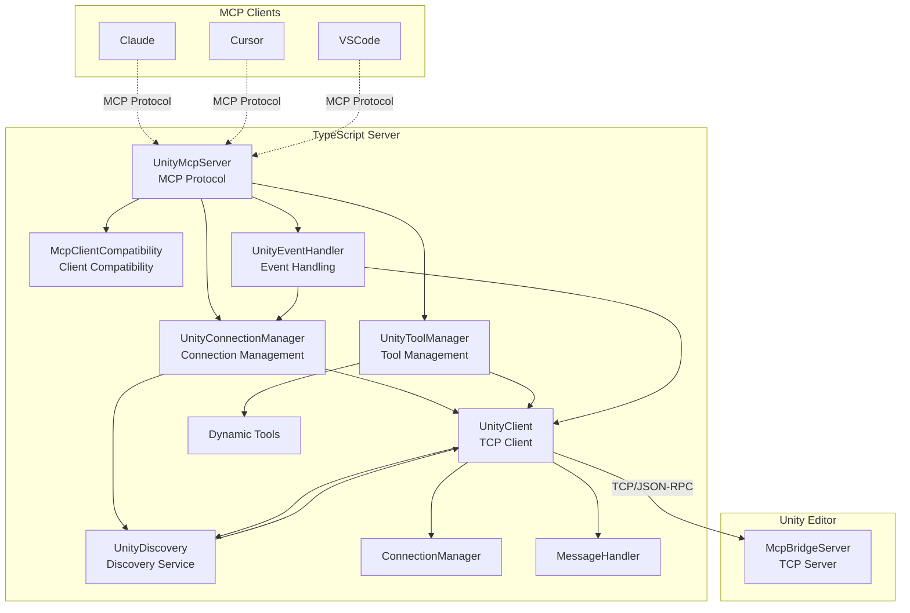
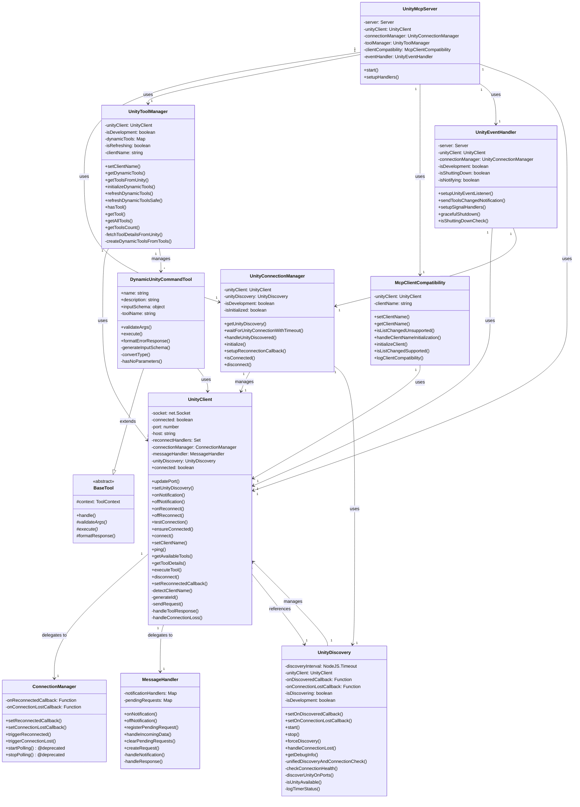
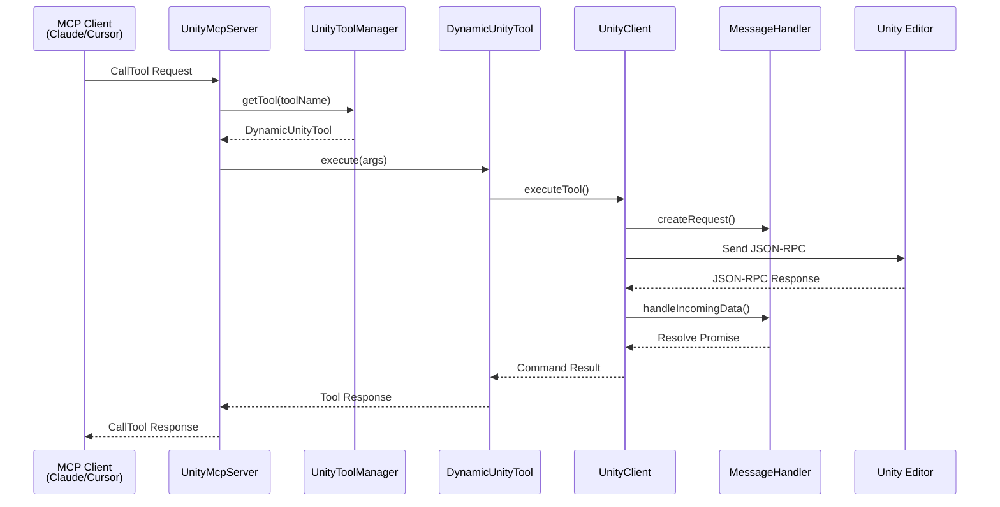

# uLoopMCP TypeScript Server Architecture

## 1. Overview

This document outlines the architecture of the TypeScript server located in `Packages/src/TypeScriptServer~`. This server acts as the intermediary between an MCP-compatible client (like Cursor, Claude, or VSCode) and the Unity Editor. It runs as a Node.js process, communicates with the client via standard I/O (stdio) using the Model Context Protocol (MCP), and relays tool requests to the Unity Editor via a TCP socket.

Its primary responsibilities are:
1.  **MCP Server Implementation**: Implements the MCP server specification using `@modelcontextprotocol/sdk` to handle requests from the client (e.g., `tools/list`, `tools/call`).
2.  **Dynamic Tool Management**: Fetches a list of available tools from the Unity Editor and dynamically creates corresponding "tools" to expose to the MCP client.
3.  **Unity Communication**: Manages a persistent TCP connection to the `McpBridgeServer` running inside the Unity Editor.
4.  **Tool Forwarding**: Translates `tools/call` requests from the MCP client into JSON-RPC requests and sends them to the Unity server for execution.
5.  **Notification Handling**: Listens for `notifications/tools/list_changed` events from Unity to automatically refresh its toolset when tools are added or removed in the Unity project.

## 2. Architecture Diagrams

### 2.1. System Overview

### 2.2. Class Relationships

### 2.3. Tool Execution Sequence

## 3. Core Architectural Principles

### 3.1. Dynamic and Extensible Tooling
The server's core strength is its ability to dynamically adapt to the tools (commands) available in Unity.

- **`UnityToolManager`**: Handles all dynamic tool management through dedicated methods:
  - `initializeDynamicTools()`: Orchestrates the tool initialization process
  - `fetchToolDetailsFromUnity()`: Retrieves command metadata from Unity using `get-tool-details`
  - `createDynamicToolsFromTools()`: Creates tool instances from Unity tool metadata
  - `refreshDynamicToolsSafe()`: Safely refreshes tools with duplicate prevention and thread safety
  - `getToolsFromUnity()`: Synchronous tool fetching for list_changed unsupported clients
  - `getAllTools()`: Returns all available tools in MCP format
  - `setClientName()`: Sets client name for Unity communication context
- **`McpClientCompatibility`**: Manages client-specific requirements:
  - `handleClientNameInitialization()`: Manages client name synchronization with Unity
  - `isListChangedUnsupported()`: Detects clients that don't support list_changed notifications (Claude Code, Gemini, Windsurf)
  - `initializeClient()`: Orchestrates client-specific initialization procedures
  - `logClientCompatibility()`: Logs client behavior for debugging
- **`DynamicUnityCommandTool.ts`**: This class is a generic "tool" factory that extends `BaseTool`. It takes the schema information received from Unity (name, description, parameters) and constructs an MCP-compliant tool on the fly:
  - `generateInputSchema()`: Converts Unity parameter schemas to JSON Schema format
  - `hasNoParameters()`: Checks if tool has no parameters for cleaner schema generation
  - `validateArgs()`: Validates incoming arguments against the schema
  - `execute()`: Executes the tool via UnityClient.executeTool()
- This means that when a Unity developer adds a new `IUnityCommand` to their project, the TypeScript server automatically discovers it and exposes it to the LLM without requiring any changes to the TypeScript code.

### 3.2. Decoupling and Single Responsibility
The architecture follows Martin Fowler's Extract Class pattern for clean separation of responsibilities:

- **`server.ts` (`UnityMcpServer`)**: The main application entry point, now focused solely on MCP protocol handling and component orchestration. Delegates specific responsibilities to specialized managers.
- **`unity-connection-manager.ts` (`UnityConnectionManager`)**: Manages Unity connection lifecycle, discovery, and reconnection logic. Provides a clean abstraction over the connection complexity.
- **`unity-tool-manager.ts` (`UnityToolManager`)**: Handles all aspects of dynamic tool management, from fetching Unity commands to creating and refreshing tool instances.
- **`mcp-client-compatibility.ts` (`McpClientCompatibility`)**: Manages client-specific behaviors and compatibility requirements, particularly for clients that don't support list_changed notifications.
- **`unity-event-handler.ts` (`UnityEventHandler`)**: Handles event processing, notifications, signal handling, and graceful shutdown procedures.
- **`unity-client.ts` (`UnityClient`)**: Manages the TCP connection to the Unity Editor. Delegates specific responsibilities to:
  - **`connection-manager.ts` (`ConnectionManager`)**: Handles connection state management
  - **`message-handler.ts` (`MessageHandler`)**: Processes JSON-RPC message parsing and routing
- **`dynamic-unity-command-tool.ts` (`DynamicUnityCommandTool`)**: Responsible for the logic of a single, dynamically-generated tool.
- **`base-tool.ts` (`BaseTool`)**: Abstract base class implementing the Template Method pattern for all tools.

### 3.3. Resilience and Robustness
The server is designed to be resilient to connection drops and process lifecycle events.

- **Connection Management**: `UnityConnectionManager` orchestrates the connection lifecycle through `UnityDiscovery` (singleton pattern prevents multiple timers). The unified discovery service handles both Unity discovery and connection health monitoring in a single timer to prevent conflicts. If the connection to Unity is lost (e.g., Unity Editor is closed or crashes), it periodically attempts to reconnect, ensuring the bridge is re-established automatically when Unity becomes available again.
- **Unity Discovery Service**: `UnityDiscovery` provides unified discovery and connection management:
  - Singleton pattern prevents multiple concurrent timers
  - Unified discovery checks both discovery and connection health
  - Expanded port range scanning for better Unity detection
  - Automatic connection loss handling and recovery
  - Development mode debugging with timer status logging
- **Graceful Shutdown**: `UnityEventHandler` handles all signal processing (`SIGINT`, `SIGTERM`, `SIGHUP`) and monitors `stdin` to ensure graceful shutdown. When the parent process (the LLM/MCP client) terminates, the Node.js server cleans up its connections and exits, preventing orphaned processes. Enhanced error handling prevents hanging processes.
- **Client Compatibility**: `McpClientCompatibility` manages different client behaviors, ensuring proper initialization for clients that don't support list_changed notifications (Claude Code, Gemini, Windsurf, Codeium).
- **Safe Timers**: The `safe-timer.ts` utility provides `SafeTimer` class and `safeSetTimeout`/`safeSetInterval` functions that automatically clear themselves when the process exits or object is destroyed, preventing orphaned processes and memory leaks.
- **Safe Logging**: The `log-to-file.ts` utility ensures debug information is written to files instead of stdout/stderr, preventing corruption of the MCP JSON-RPC communication channel.
- **Delayed Unity Connection**: The server waits for the MCP client to provide its name before connecting to Unity, preventing "Unknown Client" from appearing in the Unity UI. This ensures the client is properly identified from the first connection.

## 4. Key Components (File Breakdown)

### `src/server.ts`
This is the main entry point of the application, now significantly simplified through Martin Fowler's Extract Class refactoring.
- **`UnityMcpServer` class**:
    - Initializes the `@modelcontextprotocol/sdk` `Server` with capabilities including `tools.listChanged`.
    - Instantiates and orchestrates the specialized manager classes:
        - `UnityConnectionManager`: For connection lifecycle management
        - `UnityToolManager`: For dynamic tool management  
        - `McpClientCompatibility`: For client-specific behavior handling
        - `UnityEventHandler`: For event processing and shutdown
    - On `start()`, it delegates initialization to the appropriate managers.
    - Sets up request handlers:
        - `InitializeRequestSchema`: Handles client initialization with client name detection and compatibility-based initialization (synchronous for list_changed unsupported clients, asynchronous for supported clients)
        - `ListToolsRequestSchema`: Delegates to `toolManager.getAllTools()`
        - `CallToolRequestSchema`: Delegates to appropriate tool via `toolManager.getTool()` and executes via `tool.execute()`
    - Event listening and notification handling is delegated to `UnityEventHandler`.
    - Uses `StdioServerTransport` for MCP communication.

### `src/unity-connection-manager.ts`
Manages the Unity connection lifecycle with a focus on discovery and reconnection.
- **`UnityConnectionManager` class**:
    - Orchestrates Unity connection establishment through `UnityDiscovery` singleton.
    - Provides `waitForUnityConnectionWithTimeout()` for synchronous initialization (used by list_changed unsupported clients).
    - `handleUnityDiscovered()`: Handles Unity discovery events and establishes connection.
    - `initialize()`: Sets up discovery callbacks and starts Unity discovery.
    - `setupReconnectionCallback()`: Configures callbacks for connection recovery.
    - Integrates with the singleton `UnityDiscovery` service to prevent timer conflicts.
    - Provides connection state checking and cleanup functionality.

### `src/unity-tool-manager.ts`
Handles all aspects of dynamic tool management and lifecycle.
- **`UnityToolManager` class**:
    - `initializeDynamicTools()`: Orchestrates the complete tool initialization process.
    - `getToolsFromUnity()`: Synchronous tool fetching for list_changed unsupported clients.
    - `refreshDynamicToolsSafe()`: Thread-safe tool refresh with duplicate prevention and call stack tracking.
    - `fetchToolDetailsFromUnity()`: Retrieves command metadata from Unity using `get-tool-details` with development mode support.
    - `createDynamicToolsFromTools()`: Creates `DynamicUnityCommandTool` instances from Unity tool metadata.
    - Manages the `dynamicTools` Map<string, DynamicUnityCommandTool> and provides tool access methods.
    - Supports client name context and development-only tool filtering.

### `src/mcp-client-compatibility.ts`
Manages client-specific compatibility and behavior differences.
- **`McpClientCompatibility` class**:
    - `isListChangedUnsupported()`: Detects clients that don't support list_changed notifications (Claude Code, Gemini, Windsurf, Codeium).
    - `handleClientNameInitialization()`: Manages client name setup with MCP_CLIENT_NAME environment variable fallback and reconnection handling.
    - `initializeClient()`: Orchestrates client-specific initialization procedures.
    - `logClientCompatibility()`: Provides detailed compatibility logging for debugging.
    - Handles both primary client name from MCP initialize request and fallback mechanisms.

### `src/unity-event-handler.ts`
Manages event processing, notifications, and graceful shutdown.
- **`UnityEventHandler` class**:
    - `setupUnityEventListener()`: Configures Unity notification listeners for `notifications/tools/list_changed`.
    - `sendToolsChangedNotification()`: Sends MCP list_changed notifications with duplicate prevention and thread safety.
    - `setupSignalHandlers()`: Configures comprehensive signal handlers (SIGINT, SIGTERM, SIGHUP) and stdin monitoring for parent process detection.
    - `gracefulShutdown()`: Enhanced shutdown process with proper cleanup, timer clearing, and garbage collection to prevent orphaned processes.
    - Includes uncaught exception and unhandled rejection handling for robustness.

### `src/unity-client.ts`
This class encapsulates all communication with the Unity Editor.
- **`UnityClient` class**:
    - Manages a `net.Socket` for TCP communication with configurable port (via UNITY_TCP_PORT environment variable).
    - The `connect()` method establishes the connection, while `ensureConnected()` provides a resilient way to get a valid connection, reconnecting if necessary.
    - `executeTool()` is the primary method for sending JSON-RPC requests to Unity with timeout handling and error management.
    - `testConnection()`: Tests actual communication possibility, not just socket status.
    - `setClientName()`: Sends client name to Unity for proper identification.
    - `ping()`, `getAvailableTools()`, `getToolDetails()`: Specific Unity communication methods.
    - Delegates to `ConnectionManager` and `MessageHandler` for state management and message processing.
    - Integrates with `UnityDiscovery` for unified connection management.
    - It handles incoming data, distinguishing between responses to its requests and asynchronous notifications from the server (like `notifications/tools/list_changed`).

### `src/tools/`
This directory contains the logic for the tools exposed to the MCP client.
- **`dynamic-unity-command-tool.ts`**: The factory for tools based on Unity commands that extends `BaseTool`. Its `generateInputSchema()` method is crucial, as it translates the Unity parameter schema into JSON Schema format that the MCP client can understand. Supports parameter validation, type conversion, and error handling.
- **`base-tool.ts`**: Abstract base class implementing the Template Method pattern for all tools, providing common tool execution flow and error handling.
- **`__tests__/`**: Contains comprehensive test suites including integration tests, MCP connection tests, and stdio integration tests.

### `src/utils/`
Contains helper utilities.
- **`log-to-file.ts`**: Provides safe, file-based logging functions (`debugToFile`, `infoToFile`, `warnToFile`, `errorToFile`) that write to `{project_root}/ULoopMCPLogs/` when `MCP_DEBUG` environment variable is set. Prevents stdout/stderr corruption of MCP JSON-RPC communication.
- **`safe-timer.ts`**: Provides the `SafeTimer` class and `safeSetTimeout`/`safeSetInterval` functions for robust timer management with automatic cleanup to prevent orphaned processes.
- **`list-changed-tester.ts`**: Utility for testing list_changed notification support in MCP clients.

### `src/constants.ts`
A central file for all shared constants, including:
- MCP protocol constants (version, capabilities, notification methods)
- Unity connection configuration (ports, hosts, timeouts)
- JSON-RPC constants and parameter schema mappings
- Timeout configurations (network timeouts, test timeouts)
- Client compatibility definitions (list_changed unsupported clients)
- Environment and logging configuration
- Error messages and default values
This ensures consistency across the application and eliminates magic numbers.

### `src/unity-discovery.ts`
Unified discovery service with singleton pattern for connection management.
- **`UnityDiscovery` class**:
    - Singleton pattern prevents multiple concurrent timers and polling conflicts.
    - `unifiedDiscoveryAndConnectionCheck()`: Handles both Unity discovery and connection health monitoring in a single timer.
    - Expanded port range scanning for better Unity detection across different configurations.
    - `forceDiscovery()`: Manual discovery trigger for connection recovery scenarios.
    - `handleConnectionLost()`: Automatic connection loss detection and recovery initiation.
    - Development mode debugging with detailed timer status logging and active timer counting.
    - Integrates with `UnityClient` for unified connection management.

### `src/connection-manager.ts`
Simplified connection state management (polling moved to `UnityDiscovery`).
- **`ConnectionManager` class**:
    - Manages connection state callbacks without polling functionality.
    - `setReconnectedCallback()`, `setConnectionLostCallback()`: Callback management.
    - `triggerReconnected()`, `triggerConnectionLost()`: Event triggering with error handling.
    - Legacy polling methods marked as deprecated for backward compatibility.

### `src/message-handler.ts`
Handles JSON-RPC message processing with security features.
- **`MessageHandler` class**:
    - `handleIncomingData()`: Parses multi-line JSON-RPC messages and routes to appropriate handlers.
    - `registerPendingRequest()`: Manages request/response correlation with timeout handling.
    - Notification vs response distinction using type guards.
    - Security-aware error message formatting for blocked commands.
    - `clearPendingRequests()`: Cleanup for graceful disconnection.

### `src/types/tool-types.ts`
Core type definitions for the tool system.
- **Interfaces**: `ToolHandler`, `ToolResponse`, `ToolContext`, `ToolDefinition`, `UnityClient`
- Provides type safety and contract definitions for tool implementations.
- Aligns with MCP server return value formats.

## 5. Key Workflows

### Server Startup and Tool Initialization
1.  `UnityMcpServer` is instantiated.
2.  Specialized manager classes are instantiated:
    - `UnityConnectionManager` (with `UnityClient` and `UnityDiscovery` singleton)
    - `UnityToolManager`
    - `McpClientCompatibility`
    - `UnityEventHandler`
3.  `UnityMcpServer.start()` is called.
4.  `UnityEventHandler.setupUnityEventListener()` configures notification listeners for `notifications/tools/list_changed`.
5.  `UnityConnectionManager.initialize()` starts the unified discovery process via `UnityDiscovery`.
6.  The MCP server connects to the `StdioServerTransport`, ready to serve requests from the client.
7.  The server waits for an `initialize` request from the MCP client.
8.  Upon receiving the `initialize` request:
    - Client name is extracted from `clientInfo.name` if provided.
    - `McpClientCompatibility.setClientName()` stores the client information.
    - `McpClientCompatibility.logClientCompatibility()` logs client-specific behavior.
    - Based on client compatibility, either synchronous or asynchronous initialization is used.
9.  For synchronous initialization (list_changed unsupported clients like Claude Code, Gemini, Windsurf):
    - `UnityConnectionManager.waitForUnityConnectionWithTimeout()` waits for Unity with 10-second timeout.
    - `UnityToolManager.getToolsFromUnity()` fetches and returns tools immediately in the initialize response.
10. For asynchronous initialization (list_changed supported clients like Cursor):
    - `UnityToolManager.initializeDynamicTools()` starts background initialization.
    - Tools are discovered and `UnityEventHandler.sendToolsChangedNotification()` notifies the client when ready.
11. `UnityToolManager.fetchToolDetailsFromUnity()` retrieves command schemas from Unity using `get-tool-details` method.
12. `UnityToolManager.createDynamicToolsFromTools()` creates `DynamicUnityCommandTool` instances from the schemas.

### Handling a Tool Call
1.  The MCP client (e.g., Cursor) sends a `tools/call` request via `stdin`.
2.  `UnityMcpServer`'s `CallToolRequestSchema` handler is invoked.
3.  It calls `UnityToolManager.hasTool()` to check if the requested tool exists.
4.  It calls `UnityToolManager.getTool()` to retrieve the corresponding `DynamicUnityCommandTool` instance.
5.  It calls the `execute()` method on the tool instance with the provided arguments.
6.  The tool's `execute()` method:
    - Calls `validateArgs()` to validate and process the incoming arguments
    - Calls `this.context.unityClient.executeTool()` with the tool name and validated arguments
7.  `UnityClient.executeTool()` sends the JSON-RPC request to Unity over TCP with timeout handling.
8.  Unity executes the command and sends a response back.
9.  `UnityClient` receives the response via `MessageHandler`, resolves the promise, and returns the result to the tool.
10. The tool formats the result into an MCP-compliant `ToolResponse` and returns it.
11. `UnityMcpServer` sends the final response to the client via `stdout`.
12. If errors occur, they are caught and formatted as error responses with detailed error messages.

### Connection Discovery and Recovery
1.  `UnityDiscovery` singleton manages unified discovery and connection health monitoring.
2.  Discovery process scans expanded port range: base port, base+100/200/300/400, base-100.
3.  For each port, `isUnityAvailable()` performs a quick connection test with 500ms timeout.
4.  When Unity is found, `UnityClient.updatePort()` updates the connection port and establishes connection.
5.  Connection health is monitored via `testConnection()` using ping messages.
6.  If connection is lost, `handleConnectionLost()` restarts the discovery process.
7.  Singleton pattern prevents multiple concurrent discovery timers and ensures stability.

### Client Name Propagation
1.  Client name is received from MCP `initialize` request or environment variable fallback.
2.  `McpClientCompatibility.handleClientNameInitialization()` manages the propagation.
3.  `UnityClient.setClientName()` sends the client name to Unity for proper UI identification.
4.  Reconnection handlers ensure client name is re-sent after connection recovery.
5.  This prevents "Unknown Client" from appearing in Unity's MCP UI.

## 6. Recent Architectural Improvements (Martin Fowler Refactoring)

### 6.1. Extract Class Pattern Implementation
In recent updates, the monolithic `server.ts` was refactored using Martin Fowler's Extract Class pattern to improve maintainability and code organization. This resulted in significant simplification of the main server file while enhancing functional cohesion across specialized manager classes.

### 6.2. Extracted Classes and Their Responsibilities

#### UnityConnectionManager
- **Purpose**: Single responsibility for Unity connection lifecycle management
- **Key Features**: Unity discovery orchestration, timeout handling, reconnection callbacks, connection state monitoring
- **Cohesion**: Functional cohesion - all methods relate to connection management
- **Integration**: Works with `UnityDiscovery` singleton to prevent timer conflicts

#### UnityToolManager  
- **Purpose**: Single responsibility for dynamic tool lifecycle management
- **Key Features**: Tool creation from Unity metadata, thread-safe refresh management, client-specific tool filtering, development mode support
- **Cohesion**: Functional cohesion - all methods relate to tool management
- **Integration**: Handles both synchronous and asynchronous tool initialization based on client capabilities

#### McpClientCompatibility
- **Purpose**: Single responsibility for client-specific compatibility handling
- **Key Features**: list_changed support detection, client name management with fallbacks, compatibility logging
- **Cohesion**: Functional cohesion - all methods relate to client compatibility
- **Coverage**: Supports Claude Code, Gemini, Windsurf, Codeium and other MCP clients

#### UnityEventHandler
- **Purpose**: Single responsibility for event processing and graceful shutdown
- **Key Features**: Comprehensive signal handling, stdin monitoring, notification management, enhanced process cleanup
- **Cohesion**: Functional cohesion - all methods relate to event handling
- **Robustness**: Prevents orphaned processes through proper cleanup and garbage collection

#### UnityDiscovery
- **Purpose**: Unified connection discovery and health monitoring
- **Key Features**: Singleton pattern, unified timer management, expanded port scanning, connection recovery
- **Cohesion**: Functional cohesion - all methods relate to Unity discovery
- **Innovation**: Combines discovery and health monitoring in single timer to prevent conflicts

### 6.3. Benefits Achieved
- **Maintainability**: Each class has a clear, focused purpose making future changes easier
- **Testability**: Smaller, focused classes are easier to unit test with comprehensive test coverage
- **Reusability**: Extracted classes can be reused across different contexts
- **Readability**: Code organization follows single responsibility principle with clear boundaries
- **Robustness**: Better error isolation, enhanced connection recovery, and prevention of orphaned processes
- **Performance**: Unified discovery service eliminates timer conflicts and improves stability
- **Debugging**: Enhanced logging and monitoring capabilities for better troubleshooting
- **Compatibility**: Improved support for diverse MCP clients with different capabilities

## 7. Development and Testing Infrastructure

### 7.1. Build System
- **esbuild**: Fast TypeScript bundling with ES modules support
- **Production builds**: Optimized builds with `ULOOPMCP_PRODUCTION` flag
- **Development mode**: Enhanced debugging with `NODE_ENV=development`
- **Watch mode**: Real-time compilation during development

### 7.2. Testing Framework
- **Jest**: Primary testing framework with TypeScript support
- **Integration tests**: Comprehensive MCP protocol testing
- **Connection tests**: Unity connection and discovery validation
- **Tool tests**: Dynamic tool creation and execution testing
- **STDIO tests**: End-to-end MCP communication testing

### 7.3. Debug Tools (`debug/` directory)
- **`compile-check.ts`**: Unity compilation status monitoring
- **`connection-check.ts`**: Unity connection health verification
- **`logs-fetch.ts`**: Unity log retrieval and analysis
- **`all-logs-fetch.ts`**: Comprehensive log collection
- **`connection-survival.ts`**: Connection stability testing
- **`domain-reload-timing.ts`**: Unity domain reload impact analysis
- **`event-test.ts`**: Unity event system testing
- **`notification-test.ts`**: MCP notification functionality testing

### 7.4. Code Quality
- **ESLint**: TypeScript linting with security plugins
- **Prettier**: Code formatting enforcement
- **Husky**: Git hooks for pre-commit validation
- **lint-staged**: Staged file quality checks
- **Security scanning**: SARIF format security reports

### 7.5. Logging and Monitoring
- **File-based logging**: Safe logging to `ULoopMCPLogs/` directory
- **Development tracing**: Detailed execution flow tracking
- **Timer monitoring**: Active timer counting and leak detection
- **Connection monitoring**: Real-time connection status tracking
- **Performance monitoring**: Tool execution timing and timeout analysis
