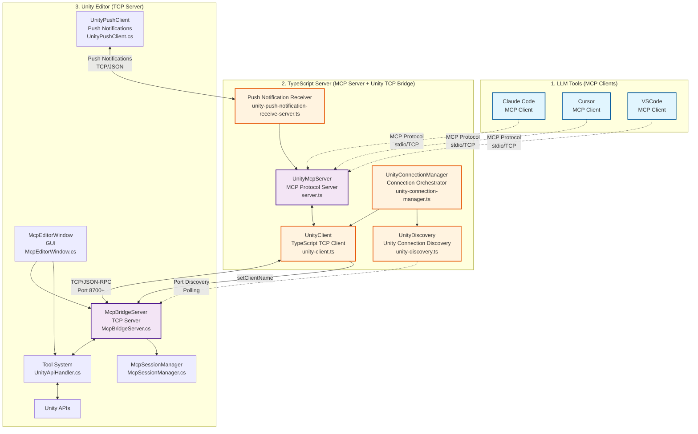

# uLoopMCP Architecture Overview

A comprehensive system that bridges Unity Editor with MCP (Model Context Protocol) compatible LLM tools.

## Documentation Structure

- **[Unity-Side Architecture Details](ARCHITECTURE_UNITY.md)** - Unity Editor side (C#) implementation details
- **[TypeScript-Side Architecture Details](ARCHITECTURE_TYPESCRIPT.md)** - TypeScript server side implementation details

## System Overview

## Communication Protocol Overview

| Component | Role | Protocol | Port | Connection Type |
|-----------|------|----------|------|-----------------|
| **LLM Tools** (Claude, Cursor, VSCode) | **Client** | MCP Protocol | stdio/various | MCP request sending |
| **TypeScript Server** | **Server** (for MCP) **Client** (for Unity) | MCP ↔ TCP/JSON-RPC | stdio ↔ UNITY_TCP_PORT | Protocol bridging |
| **Push Notification Server** (TypeScript) | **Server** (for Push notifications) | TCP/JSON | Random port | Unity notification receiving |
| **Unity Editor** | **Server** | TCP/JSON-RPC | UNITY_TCP_PORT | TCP connection acceptance |
| **UnityPushClient** (Unity) | **Client** (for Push notifications) | TCP/JSON | Push server port | Event notification sending |

## Protocol Layer Details

### Layer 1: LLM Tools ↔ TypeScript Server (MCP Protocol)
- **Protocol**: Model Context Protocol (MCP)
- **Transport**: stdio or TCP
- **Data Format**: JSON-RPC 2.0 with MCP extensions
- **Connection**: LLM tools operate as MCP clients

### Layer 2: TypeScript Server ↔ Unity Editor (TCP Protocol)
- **Protocol**: Custom TCP using JSON-RPC 2.0
- **Transport**: TCP socket
- **Port**: Port specified by UNITY_TCP_PORT environment variable (auto-discovery)
- **Connection**: TypeScript server operates as TCP client

### Layer 3: Unity Editor ↔ Push Notification Server (Push Notifications)
- **Protocol**: Custom JSON (Push notification specific)
- **Transport**: TCP socket
- **Port**: Push notification server listens on random port
- **Connection**: UnityPushClient operates as TCP client
- **Notification Types**: Domain reload, tool changes, connection establishment, disconnection

## Unity Disconnection Patterns and Push Notifications

1. **`DOMAIN_RELOAD`** - Auto-recoverable
   - **Reason**: Unity Domain Reload (compilation, assembly reload)
   - **Advance Notice**: Yes (`AssemblyReloadEvents.beforeAssemblyReload`)
   - **Recovery**: Automatic recovery → `DOMAIN_RELOAD_RECOVERED` notification

2. **`USER_DISCONNECT`** - Manual intervention required
   - **Reason**: Intentional user disconnection (manual disconnect, project change, etc.)
   - **Advance Notice**: None (sudden disconnection)
   - **Recovery**: Manual reconnection required

3. **`UNITY_SHUTDOWN`** - Unity restart required
   - **Reason**: Complete Unity Editor shutdown
   - **Advance Notice**: Yes (`EditorApplication.quitting`)
   - **Recovery**: Unity Editor restart required

## Core Features

### Implemented Tools (13 Types)

#### Core System Tools
- `ping`: Connection health check
- `compile`: Project compilation
- `clear-console`: Unity Console log clearing
- `set-client-name`: Client identification
- `get-tool-details`: Tool metadata retrieval

#### Information Retrieval Tools
- `get-logs`: Console log retrieval
- `get-hierarchy`: Scene hierarchy export
- `get-menu-items`: Unity menu item discovery
- `get-provider-details`: Unity Search provider information

#### GameObject and Scene Tools
- `find-game-objects`: Advanced GameObject search
- `unity-search`: Unified search

#### Execution Tools (Security-Controlled)
- `run-tests`: Test execution
- `execute-menu-item`: MenuItem execution

### Security Features
- **localhost restriction**: Blocks external connections
- **Tool-level security**: McpSecurityChecker validates each tool
- **Configurable access control**: Unity Editor security settings
- **Default deny policy**: Unknown tools blocked by default

## Design Principles

### Unity Side (C#)
- **Tool Pattern**: Unified design through `IUnityTool` interface
- **Schema-driven communication**: Type-safe communication via `*Schema.cs`
- **Domain reload resilience**: State persistence through `ScriptableSingleton`
- **MVP + Helper Architecture**: UI responsibility separation

### TypeScript Side
- **Dynamic tool management**: Dynamic MCP adaptation based on Unity-retrieved tool information
- **Resilient connection management**: Auto-reconnection and Unity discovery capabilities
- **Client compatibility**: Support for different MCP clients
- **VibeLogger**: Structured logging system for AI analysis

## Related Documentation

For detailed implementation information, please refer to each architecture document:

- **[Unity-Side Architecture Details](ARCHITECTURE_UNITY.md)** - C# implementation, Tool Pattern, Security Architecture
- **[TypeScript-Side Architecture Details](ARCHITECTURE_TYPESCRIPT.md)** - Node.js implementation, MCP support, Dynamic Tool Management