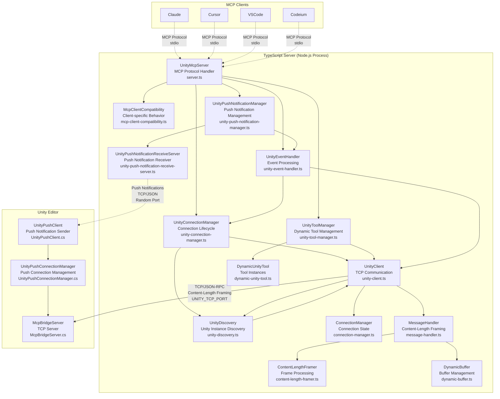
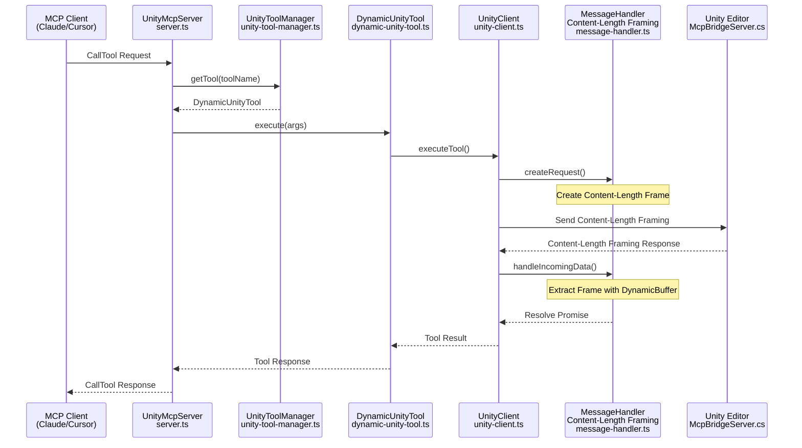

# uLoopMCP TypeScript Server Architecture

> Related Documentation: [Unity-Side Architecture](ARCHITECTURE_UNITY.md) | [Integrated Architecture Overview](ARCHITECTURE.md)

## Overview

The TypeScript server located in `Packages/src/TypeScriptServer~` acts as an intermediary between MCP-compatible clients (Cursor, Claude, VSCode, etc.) and Unity Editor. It runs as a Node.js process, communicating with clients via stdio using the Model Context Protocol (MCP), and relaying tool requests to Unity Editor through TCP socket connections.

### Primary Responsibilities
1. **MCP Server Implementation**: Implements MCP server specification using `@modelcontextprotocol/sdk`, handling client requests (`tools/list`, `tools/call`, etc.)
2. **Dynamic Tool Management**: Fetches available tools from Unity Editor and dynamically creates corresponding "tools" to expose to MCP clients
3. **Unity Communication**: Manages persistent TCP connections to `McpBridgeServer` running within Unity Editor
4. **Tool Forwarding**: Converts `tools/call` requests from MCP clients to JSON-RPC requests and sends them to Unity server for execution
5. **Notification Handling**: Listens for `notifications/tools/list_changed` events from Unity and automatically updates the toolset when tools are added/removed in Unity projects

## TypeScript Server Architecture Diagram

### TypeScript System Overview

### TypeScript Tool Execution Sequence

## Core Architectural Principles

### Dynamic and Extensible Tooling
The server's core strength is its ability to dynamically adapt to tools available in Unity:

- **`UnityToolManager`**: Handles all dynamic tool management through dedicated methods:
  - `initializeDynamicTools()`: Orchestrates tool initialization process
  - `fetchToolDetailsFromUnity()`: Retrieves tool metadata from Unity
  - `createDynamicToolsFromDetails()`: Creates tool instances from metadata
  - `refreshDynamicToolsSafe()`: Safely updates tools with deduplication
- **`McpClientCompatibility`**: Manages client-specific requirements:
  - `handleClientNameInitialization()`: Manages client name synchronization
  - `isListChangedUnsupported()`: Detects clients that don't support list_changed notifications
- **`DynamicUnityTool`**: A generic "tool" factory that takes schema information (name, description, parameters) received from Unity and constructs MCP-compliant tools on-the-fly

### Resilience and Robustness
The server is designed to be resilient against disconnections and process lifecycle events:

- **Connection Management**: `UnityConnectionManager` orchestrates connection lifecycle through `UnityDiscovery` (singleton pattern prevents multiple timers)
- **Graceful Shutdown**: `UnityEventHandler` handles all signal processing (`SIGINT`, `SIGTERM`, `SIGHUP`) and monitors `stdin` to ensure graceful shutdown
- **Client Compatibility**: `McpClientCompatibility` manages different client behaviors and ensures proper initialization for clients that don't support list_changed notifications (Claude Code, Gemini, Windsurf, Codeium)
- **Safe Timers**: `safe-timer.ts` utility provides `setTimeout` and `setInterval` wrappers that automatically clear on process exit
- **Delayed Unity Connection**: Server waits for MCP client to provide name before connecting to Unity, preventing "Unknown Client" display in Unity UI

### VibeLogger (Structured Logging for AI Analysis)
Since the server uses `stdio` for JSON-RPC communication, `console.log` cannot be used for debugging:
- **`vibe-logger.ts`**: Provides structured logging functionality optimized for AI analysis like Claude Code. When `MCP_DEBUG` environment variable is set, structured logs with operation/context/correlation_id are output to `{project_root}/uLoopMCPOutputs/VibeLogs/`
- **AI Analysis Ready**: Format designed for AI understanding with operation, context, correlation_id, human_note, ai_todo fields
- **Automatic File Management**: Safe writing with file rotation, memory management, and concurrent access handling

## Key Components (File Details)

### `src/server.ts`
Main application entry point, simplified through Martin Fowler's Extract Class refactoring:
- **`UnityMcpServer` class**:
    - Initializes `@modelcontextprotocol/sdk` `Server`
    - Instantiates and orchestrates specialized manager classes
    - Handles `InitializeRequestSchema`, `ListToolsRequestSchema`, `CallToolRequestSchema`
    - Delegates initialization to appropriate managers based on client compatibility

### `src/unity-connection-manager.ts`
Manages Unity connection lifecycle with focus on discovery and reconnection:
- **`UnityConnectionManager` class**:
    - Orchestrates Unity connection establishment through `UnityDiscovery`
    - Provides `waitForUnityConnectionWithTimeout()` for synchronous initialization
    - Handles connection callbacks and manages reconnection scenarios
    - Integrates with singleton `UnityDiscovery` service to prevent timer conflicts

### `src/unity-tool-manager.ts`
Handles all aspects of dynamic tool management and lifecycle:
- **`UnityToolManager` class**:
    - `initializeDynamicTools()`: Fetches Unity tools and creates corresponding tools
    - `refreshDynamicToolsSafe()`: Safely updates tools with deduplication
    - `fetchToolDetailsFromUnity()`: Retrieves tool metadata from Unity
    - `createDynamicToolsFromDetails()`: Creates tool instances from Unity schemas
    - Manages `dynamicTools` Map and provides tool access methods

### `src/mcp-client-compatibility.ts`
Manages client-specific compatibility and behavioral differences:
- **`McpClientCompatibility` class**:
    - `isListChangedUnsupported()`: Detects clients that don't support list_changed notifications
    - `handleClientNameInitialization()`: Manages client name setup and environment variable fallback
    - `initializeClient()`: Orchestrates client-specific initialization procedures
    - Handles compatibility for Claude Code, Gemini, Windsurf, Codeium clients

### `src/unity-event-handler.ts`
Manages event processing, notifications, and graceful shutdown:
- **`UnityEventHandler` class**:
    - `setupUnityEventListener()`: Sets up Unity notification listeners
    - `sendToolsChangedNotification()`: Sends MCP list_changed notifications with deduplication
    - `setupSignalHandlers()`: Sets up process signal handlers for graceful shutdown
    - `gracefulShutdown()`: Handles cleanup and process termination

### `src/unity-client.ts`
Encapsulates all communication with Unity Editor:
- **`UnityClient` class**:
    - Manages `net.Socket` for TCP communication
    - Provides `connect()` for connection establishment, `ensureConnected()` for resilient connection management
    - `executeTool()` sends JSON-RPC requests to Unity and waits for responses
    - Processes incoming data and distinguishes between responses and asynchronous notifications

### `src/unity-discovery.ts`
Singleton service for Unity instance discovery:
- **`UnityDiscovery` class**:
    - Implements singleton pattern to prevent multiple discovery timers
    - Provides 1-second interval polling for Unity Editor instances
    - Checks ports specified by UNITY_TCP_PORT environment variable
    - Handles connection callbacks and disconnection events

### `src/tools/dynamic-unity-tool.ts`
Factory for tools based on Unity tools:
- **`DynamicUnityTool` class**:
    - Converts C# schema definitions to JSON Schema format with `generateInputSchema()`
    - Forwards tool calls to Unity via `UnityClient` in `execute()` method
    - Inherits from `BaseTool` abstract class for consistent tool interface

### `src/utils/`
Contains helper utilities:
- **`vibe-logger.ts`**: Structured logging system for AI (`logInfo`, `logError`, `logWarning`, etc.)
- **`safe-timer.ts`**: `SafeTimer` class and `safeSetTimeout`/`safeSetInterval` functions for robust timer management

### `src/constants.ts`
Central file for all shared constants:
- MCP protocol constants
- Environment variables
- Default messages and timeout values
- Port ranges and discovery settings

## Development and Testing Infrastructure

### Build System
- **esbuild**: Fast JavaScript bundler for production builds
- **TypeScript**: Type-safe JavaScript development
- **Node.js**: Runtime environment for server execution

### Testing Framework
- **Jest**: JavaScript testing framework
- **Unit Tests**: Individual component testing
- **Integration Tests**: Component interaction testing

### Code Quality
- **ESLint**: JavaScript/TypeScript linting
- **Prettier**: Code formatting
- **Type Checking**: Strict TypeScript compilation

### Debugging and Monitoring
- **VibeLogger Structured Logging**: AI analysis-ready logs to `{project_root}/uLoopMCPOutputs/VibeLogs/`
- **Debug Environment Variables**: `MCP_DEBUG` for verbose logging
- **Push Notification Monitoring**: Event notification tracking between Unity ↔ TypeScript
- **Process Monitoring**: Signal handling and graceful shutdown
- **Connection Health**: Auto-reconnection and discovery (both Unity TCP + Push notification channels)