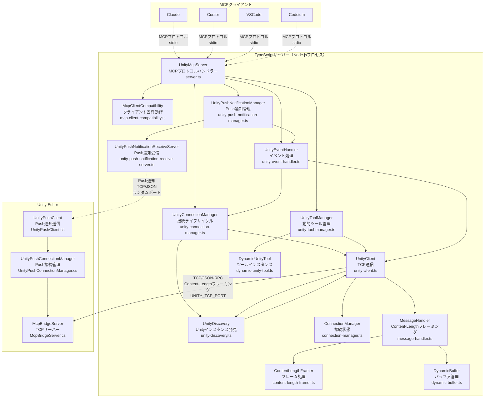
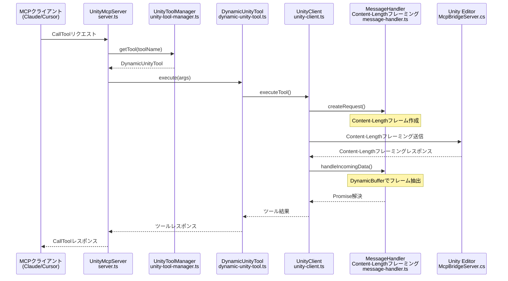

# uLoopMCP TypeScriptサーバーアーキテクチャ

> 関連ドキュメント：[Unity側アーキテクチャ](ARCHITECTURE_UNITY_ja.md) | [統合アーキテクチャ概要](ARCHITECTURE_ja.md)

## 概要

`Packages/src/TypeScriptServer~` に配置されるTypeScriptサーバーは、MCP対応クライアント（Cursor、Claude、VSCodeなど）とUnity Editorの仲介役として動作します。Node.jsプロセスとして実行され、Model Context Protocol (MCP)を使用してstdio経由でクライアントと通信し、TCPソケット接続を通じてUnity Editorにツールリクエストをリレーします。

### 主要責務
1. **MCPサーバー実装**: `@modelcontextprotocol/sdk`を使用してMCPサーバー仕様を実装し、クライアントからのリクエスト（`tools/list`、`tools/call`など）を処理
2. **動的ツール管理**: Unity Editorから利用可能なツールを取得し、MCPクライアントに公開する対応する「ツール」を動的に作成
3. **Unity通信**: Unity Editor内で動作する`McpBridgeServer`への永続的TCP接続を管理
4. **ツール転送**: MCPクライアントからの`tools/call`リクエストをJSON-RPCリクエストに変換し、実行のためUnityサーバーに送信
5. **通知処理**: Unityからの`notifications/tools/list_changed`イベントをリッスンし、Unityプロジェクトでツールが追加・削除された際に自動的にツールセットを更新

## TypeScriptサーバーアーキテクチャ図

### TypeScriptシステム概要

### TypeScriptツール実行シーケンス

## 核心アーキテクチャ原則

### 動的で拡張可能なツーリング
サーバーの核心的な強みは、Unityで利用可能なツールに動的に適応する能力です：

- **`UnityToolManager`**: 専用メソッドを通じて全ての動的ツール管理を処理：
  - `initializeDynamicTools()`: ツール初期化プロセスをオーケストレート
  - `fetchToolDetailsFromUnity()`: Unityからツールメタデータを取得
  - `createDynamicToolsFromDetails()`: メタデータからツールインスタンスを作成
  - `refreshDynamicToolsSafe()`: 重複防止機能付きでツールを安全に更新
- **`McpClientCompatibility`**: クライアント固有の要件を管理：
  - `handleClientNameInitialization()`: クライアント名同期を管理
  - `isListChangedUnsupported()`: list_changed通知をサポートしないクライアントを検出
- **`DynamicUnityTool`**: Unityから受信したスキーマ情報（名前、説明、パラメータ）を取得し、MCP準拠のツールをその場で構築する汎用「ツール」ファクトリ

### 回復力とロバストネス
サーバーは接続断とプロセスライフサイクルイベントに対して回復力を持つよう設計されています：

- **接続管理**: `UnityConnectionManager`が`UnityDiscovery`を通じて接続ライフサイクルをオーケストレート（シングルトンパターンで複数タイマーを防止）
- **グレースフルシャットダウン**: `UnityEventHandler`が全シグナル処理（`SIGINT`、`SIGTERM`、`SIGHUP`）を処理し、`stdin`を監視してグレースフルシャットダウンを保証
- **クライアント互換性**: `McpClientCompatibility`が異なるクライアント動作を管理し、list_changed通知をサポートしないクライアント（Claude Code、Gemini、Windsurf、Codeium）の適切な初期化を保証
- **セーフタイマー**: `safe-timer.ts`ユーティリティがプロセス終了時に自動的にクリアされる`setTimeout`と`setInterval`ラッパーを提供
- **遅延Unity接続**: サーバーはMCPクライアントが名前を提供するまでUnityへの接続を待機し、Unity UIに「Unknown Client」が表示されることを防止

### VibeLogger（AI解析用構造化ログ）
サーバーはJSON-RPC通信に`stdio`を使用するため、`console.log`をデバッグに使用することはできません：
- **`vibe-logger.ts`**: Claude Code等のAI解析に最適化された構造化ログ機能を提供。`MCP_DEBUG`環境変数が設定されると、操作・コンテキスト・correlation_id付きの構造化ログが`{project_root}/uLoopMCPOutputs/VibeLogs/`に出力されます
- **AI解析対応**: operation、context、correlation_id、human_note、ai_todoフィールドでAIが理解しやすい形式
- **自動ファイル管理**: ファイルローテーション、メモリ管理、並行アクセス対応の安全な書き込み機能

## 主要コンポーネント（ファイル詳細）

### `src/server.ts`
Martin FowlerのExtract Classリファクタリングで簡素化されたアプリケーションのメインエントリーポイント：
- **`UnityMcpServer`クラス**:
    - `@modelcontextprotocol/sdk` `Server`を初期化
    - 専門的なマネージャークラスをインスタンス化・オーケストレート
    - `InitializeRequestSchema`、`ListToolsRequestSchema`、`CallToolRequestSchema`を処理
    - クライアント互換性に基づいて適切なマネージャーに初期化を委任

### `src/unity-connection-manager.ts`
発見と再接続に焦点を当てたUnity接続ライフサイクルを管理：
- **`UnityConnectionManager`クラス**:
    - `UnityDiscovery`を通じてUnity接続確立をオーケストレート
    - 同期初期化のための`waitForUnityConnectionWithTimeout()`を提供
    - 接続コールバックを処理し、再接続シナリオを管理
    - タイマー競合を防ぐシングルトン`UnityDiscovery`サービスと統合

### `src/unity-tool-manager.ts`
動的ツール管理とライフサイクルの全側面を処理：
- **`UnityToolManager`クラス**:
    - `initializeDynamicTools()`: Unityツールを取得し対応するツールを作成
    - `refreshDynamicToolsSafe()`: 重複防止機能付きでツールを安全に更新
    - `fetchToolDetailsFromUnity()`: Unityからツールメタデータを取得
    - `createDynamicToolsFromDetails()`: Unityスキーマからツールインスタンスを作成
    - `dynamicTools` Mapを管理し、ツールアクセスメソッドを提供

### `src/mcp-client-compatibility.ts`
クライアント固有の互換性と動作の違いを管理：
- **`McpClientCompatibility`クラス**:
    - `isListChangedUnsupported()`: list_changed通知をサポートしないクライアントを検出
    - `handleClientNameInitialization()`: クライアント名設定と環境変数フォールバックを管理
    - `initializeClient()`: クライアント固有の初期化手順をオーケストレート
    - Claude Code、Gemini、Windsurf、Codeiumクライアントの互換性を処理

### `src/unity-event-handler.ts`
イベント処理、通知、グレースフルシャットダウンを管理：
- **`UnityEventHandler`クラス**:
    - `setupUnityEventListener()`: Unity通知リスナーを設定
    - `sendToolsChangedNotification()`: 重複防止機能付きでMCP list_changed通知を送信
    - `setupSignalHandlers()`: グレースフルシャットダウンのためのプロセスシグナルハンドラーを設定
    - `gracefulShutdown()`: クリーンアップとプロセス終了を処理

### `src/unity-client.ts`
Unity Editorとの全通信をカプセル化：
- **`UnityClient`クラス**:
    - TCP通信のための`net.Socket`を管理
    - `connect()`で接続確立、`ensureConnected()`で回復力のある接続管理を提供
    - `executeTool()`でUnityにJSON-RPCリクエストを送信し、レスポンスを待機
    - 受信データを処理し、レスポンスと非同期通知を区別

### `src/unity-discovery.ts`
Unityインスタンス発見のためのシングルトンサービス：
- **`UnityDiscovery`クラス**:
    - 複数の発見タイマーを防ぐシングルトンパターンを実装
    - Unity Editorインスタンスの1秒間隔ポーリングを提供
    - UNITY_TCP_PORT環境変数で指定されたポートを確認
    - 接続コールバックと接続断イベントを処理

### `src/tools/dynamic-unity-tool.ts`
Unityツールに基づくツールのファクトリ：
- **`DynamicUnityTool`クラス**:
    - `generateInputSchema()`でC#スキーマ定義をJSONスキーマ形式に変換
    - `execute()`メソッドで`UnityClient`経由でツール呼び出しをUnityに転送
    - 一貫したツールインターフェースのため`BaseTool`抽象クラスを継承

### `src/utils/`
ヘルパーユーティリティを含む：
- **`vibe-logger.ts`**: AI向け構造化ログシステム（`logInfo`、`logError`、`logWarning`など）
- **`safe-timer.ts`**: 堅牢なタイマー管理のための`SafeTimer`クラスと`safeSetTimeout`/`safeSetInterval`関数

### `src/constants.ts`
全ての共有定数の中央ファイル：
- MCPプロトコル定数
- 環境変数
- デフォルトメッセージとタイムアウト値
- ポート範囲と発見設定

## 開発・テストインフラストラクチャ

### ビルドシステム
- **esbuild**: プロダクションビルド用高速JavaScriptバンドラー
- **TypeScript**: 型安全JavaScript開発
- **Node.js**: サーバー実行のランタイム環境

### テストフレームワーク
- **Jest**: JavaScriptテストフレームワーク
- **ユニットテスト**: 個別コンポーネントテスト
- **統合テスト**: コンポーネント間相互作用テスト

### コード品質
- **ESLint**: JavaScript/TypeScriptリント
- **Prettier**: コード整形
- **型チェック**: 厳密なTypeScriptコンパイル

### デバッグ・監視
- **VibeLogger構造化ログ**: `{project_root}/uLoopMCPOutputs/VibeLogs/`へのAI解析対応ログ
- **デバッグ環境変数**: 詳細ログのための`MCP_DEBUG`
- **Push通知監視**: Unity ↔ TypeScript間のイベント通知追跡
- **プロセス監視**: シグナルハンドリングとグレースフルシャットダウン
- **接続ヘルス**: 自動再接続と発見（Unity TCP + Push通知の両チャネル）