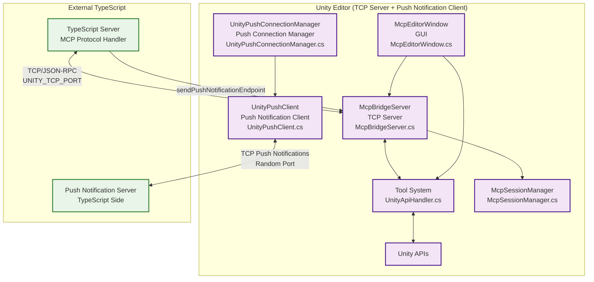
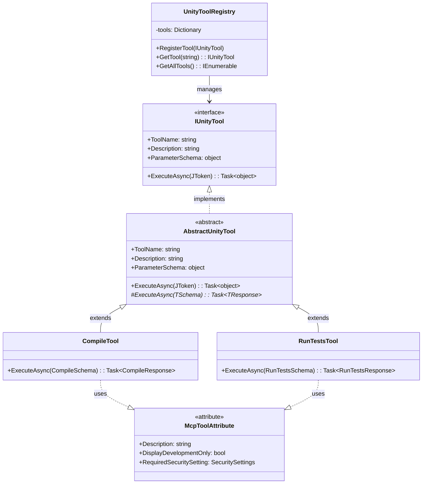
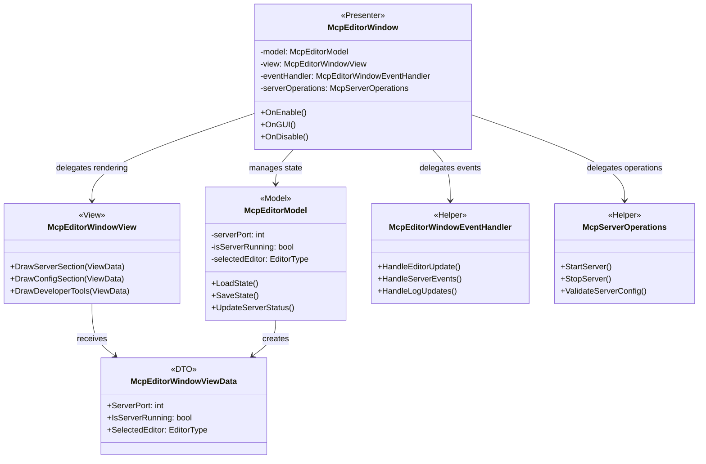

# uLoopMCP Unity Editor-Side Architecture

> Related Documentation: [TypeScript-Side Architecture](ARCHITECTURE_TYPESCRIPT.md) | [Integrated Architecture Overview](ARCHITECTURE.md)

## 1. Overview

This document details the architecture of the C# code within the `Packages/src/Editor` directory. This code runs inside the Unity Editor and serves as the bridge between the Unity environment and the external TypeScript-based MCP (Model-Context-Protocol) server.

### Unity Editor System Architecture Overview

### Primary Responsibilities
1. **Running a TCP Server (`McpBridgeServer`)**: Listens for connections from the TypeScript server to receive tool requests.
2. **Executing Unity Operations**: Processes received tool requests to perform actions within the Unity Editor, such as compiling the project, running tests, or retrieving logs.
3. **Security Management**: Validates and controls tool execution through `McpSecurityChecker` to prevent unauthorized operations.
4. **Session Management**: Maintains client sessions and connection state through `McpSessionManager`.
5. **Providing a User Interface (`McpEditorWindow`)**: Offers a GUI within the Unity Editor for developers to manage and monitor the MCP server.
6. **Managing Configuration**: Handles the setup of `mcp.json` files required by LLM tools like Cursor, Claude, and VSCode.

## 2. Core Architectural Principles

The architecture is built upon several key design principles to ensure robustness, extensibility, and maintainability.

### 2.1. Tool Pattern
The system is centered around the **Tool Pattern**. Each action that can be triggered by an LLM tool is encapsulated in its own tool class.

- **`IUnityTool`**: The common interface for all tools.
- **`AbstractUnityTool<TSchema, TResponse>`**: A generic abstract base class that provides type-safe handling of parameters and responses.
- **`McpToolAttribute`**: Attribute used to mark tools for automatic registration, including Description configuration.
- **`UnityToolRegistry`**: A central registry that discovers and holds all available tools.
- **`UnityApiHandler`**: These classes receive a tool name and parameters, look up the tool in the registry, and execute it.
- **`McpSecurityChecker`**: Validates tool execution permissions based on security settings.

This pattern makes the system highly extensible. To add a new feature, a developer simply needs to create a new class that implements `IUnityTool` and decorate it with the `[McpTool(Description = "...")]` attribute. The system will automatically discover and expose it.

### 2.2. Security Architecture
The system implements comprehensive security controls to prevent unauthorized tool execution:

- **`McpSecurityChecker`**: Central security validation component that checks tool permissions before execution.
- **Attribute-Based Security**: Tools can be decorated with security attributes to define their execution requirements.
- **Default Deny Policy**: Unknown tools are blocked by default to prevent unauthorized operations.
- **Settings-Based Control**: Security policies can be configured through Unity Editor settings interface.

### 2.3. Session Management
The system maintains robust session management to handle client connections and state:

- **`McpSessionManager`**: Singleton session manager implemented as `ScriptableSingleton` for domain reload persistence.
- **Client State Tracking**: Maintains connection state, client identification, and session metadata.
- **Domain Reload Resilience**: Session state survives Unity domain reloads through persistent storage.
- **Reconnection Support**: Handles client reconnection scenarios gracefully.

### 2.4. Tool System Architecture

### 2.5. MVP + Helper Architecture for UI

### 2.6. Schema-Driven and Type-Safe Communication
To avoid manual and error-prone JSON parsing, the system uses a schema-driven approach for tools.

- **`*Schema.cs` files** (e.g., `CompileSchema.cs`, `GetLogsSchema.cs`): These classes define the expected parameters for a tool using simple C# properties. Attributes like `[Description]` and default values are used to automatically generate a JSON Schema for the client.
- **`*Response.cs` files** (e.g., `CompileResponse.cs`): These define the structure of the data returned to the client.
- **`ToolParameterSchemaGenerator.cs`**: This utility uses reflection on the `*Schema.cs` files to generate the parameter schema dynamically, ensuring the C# code is the single source of truth.

This design eliminates inconsistencies between the server and client and provides strong type safety within the C# code.

### 2.7. Resilience to Domain Reloads
A significant challenge in the Unity Editor is the "domain reload," which resets the application's state. The architecture handles this gracefully:
- **`McpServerController`**: Uses `[InitializeOnLoad]` to hook into Editor lifecycle events.
- **`AssemblyReloadEvents`**: Before a reload, `OnBeforeAssemblyReload` is used to save the server's running state (port, status) into `SessionState`.
- **`SessionState`**: A Unity Editor feature that persists simple data across domain reloads.
- After a reload, `OnAfterAssemblyReload` reads the `SessionState` and automatically restarts the server if it was previously running, ensuring a seamless experience for the connected client.

## 3. Implemented Tools

The system currently implements 13 production-ready tools, each following the established Tool Pattern architecture:

### 3.1. Core System Tools
- **`ping`**: Connection health check and latency testing
- **`compile`**: Project compilation with detailed error reporting
- **`clear-console`**: Unity Console log clearing with confirmation
- **`set-client-name`**: Client identification and session management
- **`get-tool-details`**: Tool introspection and metadata retrieval

### 3.2. Information Retrieval Tools
- **`get-logs`**: Console log retrieval with filtering and type selection
- **`get-hierarchy`**: Scene hierarchy export with component information
- **`get-menu-items`**: Unity menu item discovery and metadata
- **`get-provider-details`**: Unity Search provider information

### 3.3. GameObject and Scene Tools
- **`find-game-objects`**: Advanced GameObject search with multiple criteria
- **`unity-search`**: Unified search across assets, scenes, and project resources

### 3.4. Execution Tools
- **`run-tests`**: Test execution with NUnit XML export (security-controlled)
- **`execute-menu-item`**: MenuItem execution via reflection (security-controlled)

### 3.5. Security-Controlled Tools
Several tools are subject to security restrictions and can be disabled via settings:
- **Test Execution**: `run-tests` requires "Enable Tests Execution" setting
- **Menu Item Execution**: `execute-menu-item` requires "Allow Menu Item Execution" setting
- **Unknown Tools**: Blocked by default unless explicitly configured

## 4. Key Components (Directory Breakdown)

### `/Server`
This directory contains the core networking and lifecycle management components.

### `/Security`
Contains the security infrastructure for tool execution control.

### `/Api`
This is the heart of the tool processing logic.

### `/Core`
Contains core infrastructure components for session and state management.

### `/UI`
Contains the code for the user-facing Editor Window, implemented using the **MVP (Model-View-Presenter) + Helper Pattern**.

### `/Config`
Manages the creation and modification of `mcp.json` configuration files.

### `/Tools`
Contains higher-level utilities that wrap core Unity Editor functionality.

### `/Utils`
Contains low-level, general-purpose helper classes.

For detailed directory structure and component descriptions, please refer to the [Integrated Architecture Overview](../Packages/src/ARCHITECTURE.md).