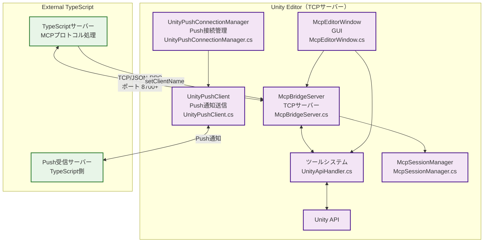
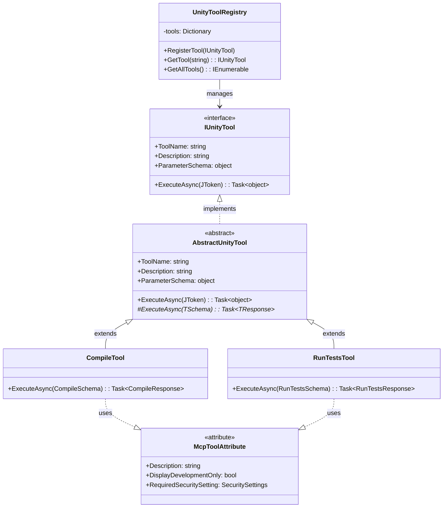
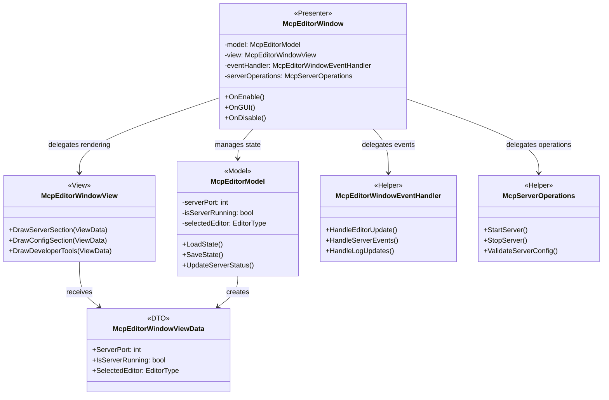

# uLoopMCP Unity Editor側アーキテクチャ

> 関連ドキュメント：[TypeScript側アーキテクチャ](ARCHITECTURE_TYPESCRIPT_ja.md) | [統合アーキテクチャ概要](ARCHITECTURE_ja.md)

## 1. 概要

このドキュメントは、`Packages/src/Editor` ディレクトリ内のC#コードのアーキテクチャについて詳細に説明します。このコードはUnity Editor内で動作し、Unity環境と外部TypeScriptベースのMCP（Model-Context-Protocol）サーバーとの橋渡しの役割を果たします。

### Unity Editor システムアーキテクチャ概要

### 主な責務
1. **TCPサーバー（`McpBridgeServer`）の実行**: TypeScriptサーバーからの接続を待ち受け、ツールリクエストを受信
2. **Unity操作の実行**: 受信したツールリクエストを処理し、プロジェクトのコンパイル、テスト実行、ログ取得などのUnity Editor内での操作を実行
3. **セキュリティ管理**: `McpSecurityChecker`を通じてツール実行の検証・制御を行い、不正操作を防止
4. **セッション管理**: `McpSessionManager`を通じてクライアントセッションと接続状態を維持
5. **ユーザーインターフェース（`McpEditorWindow`）の提供**: Unity Editor内でMCPサーバーの管理・監視を行うGUIを提供
6. **設定管理**: Cursor、Claude、VSCodeなどのLLMツールで必要な`mcp.json`ファイルの設定を処理

## 2. 核となるアーキテクチャ原則

アーキテクチャは堅牢性、拡張性、保守性を確保するため、いくつかの重要な設計原則に基づいて構築されています。

### 2.1. ツールパターン

システムは**ツールパターン**を中心に構築されています。LLMツールがトリガーできる各アクションは、独自のツールクラスにカプセル化されています。

- **`IUnityTool`**: 全てのツールに共通のインターフェース
- **`AbstractUnityTool<TSchema, TResponse>`**: パラメータとレスポンスの型安全な処理を提供する汎用抽象基底クラス
- **`McpToolAttribute`**: Description設定を含む、ツールの自動登録用属性
- **`UnityToolRegistry`**: 利用可能な全てのツールを発見・保持する中央レジストリ
- **`UnityApiHandler`**: ツール名とパラメータを受け取り、レジストリでツールを検索・実行するクラス
- **`McpSecurityChecker`**: セキュリティ設定に基づいてツール実行許可を検証

このパターンにより、システムは非常に拡張しやすくなっています。新機能を追加するには、`IUnityTool`を実装し、`[McpTool(Description = "...")]`属性を付けた新しいクラスを作成するだけです。システムが自動的に発見・公開します。

### 2.2. セキュリティアーキテクチャ

システムは不正なツール実行を防ぐため、包括的なセキュリティ制御を実装しています：

- **`McpSecurityChecker`**: 実行前にツール権限をチェックする中央セキュリティ検証コンポーネント
- **属性ベースセキュリティ**: ツールにセキュリティ属性を付けて実行要件を定義可能
- **デフォルト拒否ポリシー**: 不正操作を防ぐため、未知のツールはデフォルトでブロック
- **設定ベース制御**: Unity Editorの設定インターフェースでセキュリティポリシーを設定可能

### 2.3. セッション管理

システムはクライアント接続と状態を処理するため、堅牢なセッション管理を維持しています：

- **`McpSessionManager`**: ドメインリロード永続化のため`ScriptableSingleton`として実装されたシングルトンセッションマネージャー
- **クライアント状態追跡**: 接続状態、クライアント識別、セッションメタデータを維持
- **ドメインリロード耐性**: 永続的ストレージを通じてUnityドメインリロードを乗り切るセッション状態
- **再接続サポート**: クライアント再接続シナリオを適切に処理

### 2.4. ツールシステムアーキテクチャ

### 2.5. UI用MVP + ヘルパーアーキテクチャ

### 2.6. スキーマ駆動型・型安全通信

手動で行うエラーが発生しやすいJSON解析を避けるため、システムではツールにスキーマ駆動型アプローチを使用しています。

- **`*Schema.cs`ファイル**（例：`CompileSchema.cs`、`GetLogsSchema.cs`）: これらのクラスはシンプルなC#プロパティを使用してツールの期待パラメータを定義します。`[Description]`属性とデフォルト値を使用してクライアント向けJSON Schemaを自動生成します。
- **`*Response.cs`ファイル**（例：`CompileResponse.cs`）: クライアントに返すデータの構造を定義します。
- **`ToolParameterSchemaGenerator.cs`**: このユーティリティは`*Schema.cs`ファイルにリフレクションを使用してパラメータスキーマを動的に生成し、C#コードを唯一の信頼できるソースとして確実に保ちます。

この設計により、サーバーとクライアント間の不一致を排除し、C#コード内で強力な型安全性を提供します。

### 2.7. ドメインリロード耐性

Unity Editorの重要な課題は、アプリケーションの状態をリセットする「ドメインリロード」です。アーキテクチャはこれを適切に処理します：

- **`McpServerController`**: `[InitializeOnLoad]`を使用してEditorライフサイクルイベントにフック
- **`AssemblyReloadEvents`**: リロード前に、`OnBeforeAssemblyReload`を使用してサーバーの実行状態（ポート、ステータス）を`SessionState`に保存
- **`SessionState`**: ドメインリロードを越えてシンプルなデータを永続化するUnity Editor機能
- リロード後、`OnAfterAssemblyReload`が`SessionState`を読み取り、以前に実行されていた場合は自動的にサーバーを再起動し、接続されたクライアントに対してシームレスな体験を確保

## 3. 実装済みツール

システムは現在、確立されたMCPツールアーキテクチャに従って13の本番対応ツールを実装しています：

### 3.1. コアシステムツール

- **`ping`**: 接続ヘルスチェックとレイテンシテスト
- **`compile`**: 詳細エラーレポート付きプロジェクトコンパイル
- **`clear-console`**: 確認付きUnity Consoleログクリア
- **`set-client-name`**: クライアント識別とセッション管理
- **`get-tool-details`**: ツールのイントロスペクションとメタデータ取得

### 3.2. 情報取得ツール

- **`get-logs`**: フィルタリングとタイプ選択付きコンソールログ取得
- **`get-hierarchy`**: コンポーネント情報付きシーン階層エクスポート
- **`get-menu-items`**: Unity メニューアイテム発見とメタデータ
- **`get-provider-details`**: Unity Search プロバイダー情報

### 3.3. GameObjectとシーンツール

- **`find-game-objects`**: 複数条件による高度なGameObject検索
- **`unity-search`**: アセット、シーン、プロジェクトリソース間の統合検索

### 3.4. 実行ツール

- **`run-tests`**: NUnit XMLエクスポート付きテスト実行（セキュリティ制御）
- **`execute-menu-item`**: リフレクションによるMenuItem実行（セキュリティ制御）

### 3.5. セキュリティ制御ツール

いくつかのツールはセキュリティ制限の対象で、設定で無効化可能です：

- **テスト実行**: `run-tests`には「テスト実行を有効化」設定が必要
- **メニューアイテム実行**: `execute-menu-item`には「メニューアイテム実行を許可」設定が必要
- **未知のツール**: 明示的に設定されない限りデフォルトでブロック

## 主要コンポーネント（ディレクトリ構成）

### `/Server`

このディレクトリはコアネットワーキングとライフサイクル管理コンポーネントを含みます。

### `/Tools`

コアUnity Editor機能をラップする高レベルユーティリティを含有。

### `/Config`

Unity Editor設定とMCP設定管理を含有。

### `/UI`

Unity Editor内のユーザーインターフェースコンポーネントを含有。

詳細なディレクトリ構成とコンポーネントについては、[統合アーキテクチャ概要](../Packages/src/ARCHITECTURE_ja.md)を参照してください。