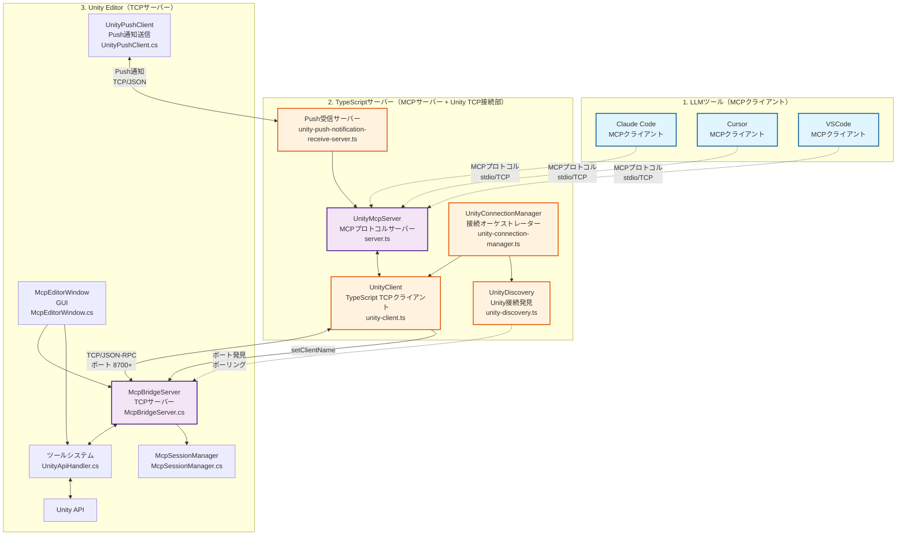

# uLoopMCP アーキテクチャ概要

Unity EditorとMCP（Model Context Protocol）対応LLMツール間を橋渡しするシステムのアーキテクチャ概要です。

## ドキュメント構成

- **[Unity側アーキテクチャ詳細](ARCHITECTURE_UNITY_ja.md)** - Unity Editor側（C#）の実装詳細
- **[TypeScript側アーキテクチャ詳細](ARCHITECTURE_TYPESCRIPT_ja.md)** - TypeScriptサーバー側の実装詳細

## システム全体概要

## 通信プロトコル概要

| コンポーネント | 役割 | プロトコル | ポート | 接続タイプ |
|-----------|------|----------|------|----------------|
| **LLMツール**（Claude、Cursor、VSCode） | **クライアント** | MCPプロトコル | stdio/各種 | MCPリクエスト送信 |
| **TypeScriptサーバー** | **サーバー**（MCP用） **クライアント**（Unity用） | MCP ↔ TCP/JSON-RPC | stdio ↔ UNITY_TCP_PORT | プロトコル橋渡し |
| **Push受信サーバー**（TypeScript） | **サーバー**（Push通知用） | TCP/JSON | ランダムポート | Unity通知受信 |
| **Unity Editor** | **サーバー** | TCP/JSON-RPC | UNITY_TCP_PORT | TCP接続受付 |
| **UnityPushClient**（Unity） | **クライアント**（Push通知用） | TCP/JSON | Push受信サーバーポート | イベント通知送信 |

## プロトコル層詳細

### レイヤー1: LLMツール ↔ TypeScriptサーバー（MCPプロトコル）
- **プロトコル**: Model Context Protocol（MCP）
- **トランスポート**: stdio または TCP
- **データ形式**: JSON-RPC 2.0 with MCP拡張
- **接続**: LLMツールがMCPクライアントとして動作

### レイヤー2: TypeScriptサーバー ↔ Unity Editor（TCPプロトコル）
- **プロトコル**: JSON-RPC 2.0を使用したカスタムTCP
- **トランスポート**: TCPソケット
- **ポート**: UNITY_TCP_PORT環境変数で指定されたポート（自動発見）
- **接続**: TypeScriptサーバーがTCPクライアントとして動作

### レイヤー3: Unity Editor ↔ Push受信サーバー（Push通知）
- **プロトコル**: カスタムJSON（Push通知専用）
- **トランスポート**: TCPソケット
- **ポート**: Push受信サーバーがランダムポートで待機
- **接続**: UnityPushClientがTCPクライアントとして動作
- **通知タイプ**: ドメインリロード、ツール変更、接続確立、切断

## Unity切断の3つのパターンとPush通知

1. **`DOMAIN_RELOAD`** - 自動復旧可能
   - **理由**: Unity Domain Reload（コンパイル、アセンブリ再読み込み）
   - **事前通知**: あり（`AssemblyReloadEvents.beforeAssemblyReload`）
   - **復旧**: 自動復旧 → `DOMAIN_RELOAD_RECOVERED`通知

2. **`USER_DISCONNECT`** - 手動介入必要
   - **理由**: ユーザー意図的切断（手動切断、プロジェクト変更等）
   - **事前通知**: なし（突然の切断）
   - **復旧**: 手動再接続が必要

3. **`UNITY_SHUTDOWN`** - Unity再起動必要
   - **理由**: Unity Editor完全終了
   - **事前通知**: あり（`EditorApplication.quitting`）
   - **復旧**: Unity Editor再起動が必要

## 主要機能

### 実装済みツール（13種類）

#### コアシステムツール
- `ping`: 接続ヘルスチェック
- `compile`: プロジェクトコンパイル
- `clear-console`: Unity Consoleログクリア
- `set-client-name`: クライアント識別
- `get-tool-details`: ツールメタデータ取得

#### 情報取得ツール
- `get-logs`: コンソールログ取得
- `get-hierarchy`: シーン階層エクスポート
- `get-menu-items`: Unity メニューアイテム発見
- `get-provider-details`: Unity Search プロバイダー情報

#### GameObjectとシーンツール
- `find-game-objects`: 高度なGameObject検索
- `unity-search`: 統合検索

#### 実行ツール（セキュリティ制御対象）
- `run-tests`: テスト実行
- `execute-menu-item`: MenuItem実行

### セキュリティ機能
- **localhost制限**: 外部接続をブロック
- **ツールレベルセキュリティ**: McpSecurityCheckerが各ツールを検証
- **設定可能なアクセス制御**: Unity Editorセキュリティ設定
- **デフォルト拒否ポリシー**: 未知のツールはデフォルトでブロック

## 設計原則

### Unity側（C#）
- **ツールパターン**: `IUnityTool`インターフェースによる統一設計
- **スキーマ駆動型通信**: `*Schema.cs`による型安全な通信
- **ドメインリロード耐性**: `ScriptableSingleton`による状態永続化
- **MVP + ヘルパーアーキテクチャ**: UIの責務分離

### TypeScript側
- **動的ツール管理**: Unityから取得したツール情報による動的MCP対応
- **回復力のある接続管理**: 自動再接続とUnity発見機能
- **クライアント互換性**: 異なるMCPクライアントへの対応
- **VibeLogger**: AI解析対応の構造化ログシステム

## 関連ドキュメント

詳細な実装については、各アーキテクチャドキュメントを参照してください：

- **[Unity側アーキテクチャ詳細](ARCHITECTURE_UNITY_ja.md)** - C#実装、ツールパターン、セキュリティアーキテクチャ
- **[TypeScript側アーキテクチャ詳細](ARCHITECTURE_TYPESCRIPT_ja.md)** - Node.js実装、MCP対応、動的ツール管理