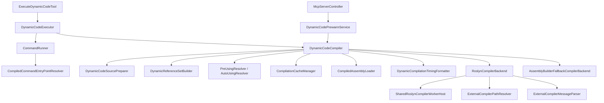

# execute-dynamic-code rebuild

This document describes the rebuilt `execute-dynamic-code` pipeline after the readability-focused refactor.

## Overview

## Responsibilities

- `ExecuteDynamicCodeTool`
  - Owns MCP/CLI-facing request and response shaping.
  - Keeps editor security-level switching outside the compiler.

- `DynamicCodeExecutor`
  - Bridges compilation and execution.
  - Converts hoisted literals into execution parameters.
  - Merges compilation and execution timings.

- `DynamicCodeCompiler`
  - Orchestrates the compilation flow.
  - Owns cache lookup, source security checks, pre-using retry flow, and compiler backend selection.
  - Does not parse compiler diagnostics or perform assembly validation directly.

- `DynamicCodeSourcePreparer`
  - Normalizes snippets into wrapper code.
  - Handles top-level mode, return completion, and literal hoisting.

- `DynamicReferenceSetBuilder`
  - Builds the minimal reference set for the current request.
  - Hides assembly catalog caching and deduplication rules.

- `CompilerDiagnostics`
  - Converts backend compiler messages into `CompilationError` and warning collections.
  - Flags ambiguity errors so the compiler can decide whether to retry without pre-using.

- `RoslynCompilerBackend`
  - Uses Unity-bundled Roslyn when available.
  - Falls back from the shared worker to one-shot compilation when needed.

- `SharedRoslynCompilerWorkerHost`
  - Owns the persistent worker lifecycle.
  - Is the only place that knows how the worker process is built, started, and invalidated on domain reload.

- `AssemblyBuilderFallbackCompilerBackend`
  - Provides the Unity `AssemblyBuilder` fallback path for environments where the external Roslyn path is unavailable.

- `CompiledAssemblyLoader`
  - Performs metadata validation, assembly load, and IL validation in one place.
  - Returns a load result so the compiler can shape the final `CompilationResult` without duplicating validation logic.

- `CommandRunner`
  - Owns execution-time concerns: Undo scope, cancellation wiring, sync/async invocation, and exception conversion.

- `CompiledCommandEntryPointResolver`
  - Resolves wrapper entry points from compiled assemblies.
  - Keeps reflection-heavy lookup logic out of `CommandRunner`.

- `DynamicCodePrewarmService`
  - Owns the single-flight warm-up policy.
  - Keeps startup and recovery hooks out of the compiler implementation.

## Design intent

- Keep orchestration readable from top to bottom.
- Keep stateful lifecycle concerns isolated.
- Prefer explicit helper names over dense multi-purpose classes.
- Preserve user-facing behavior while making internal ownership obvious.
