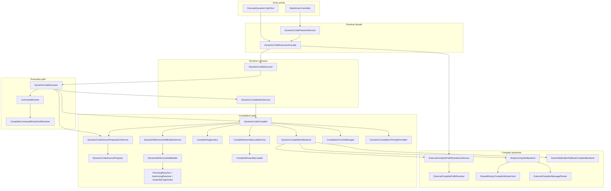
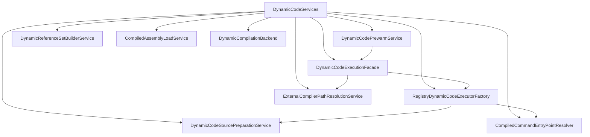

# execute-dynamic-code rebuild

This document describes the rebuilt `execute-dynamic-code` pipeline after the readability-focused refactor.

## Runtime flow

## Composition graph

## Reading guide

1. Read `Runtime flow` first.
2. `ExecuteDynamicCodeTool` and `DynamicCodePrewarmService` both depend on `DynamicCodeExecutionFacade`.
3. `DynamicCodeExecutionFacade` is the public runtime boundary inside the editor process.
4. `DynamicCodeExecutor` coordinates the two main flows:
   - compilation via `DynamicCodeCompiler`
   - execution via `CommandRunner`
5. Read `Composition graph` second.
6. `DynamicCodeServices` is the only place that wires concrete collaborators together.
7. Cross-box concrete references are acceptable in the composition graph because wiring is its only job.

## Responsibilities

- `ExecuteDynamicCodeTool`
  - Owns MCP/CLI-facing request and response shaping.
  - Keeps editor security-level switching outside the compiler.

- `DynamicCodeServices`
  - Acts as the small composition root for the dynamic-code subsystem.
  - Owns the shared service instances that used to be hidden behind static helper calls.
  - Is the only place that is expected to know many concrete classes at once.

- `DynamicCodeExecutionFacade`
  - Provides the runtime-facing facade for entry points.
  - Owns executor reuse per security level.
  - Prevents tools and warm-up code from reaching into factory and executor wiring directly.

- `RegistryDynamicCodeExecutorFactory`
  - Resolves the registered compilation provider from the registry.
  - Wires `DynamicCodeExecutor`, `CommandRunner`, and source preparation dependencies together.
  - Lives in the composition graph, not in the tool-facing runtime boundary.

- `IDynamicCodeExecutor` / `IDynamicCompilationService`
  - Expose async-only contracts.
  - Keep the API honest by not advertising unsupported synchronous execution.

- `DynamicCodeExecutor`
  - Bridges compilation and execution.
  - Converts hoisted literals into execution parameters.
  - Merges compilation and execution timings.
  - Exposes async-only execution so the public contract matches the actual runtime behavior.

- `DynamicCodeCompiler`
  - Orchestrates the compilation flow.
  - Owns cache lookup, source security checks, pre-using retry flow, and compiler backend selection.
  - Depends on explicit collaborator services for source preparation, reference building, backend compilation, and assembly loading.

- `DynamicCodeSourcePreparationService`
  - Provides an explicit dependency boundary for source preparation.
  - Keeps the compiler and executor from reaching into static preparation helpers directly.

- `DynamicCodeSourcePreparer`
  - Normalizes snippets into wrapper code.
  - Handles top-level mode, return completion, and literal hoisting.

- `DynamicReferenceSetBuilderService`
  - Makes reference resolution a visible dependency of the compiler.
  - Keeps reference-building policy replaceable without changing compiler orchestration.

- `DynamicReferenceSetBuilder`
  - Builds the minimal reference set for the current request.
  - Hides assembly catalog caching and deduplication rules.
  - Keeps pre-using, auto-using, and assembly-candidate lookup behind one boundary.

- `CompilerDiagnostics`
  - Converts backend compiler messages into `CompilationError` and warning collections.
  - Flags ambiguity errors so the compiler can decide whether to retry without pre-using.

- `ExternalCompilerPathResolutionService`
  - Makes Unity-bundled compiler path discovery explicit.
  - Keeps prewarm and compiler orchestration from depending on static path lookup directly.

- `DynamicCompilationBackend`
  - Selects the concrete backend for a build request.
  - Keeps `DynamicCodeCompiler` from branching across backend implementations directly.

- `RoslynCompilerBackend`
  - Uses Unity-bundled Roslyn when available.
  - Falls back from the shared worker to one-shot compilation when needed.

- `SharedRoslynCompilerWorkerHost`
  - Owns the persistent worker lifecycle.
  - Is the only place that knows how the worker process is built, started, and invalidated on domain reload.

- `AssemblyBuilderFallbackCompilerBackend`
  - Provides the Unity `AssemblyBuilder` fallback path for environments where the external Roslyn path is unavailable.

- `CompiledAssemblyLoadService`
  - Makes assembly loading and validation explicit in the compiler constructor.
  - Keeps the compiler from depending on static load helpers directly.

- `CompiledAssemblyLoader`
  - Performs metadata validation, assembly load, and IL validation in one place.
  - Returns a load result so the compiler can shape the final `CompilationResult` without duplicating validation logic.

- `CommandRunner`
  - Owns execution-time concerns: Undo scope, cancellation wiring, sync/async invocation, and exception conversion.

- `CompiledCommandEntryPointResolver`
  - Resolves wrapper entry points from compiled assemblies.
  - Keeps reflection-heavy lookup logic out of `CommandRunner`.

- `DynamicCodePrewarmService`
  - Owns the single-flight warm-up policy.
  - Depends on the runtime facade instead of the executor factory directly.
  - Reuses the same runtime execution path as normal requests so warm-up and production stay aligned.

## Design intent

- Keep orchestration readable from top to bottom.
- Keep stateful lifecycle concerns isolated.
- Prefer explicit helper names over dense multi-purpose classes.
- Preserve user-facing behavior while making internal ownership obvious.
- Keep the async-only public contract honest: no interface advertises unsupported synchronous execution.
- Separate two kinds of edges:
  - runtime dependencies, where facades and contracts should hide wiring details
  - composition dependencies, where a composition root is allowed to know concrete classes
- Make the main dependency directions visible:
  - entry points depend on the runtime facade
  - orchestration depends on contracts and collaborator services
  - low-level helpers do not reach back into the tool layer
