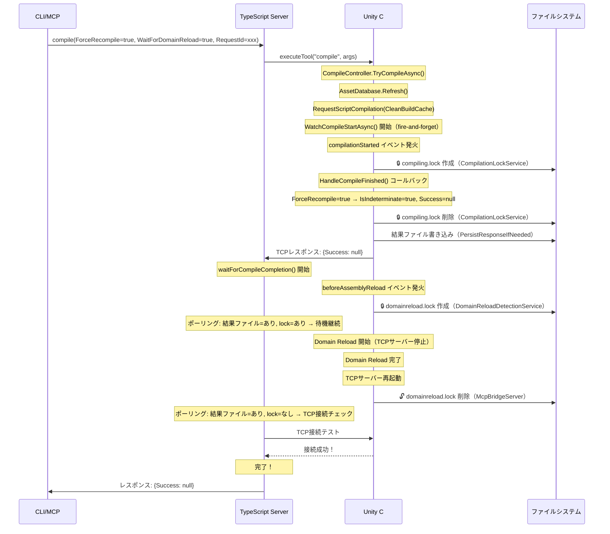
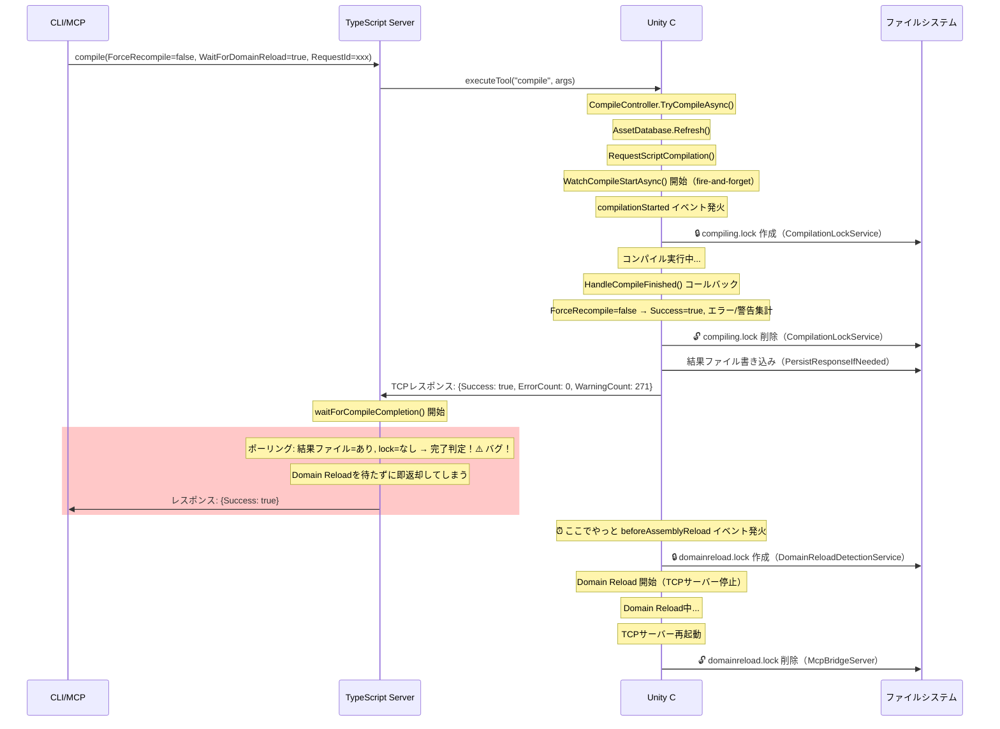
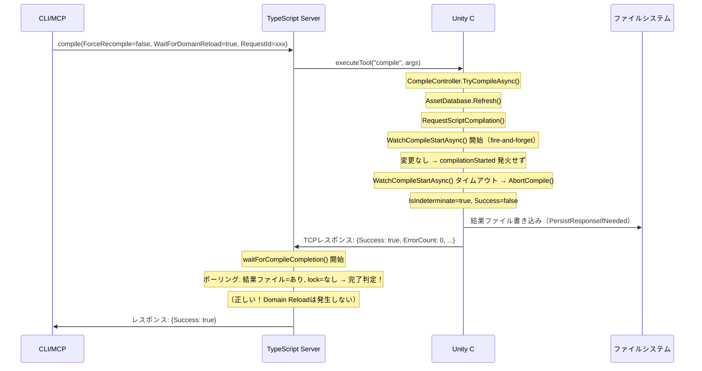

# Compile WaitForDomainReload シーケンス図

## lockファイルの生成・削除タイミング

| lockファイル | 生成タイミング | 削除タイミング |
|-------------|--------------|--------------|
| `compiling.lock` | `CompilationPipeline.compilationStarted` イベント | `CompilationPipeline.compilationFinished` イベント |
| `domainreload.lock` | `AssemblyReloadEvents.beforeAssemblyReload` イベント | McpBridgeServer のサーバー起動完了時 |
| `serverstarting.lock` | （サーバー起動開始時） | （サーバー起動完了時） |

## Case 1: ForceRecompile=true, WaitForDomainReload=true (正常動作)

## Case 2: ForceRecompile=false, C#変更あり, WaitForDomainReload=true (バグ)

## Case 3: ForceRecompile=false, C#変更なし, WaitForDomainReload=true (正常動作)

## 根本原因

Case 2 で `compilationFinished` と `beforeAssemblyReload` の間にギャップがある。

1. `compilationFinished` → `compiling.lock` 削除 + 結果ファイル書き込み + TCPレスポンス送信
2. （ここでギャップ！lockファイルが一つも存在しない瞬間がある）
3. `beforeAssemblyReload` → `domainreload.lock` 作成

`waitForCompileCompletion()` がこのギャップ中にポーリングすると「結果あり + lockなし = 完了」と誤判定する。

## タイミングの違いまとめ

| ケース | `compilationFinished` 時の挙動 | `beforeAssemblyReload` のタイミング | 問題 |
|--------|-------------------------------|-----------------------------------|------|
| ForceRecompile=true | 即座にTCPレスポンス返却 | コンパイル中〜直後（TCPレスポンス前に発生しうる） | lock出現が早い → 待機OK |
| ForceRecompile=false（変更あり） | コンパイル完了後にTCPレスポンス返却 | TCPレスポンス返却**後** | lockが出現する前に完了判定 → バグ |
| ForceRecompile=false（変更なし） | 即座にTCPレスポンス返却 | 発生しない | Domain Reloadなし → 正常 |
